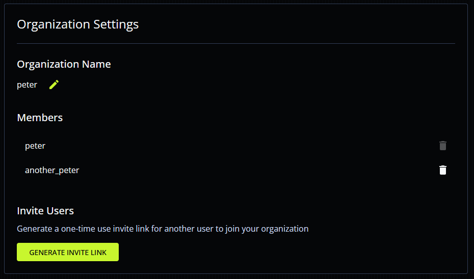

In this guide, you'll learn how to manage DBOS Cloud accounts.

### New User Registration

You can sign up for an account on the [DBOS Cloud console](https://console.dbos.dev/login-redirect).
Additionally, all `dbos-cloud` commands prompt you to register a new account if you don't already have one.

### Authenticating Programatically

Sometimes, such as in a CI/CD pipeline, it is useful to authenticate programatically without providing credentials through a browser-based login portal.
DBOS Cloud provides this capability with refresh tokens.
To obtain a refresh token, run:

```
dbos-cloud login --get-refresh-token
```

This command has you authenticate through the browser, but obtains a refresh token and stores it in `.dbos/credentials`.

Once you have your token, you can use it to authenticate programatically without going through the browser with the following command:

```
dbos-cloud login --with-refresh-token <token>
```

Refresh tokens automatically expire after a year or after a month of inactivity.
You can manually revoke them at any time:

```
dbos-cloud revoke <token>
```

:::warning
Until they expire or are revoked, refresh tokens can be used to log in to your account.
Treat them as secrets and keep them safe!
:::


### Organization Management

:::info
This feature is currently only available to [DBOS Pro or Enterprise](https://www.dbos.dev/pricing) subscribers.
:::

Organizations allow multiple users to collaboratively manage applications.
When a user creates an account, they are automatically added to an organization containing only them, where the organization name is the same as their username.

You can manage your organization from the [cloud console organizations page](https://console.dbos.dev/settings/organization):



#### Organization Admins

The original creator of an organization is the organization admin.
Only the organization admin can invite new users, delete existing users, or rename the organization.
All users have full access to organization resources, including databases and applications.

#### Inviting New Users

To invite a new user to your organization, click the "Generate Invite Link" button.
This generates a **single-use** URL for joining your organization.

When a user signs in to the cloud console using that URL, they are prompted to join your organization.
If they do not have an account, they are prompted to create one.
If they already have an account, they must delete all resources (applications and databases) before joining your organization.

#### Renaming Your Organization

You can rename your organization by clicking the icon next to your organization name.
Note that applications belonging to organizations are hosted at the URL `https://<organization-name>-<app-name>.cloud.dbos.dev/`.
**Therefore, renaming your organization changes your application URLs**.

#### Removing Users

The organization admin can remove any other user from their organization.
This immediately terminates their access to all organization resources.
