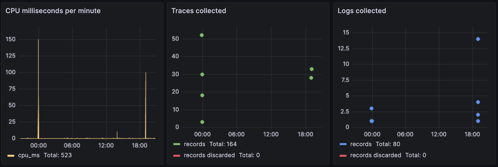
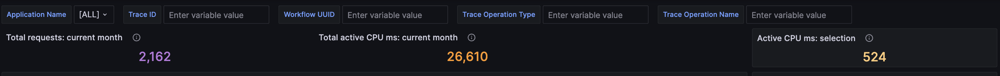

In this guide, you'll learn how to use the monitoring dashboard to visualize the call history and performance of applications in DBOS Cloud.

### Preliminaries

In order to launch the dashboard you must first deploy an application, as described in [quickstart](../getting-started/quickstart.md). Having done so, from your application directory, run:

```
npx dbos-cloud dashboard url
```

This command will output the URL of your dashboard. Log in with the same credentials you used to register your app. 

### Exploring Your Dashboard

In the top-right corner, the dashboard provides a time selector, defaulting to the last hour. You can change this setting to navigate to a different window of time. All of the panels are filtered for the selected time interval.


Under the time selector you can find time series for the counts of logs and traces generated by your applications, summarized for every second. These two panes have a matched time axis. You can click and drag across an interesting region in the series to "zoom in". 


This will update the time selector and, therefore, all other panels. You can then use the time selector to "zoom back out" or use the `<` and `>` buttons to move backwards and forwards in time.

In rare cases, log and trace data for Free Tier DBOS applications can be discarded due to service outages or resource constraints. The discarded data cannot be displayed, but the number of discarded logs and traces is tracked and appears in the above timeseries as red data points.

On the left side, the dashboard provides a log view with entries generated by your applications arranged chronologically. The pane displays up to 1,000 most recent log records in the selected time period. Log records are color coded by severity level. Special entries for application lifetime events are colored grey and labeled as `[APP REGISTER]`, `[APP DEPLOY]` and so on. These are generated by DBOS Cloud automatically and not shown in the summarized log counts. You can click on a log record to browse additional metadata. In the example below, we see logs for an example app first getting registered, then undergoing schema migration, then getting deployed:


On the bottom of the dashboard, there is a table of traces. Each row corresponds to a handler, workflow, transaction or communicator span. Each span is timestamped and decorated with duration in milliseconds, the IDs of the trace and workflow it belongs to, its execution status, and other information. 

### Filtering

In the top-right corner of the app, there are filtering selectors:

1. you can pull-down to select a single `Application Name` to display. Other applications' data will be filtered out.
2. you can copy-paste a specific `Trace ID` to only view logs and spans for that Trace. To clear the field, erase the text and press "return."
3. similar to Trace ID you can copy-paste a specific `Workflow UUID` to filter by that. It is cleared the same way as Trace ID.

:::tip
When turning on these filters, the time window filter also still applies. You may see more data for your selection if you "zoom out" in time. Also note that the Application Name choices are set once when you open the dashboard. To refresh the choices for a new app, simply reload your browser.
:::

For much faster filtering, you can set the Trace ID or Workflow UUID simply by clicking on the respective value in the bottom traces table. For Workflow UUID you can also open the selected workflow in the debugger. Click once to see the choices and confirm with another click:


### Time Travel Debugging

As per the previous section, clicking on a value in the Workflow UUID column allows you to [filter](#filtering) your view to a single workflow execution or to execute the selected workflow in the Time Travel Debugger. Please see the [Time Travel Debugger Tutorial](./timetravel-debugging#debugging-from-the-monitoring-dashboard) for more information


### Execution Seconds

The dashboard tracks and continuously updates the total execution time for all of your apps. Execution seconds are calculated as the sum of the durations of all the traces. The duration of a trace is defined as the wall-clock interval from start to completion. In other words, it is the interval from the earliest span start time to the latest span end time, across all spans in the trace. These totals are updated every time you refresh your dashboard. They are applied against your DBOS Pricing tier's [execution time limit](https://www.dbos.dev/pricing).

The dashboard presents the total number of execution seconds since the start of the month, in orange, and the total for the selected data in green. You can use the above filtering controls to navigate to any particular app, time interval, group of traces or a specific trace and use the green number to view its contribution. 

