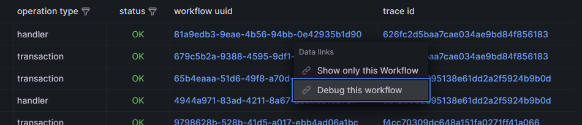
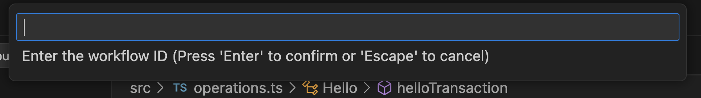

:::info
Time travel is only available for TypeScript DBOS Cloud applications using the **experimental** time travel feature.
Time Travel Debugging is currently only available in TypeScript
:::

In this guide, you'll learn how to time travel debug your production applications deployed on DBOS Cloud.

DBOS Cloud automatically records every step a DBOS application takes and every change it makes in the database.
The Time Travel Debugger uses this information to "rewind time" and project database state as it existed when a selected workflow originally ran.
Developers can step through past executions and add print statements or database read queries to them and they'll return results as if they ran in the past!

:::warning
For Free Tier DBOS applications, time travel debug information is only kept for 3 days.
:::

## Time Travel with Visual Studio Code

### Preliminaries

Before following the steps in this guide, make sure you've [deployed an application to DBOS Cloud](application-management) with [time travel enabled](./cloud-cli#dbos-cloud-app-deploy).

Time travel debugging uses [Visual Studio Code](https://code.visualstudio.com/) and the
[DBOS Time Travel Debugger Extension](https://marketplace.visualstudio.com/items?itemName=dbos-inc.dbos-ttdbg).
The extension can be installed from the link above or by searching the
[Extension Marketplace](https://code.visualstudio.com/docs/editor/extension-marketplace)
inside VS Code for "DBOS"


Once installed, the DBOS Time Travel Extension will automatically update as new releases are published to the VS Code Marketplace.

:::info
If you're not a VS Code user, please see the section below on [Time Travel Debugging with the DBOS CLI](#time-travel-with-dbos-cli-non-vs-code-users) below.
:::

### Launching a Debug Session

The scaffold project generated by `npx @dbos-inc/create` includes VS Code
configuration files to time travel debug your DBOS application. The time travel debugger can be launched via VS Code's normal
[Run and Debug View](https://code.visualstudio.com/docs/editor/debugging#_run-and-debug-view) or via a custom
[CodeLens](https://code.visualstudio.com/blogs/2017/02/12/code-lens-roundup) provided by the DBOS Time Travel Debugger Extension.

:::info
The scaffold project also includes local debugging configuration that can be used during initial development.
Time Travel debugging is only supported for applications that have been deployed to DBOS cloud.
:::

#### Debugging from a CodeLens

When you open your DBOS application in VS Code, the  DBOS Time Travel Debugger extension inserts a "⏳ Time Travel Debug"
CodeLens to every DBOS function in your application.


When you click on the Time Travel Debug CodeLens, you are provided with a list of recent executions of that function to debug.


:::info
In the upper right hand corner of the workflow picker, there are buttons to manually enter a workflow ID or to
select a workflow to debug via your [monitoring Dashboard](./monitoring-dashboard).
More details on those options below.
:::

After selecting a recent execution of your function, the DBOS Time Travel Debugger will launch the DBOS debug runtime
and VS Code TypeScript debugger. This allows you to debug your DBOS application against the database as it existed
at the time the selected workflow originally executed.
Other than using time travel database state, the debugging experience for your DBOS application is just like debugging any other TypeScript application in VS Code.
You can [set breakpoints](https://code.visualstudio.com/docs/editor/debugging#_breakpoints),
[inspect variables](https://code.visualstudio.com/docs/editor/debugging#_data-inspection) and
[step through your code](https://code.visualstudio.com/docs/editor/debugging#_debug-actions) as you would expect.


#### Debugging from the Run and Debug View

You can also debug your DBOS application via [VS Code's Start Debugging command](https://code.visualstudio.com/docs/editor/debugging).
The extension includes command variables that can
be used in the launch configuration file.

When debugging this way, the `pick-workflow-id` command variable is used to select a recent execution of your cloud application to debug.
This is similar to the CodeLens experience described above, except that the list of workflow executions is not filtered to the executions
of a single function.

#### Debugging from the Monitoring Dashboard

You can launch the Time Travel Debugger directly from the [Monitoring Dashboard](./monitoring-dashboard).
Clicking on the dashboard button in the workflow picker brings you directly to the Monitoring Dashboard. From there, you
can use the dashboard's filtering capabilities to find the workflow you want to time travel debug. Once you find the
desired workflow execution, click on the value in the workflow uuid column and select "Debug this Workflow" from the menu.



#### Manually entering the Workflow ID to debug

If you already know the workflow ID of the execution you want to debug, press the edit button in the workflow picker
and you are provided a place to enter that workflow ID directly.




### Time Travel Database Queries

DBOS Cloud automatically records every step a DBOS application takes and every change it makes in the database.
The Time Travel Debugger uses this information to "rewind time" and project database state as it existed when a selected workflow originally ran.
Developers can step through past executions and add print statements or database read queries to them and they'll return results as if they ran in the past!

:::warning
When time travel debugging, you can freely add read queries to your application and observe their results when run against past database state, but do not add or modify database queries that write to the database such as insert/delete/update SQL statements; otherwise, the query results may be incorrect.
DBOS will support such changes in the future.
:::

For example, here is an transaction function:

```javascript
export class Hello {
  @Transaction()  // Run this function as a database transaction
  static async helloTransaction(ctxt: TransactionContext<Knex>, user: string) {
    // Retrieve and increment the number of times this user has been greeted.
    const rows = await ctxt.client<dbos_hello>("dbos_hello")
      .insert({ name: user, greet_count: 1 })
      .onConflict("name") // If user is already present, increment greet_count.
        .merge({ greet_count: ctxt.client.raw('dbos_hello.greet_count + 1') })
      .returning("greet_count");
    const greet_count = rows[0].greet_count;
    return `Hello, ${user}! You have been greeted ${greet_count} times.\n`;
  }
}
```

We can add queries to the function to retrieve past database states.
For example, the following code block adds queries to retrieve the user's greet count before and after it gets updated.

:::info
Don't forget to rebuild your DBOS application with `npm run build` before running it in the debugger.
:::

```javascript
export class Hello {

  @Transaction()  // Run this function as a database transaction
  static async helloTransaction(ctxt: TransactionContext<Knex>, user: string) {

    const before = await ctxt.client<dbos_hello>("dbos_hello")
        .select("greet_count")
        .where("name", user)
        .first();

    // Retrieve and increment the number of times this user has been greeted.
    const rows = await ctxt.client<dbos_hello>("dbos_hello")
      .insert({ name: user, greet_count: 1 })
      .onConflict("name") // If user is already present, increment greet_count.
        .merge({ greet_count: ctxt.client.raw('dbos_hello.greet_count + 1') })
      .returning("greet_count");
    const greet_count = rows[0].greet_count;

    const after = await ctxt.client<dbos_hello>("dbos_hello")
        .select("greet_count")
        .where("name", user)
        .first();

    return `Hello, ${user}! You have been greeted ${greet_count} times.\n`;
  }
}
```

When this updated code is run in the debugger, we can inspect the new `before` and `after` variables to see past database state.

### Limitations

Currently, the time travel debugger supports stepping through any past workflows and most transactions, but has a few limitations:

- DBOS will compare debug function output to the function's originally recorded output.
  If they do not match, the debug session will halt with an error.
- DBOS will allow you to step thru transaction functions that aborted when originally executed, but will always throw their recorded errors
  regardless of what the function returned during debugging. This allows consistent execution under the debugger for
  database errors that were caused by non-deterministic factors (e.g., database lock contentions).
- DBOS debugger exclusively uses recorded outputs for steps without providing an opportunity to step through the code,
  because steps may contain unexpected side effects.
  For example, if a step sent an email to the user at run time, an email would not be sent out during debugging sessions.

### Configurations

For more information, please read the [debugger extension reference](../typescript/reference/tools/time-travel-debugger.md).

## Time Travel with DBOS CLI (Non-VS Code Users)

For non-VS Code users, you can run the time-travel debugger manually through the DBOS CLI.

### Manual Setup

The time travel debugger requires our debug proxy to transform database queries so that it can "travel" back in time.
You can download the pre-compiled debug proxy using the following link. Please choose the one based on your operating system and hardware platform:

- [Download for macOS (Intel Chip)](https://dbos-releases.s3.us-east-2.amazonaws.com/debug-proxy/1.1.7/debug-proxy-macos-x64-1.1.7.zip)
- [Download for macOS (Apple Chip)](https://dbos-releases.s3.us-east-2.amazonaws.com/debug-proxy/1.1.7/debug-proxy-macos-arm64-1.1.7.zip)
- [Download for Linux (x86_64)](https://dbos-releases.s3.us-east-2.amazonaws.com/debug-proxy/1.1.7/debug-proxy-linux-x64-1.1.7.zip)
- [Download for Linux (arm)](https://dbos-releases.s3.us-east-2.amazonaws.com/debug-proxy/1.1.7/debug-proxy-linux-arm64-1.1.7.zip)

After downloading the file, unzip it and make the `debug-proxy` file executable:

```bash
cd <Your Download Folder>/
chmod +x debug-proxy
./debug-proxy -db <app database name>_dbos_prov -host <app cloud database hostname>  -password <database password> -user <database username>
```

::::info
For macOS users, you may see a pop-up window: "“debug-proxy” is an app downloaded from the Internet. Are you sure you want to open it?" Please click `Open`.
::::

### Replay a Workflow

Open another terminal window, enter your application folder, compile your code, and replay a workflow using the following commands:

```bash
cd <Your App Folder>/
npm run build
npx dbos debug -u <workflow UUID>
```

:::info
Every time you modify your code, you need to recompile it before running the `dbos debug` command again.
:::

For more information on the debug command, please see our [references](../typescript/reference/tools/cli.md#npx-dbos-debug)
