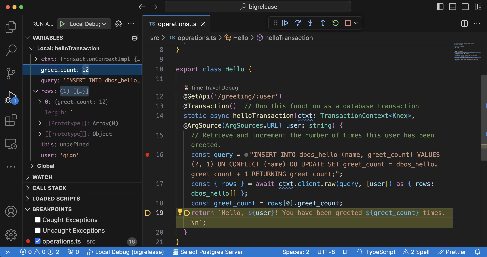

In this guide, you'll learn how to time travel debug your production applications deployed on DBOS Cloud.

## Time Travel with Visual Studio Code

### Preliminaries

Before following the steps in this guide, make sure you've [deployed an application to DBOS Cloud](application-management).

Time travel debugging requires [Visual Studio Code](https://code.visualstudio.com/) and the
[DBOS Time Travel Debugger Extension](https://marketplace.visualstudio.com/items?itemName=dbos-inc.dbos-ttdbg). 
The extension can be installed from the link above or by searching the 
[Extension Marketplace](https://code.visualstudio.com/docs/editor/extension-marketplace)
inside VS Code for "DBOS"


Once installed, the DBOS Time Travel Extension will automatically update as new releases are published to the VS Code Marketplace.

### Launching a Debug Session

Open your DBOS application in VS Code. 
The DBOS Time Travel Debugger extension attaches a "Time Travel Debug" 
[CodeLens](https://code.visualstudio.com/blogs/2017/02/12/code-lens-roundup)
to every DBOS [workflow](../tutorials/workflow-tutorial),
[transaction](../tutorials/transaction-tutorial)
and [communicator](../tutorials/communicator-tutorial) method in your DBOS application.


When you click on the Time Travel Debug CodeLens, you are provided a list of recent executions of that method to debug.

:::warning
Time travel debug information is only kept for three days.
:::


After selecting a recent execution of your function, the DBOS Time Travel Debugger will launch the DBOS debug runtime 
and VS Code TypeScript debugger. This allows you to debug your DBOS application against the database as it existed 
at the time the selected execution originally occurred.
Other than using time travel database state, the debugging experience for your DBOS application is just like debugging any other TypeScript application in VS Code.
You can [set breakpoints](https://code.visualstudio.com/docs/editor/debugging#_breakpoints),
[inspect variables](https://code.visualstudio.com/docs/editor/debugging#_data-inspection) and 
[step through your code](https://code.visualstudio.com/docs/editor/debugging#_debug-actions) as you would expect.



### Time Travel Database Queries

DBOS [records](../explanations/how-workflows-work#reliability-through-recording-and-safe-re-execution) every step 
a DBOS application takes in the database so that it can safely re-execute the application if it is interrupted. 
The Time Travel Debugger uses this information to project the database state as it existed when a selected workflow ran.

Because DBOS time travels by projecting past database state, you can alter your DBOS application code


Time-Travel debugging 

TODO: explain how we can allow developers to retroactively add new (read-only) queries over old versions of data as if the queries "time-traveled" to the past.
This is a really unique and cool feature of DBOS, because we allow you to modify your code and run it against the past!

### Configurations

For more information, please read the [debugger extension reference](../api-reference/timetravel-debugger-extension).


### Dos and Don'ts

Currently, the time travel debugger supports stepping through any past workflows and most transactions, but has a few limitations:
- You can modify/add arbitrary read-only database queries to the replayed transactions, and you will get results as if they run in the past. However, do not change, add, or remove any statements that write to the database such as insert/delete/update SQL statements. In the future, we plan to support them.
- We use recorded outputs for communicators instead of stepping through their code, because they may contain unexpected side effects. For example, this guarantees that we don't resend any emails during debugging sessions.
- We use recorded errors for aborted transactions instead of executing their queries, because database errors can be caused by non-deterministic factors (e.g., database lock contentions). We are adding support to replay many common errors -- stay tuned!


## Time Travel with DBOS SDK CLI (Non-VS Code Users)

For non-VS Code users, you can run the time-travel debugger manually through the DBOS SDK CLI.

### Manual Setup

The time travel debugger requires our debug proxy to transform database queries so that it can "travel" back in time.
You can download the pre-compiled debug proxy using the following link. Please choose the one based on your operating system and hardware platform:

- [Download for macOS (Intel Chip)](https://dbos-releases.s3.us-east-2.amazonaws.com/debug-proxy/0.8.15-preview/debug-proxy-macos-x64-0.8.15-preview.zip)
- [Download for macOS (Apple Chip)](https://dbos-releases.s3.us-east-2.amazonaws.com/debug-proxy/0.8.15-preview/debug-proxy-macos-arm64-0.8.15-preview.zip)
- [Download for Linux (x86_64)](https://dbos-releases.s3.us-east-2.amazonaws.com/debug-proxy/0.8.15-preview/debug-proxy-linux-x64-0.8.15-preview.zip)
- [Download for Linux (arm)](https://dbos-releases.s3.us-east-2.amazonaws.com/debug-proxy/0.8.15-preview/debug-proxy-linux-arm64-0.8.15-preview.zip)

After downloading the file, unzip it and make the `debug-proxy` file executable:
```bash
cd <Your Download Folder>/
chmod +x debug-proxy
./debug-proxy -db <app database name>_dbos_prov -host <app cloud database hostname>  -password <database password> -user <database username>
```

::::tip

For macOS users, you may see a pop-up window: "“debug-proxy” is an app downloaded from the Internet. Are you sure you want to open it?" Please click `Open`.

::::

### Replay a Workflow

Open another terminal window, enter your application folder, compile your code, and replay a workflow using the following commands:
```bash
cd <Your App Folder>/
npm run build
npx dbos-sdk debug -u <workflow UUID>
```

Every time you modify your code, you need to recompile it before running the `dbos-sdk debug` command again.
For more information on the debug command, please see our [references](../api-reference/cli.md#npx-dbos-sdk-debug)