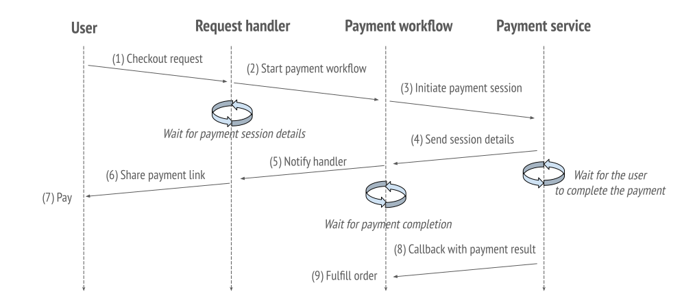

# Programming a reliable checkout workflow

In this guide, we will follow-up on the reliable workflow concept from [programming quickstart](quickstart-programming) and write the checkout workflow of a shopping cart app.
The workflow will maintain three properties:
1. Never charge a customer without fulfilling an order.
2. Never charge a customer twice for the same order.
3. Maintain product inventory correctly.

Without DBOS, maintaining these properties is hard: users can click the buy button twice, the program can crash in the middle of the transaction, the payment service can fail, etc.

:::info what you will learn
- Handle asynchronous interactions with third party services
- Interact with running workflows
- Use idempotency keys
:::

## Resources
This guide comes a companion [repository](https://github.com/dbos-inc/dbos-demo-apps). Let's clone it:
```shell
git clone https://github.com/dbos-inc/dbos-demo-apps
cd dbos-demo-apps/shop-guide
```
We will also be using [cURL](https://curl.se/dlwiz/?type=bin) which is likely already installed on your system.

## Overview

In this guide, we'll be implementing two functions: the checkout workflow and its HTTP handler.
These interact with an external payment service modelled on [Stripe](https://stripe.com).
Here's a diagram of what the end-to-end checkout flow looks like:



## The HTTP handler

Upon receiving a request, the handler starts a payment workflow and waits for a payment session ID.
If it obtains a valid session ID, it will respond the user with links to submit or cancel the payment.
The handler accepts an optional [idempotency key](../tutorials/idempotency-tutorial) used to inform DBOS whether to start a new workflow or resume an existing one.

```javascript
@PostApi('/checkout/:uuid?')
static async webCheckout(ctxt: HandlerContext, @ArgOptional uuid: string): Promise<void> {
  // A workflow handle is immediately returned. The workflow continues in the background.
  const handle = await ctxt.invoke(Shop, uuid).paymentWorkflow();

  // Block until the payment session is ready
  const session_id = await ctxt.getEvent<string>(handle.getWorkflowUUID(), checkout_url_topic);
  if (session_id === null) {
    ctxt.logger.error("workflow failed");
    return;
  }

  // Display links to submit/cancel the payment
  generatePaymentUrls(handle.getWorkflowUUID(), session_id);
}
```

### Registering the handler

```javascript
@PostApi('/checkout/:uuid?')
static async webCheckout(ctxt: HandlerContext, @ArgOptional uuid: string): Promise<void> {
```
We register a handler to serve the route `/checkout/:uuid?` with the function `webCheckout`.
The route accepts an optional path parameter `uuid`, used as an [idempotency key](../tutorials/idempotency-tutorial).
Note we must specify to DBOS the `uuid` parameter of `webCheckout` is optional using the [@ArgOptional](../api-reference/decorators#argoptional) decorator.

### Invoking the payment workflow

Once a request is received, the handler invokes a `paymentWorkflow` and retrieves a [workflow handle](../api-reference/workflow-handles):
```javascript
const handle = await ctxt.invoke(Shop, uuid).paymentWorkflow();`
```
The workflow will start executing in the background. You can use the handle to inquire on the workflow status, get the workflow UUID, and wait for a result.
Note how we invoke the workflow using the idempotency key `uuid` so DBOS can resume an existing workflow or simply handle common cases like "the user clicked twice on the buy button".

### Waiting for a payment session ID
Once the workflow is started, the handler uses the [events API](../tutorials/workflow-communication-tutorial#events-api) to wait for a payment session ID.
In this case, we expect to receive the ID of a payment session. We will see in the next section how the payment workflow can notify the handler.
```javascript
  const session_id = await ctxt.getEvent<string>(handle.getWorkflowUUID(), checkout_url_topic);
```

If `session_id` is invalid, the handler logs an error using its [context logger](../api-reference/contexts#ctxtlogger).
Otherwise, it respond the request with links to submit or cancel the payment at the payment service (using `generatePaymentUrls`.)

## The payment workflow

The workflow initiates a payment session with a third party service and manages the shop's inventory.
Specifically, it:
- Wraps interactions with the payment service in a [communicator](.../tutorials/communicator-tutorial), so customers cannot be charged twice for the same order.
- Undo inventory modifications on failure.
- Always fulfill orders if payments succeed.

Once a payment session is initiated, the workflow shares the payment session ID with the handler.
The handler will direct the user to a payment endpoint and the workflow be waiting to hear from the payment service.

:::info
Check out our [e-commerce demo app](https://github.com/dbos-inc/dbos-demo-apps/tree/main/e-commerce) for a more elaborate example.
:::

Let's build the payment workflow step by step. For the sake of brevity, we will be using pre-installed functions in `src/utilities.ts`. Feel free to check them out!

### Registering the workflow
Let's declare a simple workflow.
```javascript
@Workflow()
static async paymentWorkflow(ctxt: WorkflowContext): Promise<void> {
```

### Update the shop's inventory
The first action is to use `subtractInventory`, a DBOS transaction and member of `ShopUtilities` (exported from `src/utilities.ts`) to update the inventory. If this step fails, the workflow immediately signals the handler with a `null` value and returns.
```javascript
  // Attempt to update the inventory. Signal the handler if it fails.
  try {
    await ctxt.invoke(ShopUtilities).subtractInventory(product);
  } catch (error) {
    ctxt.logger.error("Failed to update inventory");
    await ctxt.setEvent(checkout_url_topic, null);
    return;
  }
```

### Initiating a payment session
Next, the workflow will initiate a payment session with the payment service.
```javascript
  // Attempt to start a payment session. If it fails, restore inventory state and signal the handler.
  const paymentSession = await ctxt.invoke(ShopUtilities).createPaymentSession();
  if (!paymentSession?.url) {
    ctxt.logger.error("Failed to create payment session");
    await ctxt.invoke(ShopUtilities).undoSubtractInventory(product);
    await ctxt.setEvent(checkout_url_topic, null);
    return;
  }
```
Under the hood, `createPaymentSession` calls a [sample payment service hosted on DBOS cloud](https://cloud.dbos.dev/dbos-instructor/apps/payment) and shares a webhook (`/payment_webhook`).
The payment service will use that hook to notify our shop application of the payment outcome.
In case of failure to initiate a payment session, the workflow will undo changes to the inventory, signal the handler, and exit.

### Waiting for a payment
Now, the workflow must do two things: notify the handler with the payment session ID and wait for the outcome of the payment.
```javascript
  // Notify the handler and share the payment session ID.
  await ctxt.setEvent(checkout_url_topic, paymentSession.session_id);

  // Wait for a notification from the payment service with a 30 seconds timeout.
  const notification = await ctxt.recv<string>(checkout_complete_topic, 30);
```

### Handling payment outcomes
Finally, the workflow must handle three situations: the payment succeeds, fails, or times out.
For brevity, we will write logic to consider the payment invalid both if it times out or failed.
In a real application, you will want to check with the payment provider in case of time out, to verify the status of the payment.
```javascript
  if (notification && notification === 'paid') {
    // If the payment succeeds, fulfill the order (code omitted for brevity.)
    ctxt.logger.info(`Payment notification received`);
  } else {
    // Otherwise, either the payment failed or timed out.
    // Code to check the payment status with the payment service omitted for brevity.
    ctxt.logger.warn(`Payment failed or timed out`);
    await ctxt.invoke(ShopUtilities).undoSubtractInventory(product);
  }
}
```

### Full workflow code
```javascript
import { WorkflowContext, Workflow, HandlerContext, PostApi, ArgOptional} from '@dbos-inc/dbos-sdk';
import { ShopUtilities, checkout_complete_topic, generatePaymentUrls, product } from './utilities';
export { ShopUtilities } from './utilities'; // Required to register methods

export const checkout_url_topic = "payment_checkout_url";

export class Shop {
  @PostApi('/checkout/:uuid?')
  static async webCheckout(ctxt: HandlerContext, @ArgOptional uuid: string): Promise<string> {
    // Handle will be returned immediately, and the workflow will continue in the background
    const handle = await ctxt.invoke(Shop, uuid).paymentWorkflow();
    ctxt.logger.info(`Checkout workflow started with UUID: ${handle.getWorkflowUUID()}`);

    // This will block until the payment session is ready
    const session_id = await ctxt.getEvent<string>(handle.getWorkflowUUID(), checkout_url_topic);
    if (session_id === null) {
      ctxt.logger.error("workflow failed");
      return "";
    }

    return generatePaymentUrls(handle.getWorkflowUUID(), session_id);
  }

  @Workflow()
  static async paymentWorkflow(ctxt: WorkflowContext): Promise<void> {
    // Attempt to update the inventory. Signal the handler if it fails.
    try {
      await ctxt.invoke(ShopUtilities).subtractInventory();
    } catch (error) {
        console.log(error);
      ctxt.logger.error("Failed to update inventory");
      await ctxt.setEvent(checkout_url_topic, null);
      return;
    }

    // Attempt to start a payment session. If it fails, restore inventory state and signal the handler.
    const paymentSession = await ctxt.invoke(ShopUtilities).createPaymentSession();
    if (!paymentSession?.url) {
      ctxt.logger.error("Failed to create payment session");
      await ctxt.invoke(ShopUtilities).undoSubtractInventory(product);
      await ctxt.setEvent(checkout_url_topic, null);
      return;
    }

    // Signal the handler with the payment session ID.
    await ctxt.setEvent(checkout_url_topic, paymentSession.session_id);

    // Wait for a notification from the payment service.
    const notification = await ctxt.recv<string>(checkout_complete_topic, 30);
    console.log(notification);

    if (notification && notification === 'paid') {
      // If the payment succeeds, fulfill the order (code omitted for clarity.)
      ctxt.logger.info(`Payment notification received`);
    } else {
      // Otherwise, either the payment failed or timed out.
      // Code to check the latest session status with the payment service omitted for clarity.
      ctxt.logger.warn(`Payment failed or timed out`);
      await ctxt.invoke(ShopUtilities).undoSubtractInventory(product);
    }
  }
}
```

## Building and running
Let's build and run the application (make sure you have the full code as provided in the [guide's repository](https://github.com/dbos-inc/dbos-demo-apps).)

First we will start the payment service in the background. In one terminal, run:
```shell
./start_payment_service.sh
```

Then we will start the shop application itself. In another terminal, run:
```shell
npm run build
npx dbos-sdk start
```

The output should look like:

```shell
[info]: Workflow executor initialized
[info]: HTTP endpoints supported:
[info]:     POST  :  /payment_webhook
[info]:     POST  :  /checkout
[info]: DBOS Server is running at http://localhost:8082
[info]: DBOS Admin Server is running at http://localhost:8083
```

And send a request to initiate a checkout: `curl -X POST http://localhost:8082/checkout`.
The response will include two links, one for validating the payment and one for cancelling it:
```shell
Submit payment: curl -X POST http://localhost:8086/api/submit_payment -H "Content-type: application/json" -H "dbos-workflowuuid: f5103e9f-e78a-4aab-9801-edd45a933d6a" -d '{"session_id":"fd17b90a-1968-440c-adf7-052aaeaaf788"}'
Cancel payment: curl -X POST http://localhost:8086/api/cancel_payment -H "Content-type: application/json" -H "dbos-workflowuuid: f5103e9f-e78a-4aab-9801-edd45a933d6a" -d '{"session_id":"fd17b90a-1968-440c-adf7-052aaeaaf788"}'
```

You can take three actions: submit the payment, cancel it, or do nothing. Here are example outputs from the application in these three cases:
```shell
# Submit the payment
[info]: Checkout payment notification received
# Cancel the payment or do nothing
[warn]: Checkout payment failed or timed out
```

In the two last cases, the shop's inventory will be rolled back.

If you call the endpoint again with the idempotency key provided - the `dbos-workflowuuid` in the output above - the application will reuse the same payment session. Check it out with `curl -X POST http://localhost:8082/checkout/f5103e9f-e78a-4aab-9801-edd45a933d6a` (replacing the ID with the `dbos-workflowuuid` value printed in the handler's response.)


