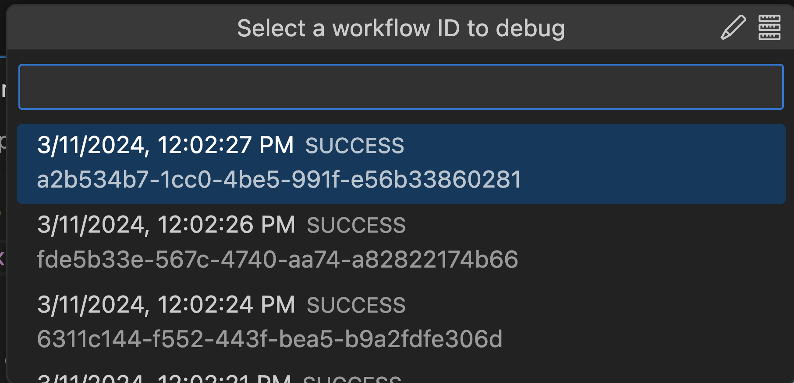

Now that we've learned a little about programming DBOS, let's learn how to use the DBOS Time Travel Debugger!

This tutorial assumes you have [Visual Studio Code](https://code.visualstudio.com/) installed.
Please see the VS Code documentation for [installation instructions](https://code.visualstudio.com/docs/setup/setup-overview) if necessary. 

:::info
If you're not a VS Code user, there is an advanced tutorial for [Time Travel Debugging with DBOS CLI](../cloud-tutorials/timetravel-debugging#time-travel-with-dbos-cli-non-vs-code-users).
:::

Additionally, this tutorial builds on the [DBOS Quickstart](./quickstart).
For convenience, we recommend [creating a DBOS Cloud account](./quickstart#deploying-to-dbos-cloud) and 
[provisioning a DBOS Cloud database instance](./quickstart#provisioning-a-cloud-database-instance) before starting this tutorial.

### Installing the DBOS Time Travel Debugging VS Code Extension

Before we use the DBOS Time Travel debugger, we need to install its VS Code extension.

To install the extension, navigate to the [extension's web page](https://marketplace.visualstudio.com/items?itemName=dbos-inc.dbos-ttdbg) and press the "Install" button. 
This will launch VS Code and open the DBOS Time Travel Debugger extension page inside the IDE. 
From there, select the "Install" button to install the extension.


:::info
You can also install the extension by opening the [Extension Marketplace](https://code.visualstudio.com/docs/editor/extension-marketplace) 
inside VS Code (default keybinding: Ctrl+Shift+X / ⇧⌘X) and searching for "DBOS".
:::

### Deploy the Programming Quickstart App to DBOS Cloud

In this tutorial, you will time travel debug the `greeting-emails` application you built in the [Programming Quickstart](./quickstart-programming). 

If you finished that tutorial, remove the sleep logic from `GreetingWorkflow`. 
We're not going to need that sleep code for this tutorial.

If you did not finished the Programming Quickstart, create a new DBOS application using `@dbos-inc/create`.

```
npx -y @dbos-inc/create@latest -n <app-name>
```

And replace the logic in `src/operations.ts` with the following.

```ts
import {
  TransactionContext, Transaction,
  HandlerContext, GetApi,
  CommunicatorContext, Communicator,
  WorkflowContext, Workflow,
} from "@dbos-inc/dbos-sdk";
import { Knex } from "knex";

export class Greetings {
  @Communicator()
  static async SendGreetingEmail(ctxt: CommunicatorContext, friend: string, content: string) {
      ctxt.logger.info(`Sending email "${content}" to ${friend}...`);
      // Code omitted for simplicity
      ctxt.logger.info("Email sent!");
  }

  @Transaction()
  static async InsertGreeting(ctxt: TransactionContext<Knex>, friend: string, content: string) {
      await ctxt.client.raw(
          "INSERT INTO dbos_greetings (greeting_name, greeting_note_content) VALUES (?, ?)",
          [friend, content]
      );
  }

  @Workflow()
  @GetApi("/greeting/:friend")
  static async GreetingWorkflow(ctxt: WorkflowContext, friend: string) {
      const noteContent = `Thank you for being awesome, ${friend}!`;
      await ctxt.invoke(Greetings).SendGreetingEmail(friend, noteContent);
      await ctxt.invoke(Greetings).InsertGreeting(friend, noteContent);
      ctxt.logger.info(`Greeting sent to ${friend}!`);
      return noteContent;
  }
}
```

Next, we are going to deploy this application to DBOS Cloud.
Currently, Time Travel Debugging is only supported for applications that have been deployed to DBOS Cloud.

If you finished the [DBOS quickstart](./quickstart), you should already have a DBOS Cloud account and database instance.
If you didn't finish the [Deploying to DBOS Cloud](./quickstart#deploying-to-dbos-cloud) section of that tutorial, 
please create an account and provision a cloud database instance by running the `npx dbos-cloud` commands shown below from project's root folder.

```
npx dbos-cloud register -u <username>
npx dbos-cloud db provision <database-instance-name> -U <database-username>
```

You can then deploy the app to DBOS Cloud by executing these commands from project's root folder:

```
npx dbos-cloud app register -d <database-instance-name>
npx dbos-cloud app deploy
```

:::info
DBOS Cloud database instances can host multiple application databases.
Even if you deployed the DBOS quickstart app, you can also deploy the `greeting-emails` app using the same database instance.
:::

When complete, the `npx dbos-cloud app deploy` command will print your application's URL to the console.
The URL will be formatted like:  `https://<username>-greeting-emails.cloud.dbos.dev/`.
Visit `https://<username>-greeting-emails.cloud.dbos.dev/greeting/dbos` in your browser a few times to generate data that we can use to demonstrate the time travel debugger.

### Time Travel Debugging Your Cloud Application

After you have installed the DBOS VS Code extension and deployed the app to DBOS Cloud, open up the project folder in VS Code then open the `src/operations.ts` file in the editor. 
Set a breakpoint at the top of each of the functions in the `operations.ts` file: `GreetingWorkflow`, `InsertGreeting`, `SendGreetingEmail`.
To set a breakpoint in VS Code, position the cursor on desired line and press `F9`.

Notice there is a Time Travel Debug CodeLens attached to each function in the app. 
This CodeLens is automatically attached to every DBOS Workflow, Transaction and Communicator function in a DBOS application.
Click on the CodeLens attached to the `GreetingWorkflow` function.


After you click on the CodeLens, you will given a list of workflow IDs of that function to choose from. 



After you select a workflow ID, the DBOS Time Travel Debugger will launch the DBOS debug runtime and VS Code TypeScript debugger.
The workflow will start executing and break on the breakpoint you set at the top of the `GreetingWorkflow` method.


The debugging experience for your DBOS application is similar to debugging any other 
[Node.JS application](https://code.visualstudio.com/docs/nodejs/nodejs-debugging) in VS Code.
You can [set breakpoints](https://code.visualstudio.com/docs/editor/debugging#_breakpoints),
[inspect variables](https://code.visualstudio.com/docs/editor/debugging#_data-inspection) and 
[step through your code](https://code.visualstudio.com/docs/editor/debugging#_debug-actions) as you would expect.
However, there is one significant difference that you will notice if you press the Continue (F5) in the debugger.


Even though you set a breakpoint in the `SendGreetingEmail` function, it did not get hit.
Instead, the debugger stopped at the breakpoint at the `InsertGreeting` function. 
This is by design.
[Communicators](../tutorials/communicator-tutorial.md) are used for code with non-idempotent side effects, such as sending an email to a user.
When debugging, DBOS skips communicators to avoid these side effects. 

### Debugging Your Updated Application

The Time Travel Debugger executes your DBOS application locally working against a snapshot of your DBOS Cloud database _as it existed at the time the selected workflow actually ran_.
Unfortunately, the programming quickstart application only writes data to the database, it does not read it.
This means the execution of `GreetingWorkflow` is identical regardless which workflow ID you selected to execute.
Let's modify the code to read some state from the database and see how this updated code interacts with existing workflow executions stored in DBOS Cloud.

Update `InsertGreeting` function to retrieve how many greetings the friend has received before and after the new greeting is added.

```ts
@Transaction()
static async InsertGreeting(ctxt: TransactionContext<Knex>, friend: string, content: string) {
    const before = await ctxt.client.raw(
        "SELECT count(*) FROM dbos_greetings WHERE greeting_name = ?", 
        [friend]
    );
    ctxt.logger.info(`before count ${before.rows[0].count}`);

    await ctxt.client.raw(
        "INSERT INTO dbos_greetings (greeting_name, greeting_note_content) VALUES (?, ?)",
        [friend, content]
    );

    const after = await ctxt.client.raw(
        "SELECT count(*) FROM dbos_greetings WHERE greeting_name = ?", 
        [friend]
    );
    ctxt.logger.info(`after count ${after.rows[0].count}`);
}
```

Now, when we click the `GreetingWorkflow` CodeLens, the workflow execution we select will affect the log output. 
If we select the oldest execution, we get output that looks like this.

```
2024-03-22 23:00:53 [info]: Running in debug mode! 
2024-03-22 23:00:53 [info]: Debugging mode proxy: localhost:2345 
2024-03-22 23:00:53 [info]: Workflow executor initialized 
2024-03-22 23:00:57 [info]: before count 0 
2024-03-22 23:00:57 [info]: after count 1 
2024-03-22 23:01:01 [info]: Greeting sent to friend! 
```

But if we select a later execution, we get different output.

```
2024-03-22 23:03:40 [info]: Running in debug mode! 
2024-03-22 23:03:40 [info]: Debugging mode proxy: localhost:2345 
2024-03-22 23:03:40 [info]: Workflow executor initialized 
2024-03-22 23:03:46 [info]: before count 2
2024-03-22 23:03:47 [info]: after count 3 
2024-03-22 23:03:47 [info]: Greeting sent to friend! 
```

To clarify what has happened here, you modified the InsertGreeting function to retrieve database state and log it.
Then, you executed that updated code in the Time Travel Debugger working against _past database state_.
Note, this worked even though your local code is different from the code running in DBOS Cloud!

:::warning
When time travel debugging, you can freely add read queries to your application and observe their results when run against past database state.
This state can be viewed via the logger as described above or via VS Code's variables window.
However, you cannot change code that updates database state (i.e. insert/delete/update SQL statements) or change the value returned from 
a workflow or transaction function.
:::

Now that you know the basics of DBOS Time Travel Debugging, please check out our [tutorials](../category/dbos-transact-tutorials).
To learn more about the Time Travel Debugger, check out our Time Travel Debugger [tutorial](../cloud-tutorials/timetravel-debugging)
and [reference](../api-reference/time-travel-debugger).