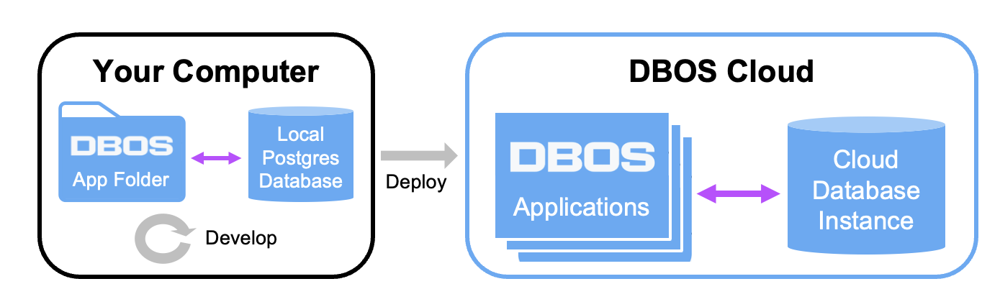

import Tabs from '@theme/Tabs';
import TabItem from '@theme/TabItem';

# DBOS Quickstart

You start developing a DBOS app by creating a folder for it on your computer. From this folder, you can run the app locally and deploy to DBOS Cloud in minutes.

In this guide, we start by deploying a sample "Hello" app to the cloud. After that, we provide instructions for running this app on your computer.

## Deploy Your First App to the Cloud

### 1. Install Node.js version 20 or later

<Tabs groupId="operating-systems">
<TabItem value="maclinux" label="macOS or Linux">
   Run the following commands in your terminal:

   ```bash
curl -o- https://raw.githubusercontent.com/nvm-sh/nvm/v0.39.7/install.sh | bash

export NVM_DIR="$HOME/.nvm"
[ -s "$NVM_DIR/nvm.sh" ] && \. "$NVM_DIR/nvm.sh"  # This loads nvm

nvm install 20
nvm use 20
   ```
</TabItem>
<TabItem value="win-ps" label="Windows">

Download Node.js 20 or later from the [official Node.js download page](https://nodejs.org/en/download) and install it.
After installing Node.js, create the following folder: `C:\Users\%user%\AppData\Roaming\npm`
(`%user%` is the Windows user on which you are logged in).
</TabItem>
</Tabs>

### 2. Create the app folder

Pick a name for your app, which should be 3 to 30 characters long and contain only lowercase letters and numbers, dashes, and underscores. Then, run this command:

```bash
npx -y @dbos-inc/create@latest -n <app-name>
```

For example, to name your app `hello`, run:
   ```bash
npx -y @dbos-inc/create@latest -n hello
   ```

This command should print `Application initialized successfully!` It creates a new folder named `<app-name>` that contains all the files needed by the "Hello" app. This app greets users and tracks the count of greetings per user. Enter the folder to perform the next step.

```
cd <app-name>
```

### 3. Deploy!

Run the following command to deploy your app to DBOS Cloud:
```
npx dbos-cloud app deploy
```

This command first prompts you to login, or register if this is your first time. Then, it prompts you to provision a free cloud database instance. Finally, it uploads your code to DBOS Cloud and deploys your app. After about a minute, it should succeed and print `Successfully deployed <app-name>! Access your application at <URL>`.

To see that your app is working, visit `<URL>` in your browser. For example, if your username is `mike` and your app name is `hello`, you would visit:
```
https://mike-hello.cloud.dbos.dev/
```

Congratulations, you've successfully deployed your first app to DBOS Cloud! You can see your deployed app in the [cloud console](https://console.dbos.dev/), or in the CLI by running `npx dbos-cloud app list`.


## Run the App on Your Computer

For development, testing, or self-hosted deployment, here's how to run this app on your local machine. This section assumes you've already created an app folder as described above.

### 1. Install Postgres or use Docker

The app needs a Postgres database to connect to. If you are familiar with Docker, you may find it convenient to use a Postgres container that we provide. Alternatively, you can install Postgres on your system:

<Tabs groupId="postgres-or-docker">
   <TabItem value="postgres" label="Install Postgres">
   <Tabs groupId="operating-systems">
      <TabItem value="mac" label="macOS">
         Follow [this official guide](https://www.postgresql.org/download/macosx/) to install Postgres on macOS.
      </TabItem>
      <TabItem value="linux" label="Linux">
         Follow these [official guides](https://www.postgresql.org/download/linux/) to install Postgres on several popular Linux distributions.
      </TabItem>
      <TabItem value="win-ps" label="Windows">
         Follow [this official guide](https://www.postgresql.org/download/windows/) to install Postgres on Windows.
      </TabItem>
   </Tabs>
   </TabItem>
   <TabItem value="docker" label="Launch Postgres with Docker">
   <Tabs groupId="operating-systems">
      <TabItem value="mac" label="macOS">
         You can install Docker on macOS through [Docker Desktop](https://docs.docker.com/desktop/install/mac-install/).
      </TabItem>
      <TabItem value="linux" label="Linux">
         Follow the [Docker Engine installation page](https://docs.docker.com/engine/install/) to install Docker on several popular Linux distributions.
      </TabItem>
      <TabItem value="win-ps" label="Windows">
         You can install Docker on Windows through [Docker Desktop](https://docs.docker.com/desktop/install/windows-install/).
      </TabItem>
   </Tabs>
   </TabItem>
</Tabs>


### 2. Configure the Postgres connection

<Tabs groupId="postgres-or-docker">
<TabItem value="postgres" label="Use Installed Postgres">

In your terminal, change to your app folder and run this command to configure your Postgres connection:

```
cd <app-folder>
npx dbos configure
```

The command will prompt you for your Postgres server hostname and port and for your Postgres username.
If you locally installed Postgres with the default settings, you can select the default hostname (`localhost`), port (`5432`), and username (`postgres`).

Then, set the `PGPASSWORD` environment variable to your Postgres password:

<Tabs groupId="operating-systems">
  <TabItem value="mac" label="macOS">
	  
   ```bash
export PGPASSWORD=<your-postgres-password>
   ```
  </TabItem>
    <TabItem value="linux" label="Linux">
	    
   ```bash
export PGPASSWORD=<your-postgres-password>
   ```
  </TabItem>
  <TabItem value="win-ps" label="Windows (PowerShell)">
  
     ```bash
$env:PGPASSWORD = "<your-postgres-password>"
   ```
  </TabItem>
  <TabItem value="win-cmd" label="Windows (cmd)">

     ```bash
set PGPASSWORD=<your-postgres-password>
   ```
  </TabItem>
</Tabs>

</TabItem>
<TabItem value="docker" label="Launch Postgres with Docker">

Run this script to launch Postgres in a Docker container:
<Tabs groupId="operating-systems">
  <TabItem value="mac" label="macOS">
	  
   ```bash
cd <application-folder>
export PGPASSWORD=dbos
# Docker may require sudo -E
node start_postgres_docker.js
   ```
  </TabItem>
    <TabItem value="linux" label="Linux">
	    
   ```bash
cd <application-folder>
export PGPASSWORD=dbos
# Docker may require sudo -E
node start_postgres_docker.js
   ```
  </TabItem>
  <TabItem value="win-ps" label="Windows (PowerShell)">
  
     ```bash
cd <app-folder>
$env:PGPASSWORD = "dbos"
node start_postgres_docker.js
   ```
  </TabItem>
  <TabItem value="win-cmd" label="Windows (cmd)">

     ```bash
cd <app-folder>
set PGPASSWORD=dbos
node start_postgres_docker.js
   ```
  </TabItem>
</Tabs>

If successful, the script should print `Database started successfully!`
:::tip
 You can connect to this container just like a local Postgres database, and run queries with common tools like [psql](https://www.postgresql.org/docs/current/app-psql.html). It accepts connections on `localhost`, the default port 5432, username `postgres` and the password you set above.
:::
</TabItem>
</Tabs>

### 3. Run the app

Next, let's create some tables in your database by running a schema migration:

   ```bash
npx dbos migrate
   ```

If successful, the migration should print `Migration successful!`.

Finally, build and run the app:

   ```bash
npm run build
npx dbos start
   ```

To see that it's working, visit this URL in your browser: [http://localhost:3000/greeting/dbos](http://localhost:3000/greeting/dbos).  You should get this message: `Hello, dbos! You have been greeted 1 times.` Each time you refresh the page, the counter should go up by one.

Congratulations!  You just launched your DBOS app locally!

Next, to learn how to build your own apps, check out our [programming guide](./quickstart-programming.md).
