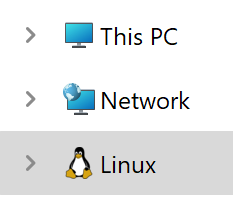

import Tabs from '@theme/Tabs';
import TabItem from '@theme/TabItem';

# DBOS SDK Quickstart

Here's how to get a simple DBOS "Hello, Database!" application up and running in less than five minutes, once System requirements are met!

The DBOS SDK requires [Node.js 20 or later](https://nodejs.org/en) and this tutorial uses [Docker](https://www.docker.com/) to launch a Postgres database (DBOS doesn't need Docker, but this tutorial uses it as a convenience).

To install both Node.js and Docker (assuming you don't already have them installed):

### Choose Operating System for System Requirements and Instructions

<Tabs groupId="operating-systems">
  <TabItem value="mac" label="macOS">
	  
Copy and run the following commands in your terminal to install Node.js:

   ```bash
curl -o- https://raw.githubusercontent.com/nvm-sh/nvm/v0.39.7/install.sh | bash

export NVM_DIR="$HOME/.nvm"
[ -s "$NVM_DIR/nvm.sh" ] && \. "$NVM_DIR/nvm.sh"  # This loads nvm

nvm install 20
nvm use 20
   ```

   An easy way to install Docker on MacOS is through [Docker Desktop](https://docs.docker.com/desktop/install/mac-install/).
   Download and install.
   
  </TabItem>
  <TabItem value="ubuntu" label="Ubuntu">
	  
  Copy and run the following commands in your terminal to install Node.js:
  
   ```bash
curl -o- https://raw.githubusercontent.com/nvm-sh/nvm/v0.39.7/install.sh | bash
source ~/.bashrc
nvm install 20
nvm use 20
   ```

  Copy and run the following commands in your terminal to install Docker:
  
   ```bash
sudo install -m 0755 -d /etc/apt/keyrings
curl -fsSL https://download.docker.com/linux/ubuntu/gpg | sudo gpg --dearmor -o /etc/apt/keyrings/docker.gpg
sudo chmod a+r /etc/apt/keyrings/docker.gpg
echo "deb [arch=$(dpkg --print-architecture) signed-by=/etc/apt/keyrings/docker.gpg] https://download.docker.com/linux/ubuntu $(. /etc/os-release && echo "$VERSION_CODENAME") stable" | sudo tee /etc/apt/sources.list.d/docker.list > /dev/null
sudo apt-get update
sudo apt-get install -yq docker-ce docker-ce-cli containerd.io docker-buildx-plugin docker-compose-plugin
sudo groupadd docker
sudo usermod -aG docker $USER
   ```

  </TabItem>
  <TabItem value="win" label="Windows 10/11 64 (WSL)">

	Download [Node.js 20 or later](https://nodejs.org/en) and install with "Additional Tools" selected.
	
  The following directories will be created:
  
	C:\Program Files\nodejs
 
	C:\PythonXXX (XXX is the Python version)
 
	C:\ProgramData\Chocolatey
 
	C:\ProgramData\ChocolateyHttpCache

  Windows 10/11 requires [WSL](https://learn.microsoft.com/en-us/windows/wsl/install).  Download and install
  A Linux environment will be created:
  
  
 
	The following directory will be created
	C:\Program Files\WSL
	
  Download and install [Docker Desktop](https://docs.docker.com/desktop/install/mac-install/).  

  The following directories will be created:
  
	C:\Program Files\Docker
 
	Linux\docker-desktop
 
	Linux\docker-desktop-data
	
	Manually create the following npm folder:
	C:\Users\%user%\AppData\Roaming\npm
	%user% is the Windows user you are logged in under

   It is recommend to use an elevated Windows Command Prompt over PowerShell.  There seems to be an issue later in the guide when using the export function to set the Postgres database password.
   </TabItem>
</Tabs>

After installing Docker, close and reopen your terminal to apply any changes. Then, verify Docker is working by running:

   ```bash
docker run hello-world
   ```

### Project Initialization

From your project folder initialize a new DBOS application, run the following command.
Application names should be between 3 and 30 characters and must contain only lowercase letters and numbers, dashes (`-`), and underscores (`_`).

   ```bash
npx -y @dbos-inc/dbos-sdk@latest init -n <app-name>
   ```

This creates a folder for your application, configures its layout, and installs required dependencies.
If successful, it should print `Application initialized successfully!`.

### Getting Started

By default, `dbos-sdk init` instantiates a "Hello, Database!" application which greets users and tracks the count of greetings per user.
First, we'll show you how to build and run it, then we'll show you how to extend it with more powerful features.

Before you can launch your app, you need a database.
DBOS works with any Postgres database, but to make things easier, we've provided a nifty script that starts a Docker Postgres container and creates a database:

<Tabs groupId="operating-systems">
  <TabItem value="mac" label="macOS">
	  
   ```bash
cd <application-folder>
export PGPASSWORD=dbos
./start_postgres_docker.sh
   ```
  </TabItem>
    <TabItem value="ubuntu" label="Ubuntu">
	    
   ```bash
cd <application-folder>
export PGPASSWORD=dbos
./start_postgres_docker.sh
   ```
  </TabItem>
  <TabItem value="win" label="Windows 10/11 64 (WSL)">
  The WSL installion installs and sets the default Linux distribution to docker-desktop.  For commands to work correctly we need to install Ubuntu by running:

   ```bash
cd <application-folder>
wsl --install
   ```
To confirm the list of Linux distributions run:   
   ```bash
  wsl -l
    ```
To change to the Ubuntu distribution run:
   ```bash
   wsl -s
   ```
We now need to switch to Ubuntu terminal prompt by running:
   ```bash
   wsi
   ```
 
We can now create the Postgres database by running:  
   ```bash
cd <application-folder>
export PGPASSWORD=dbos
. start_postgres_docker.sh
   ```  
  </TabItem>
</Tabs>

If successful, the script should print `Database started successfully!`.

Then, let's run a database migration to create some tables:

   ```bash
npx dbos-sdk migrate
   ```

If successful, the migration should print `Migration successful!`.

Next, build and run the app:

   ```bash
npm run build
npx dbos-sdk start
   ```

To see that it's working, visit this URL in your browser: [http://localhost:3000/greeting/dbos](http://localhost:3000/greeting/dbos).  You should get this message: `Hello, dbos! You have been greeted 1 times.` Each time you refresh the page, the counter should go up by one!

Congratulations!  You just launched your first DBOS application.

From here, if you want to deploy your application to DBOS Cloud, visit our [cloud quickstart](./quickstart-cloud.md).
If you want to learn how to build your own application, check out our [programming quickstart](./quickstart-programming.md).
