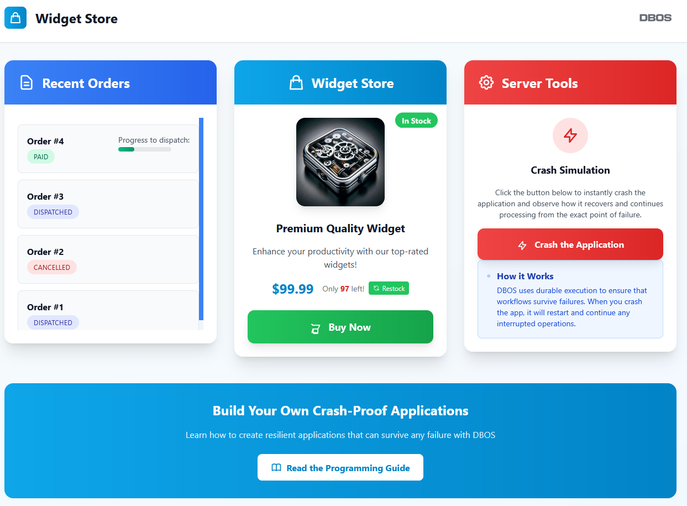

:::info
This example is also available in [TypeScript](../../typescript/examples/checkout-tutorial) and [Python](../../python/examples/widget-store.md).
:::

In this example, we use DBOS and Gin to build an online storefront that's resilient to any failure.

You can see the application live [here](https://demo-widget-store.cloud.dbos.dev/).
Try playing with it and pressing the crash button as often as you want.
Within a few seconds, the app will recover and resume as if nothing happened.

All source code is [available on GitHub](https://github.com/dbos-inc/dbos-demo-apps/tree/main/golang/widget-store).




## Building the Checkout Workflow

The heart of this application is the checkout workflow, which orchestrates the entire purchase process.
This workflow is triggered whenever a customer buys a widget and handles the complete order lifecycle:

1. Creates a new order in the system
2. Reserves inventory to ensure the item is available
3. Processes payment 
4. Marks the order as paid and initiates fulfillment
5. Handles failures gracefully by releasing reserved inventory and canceling orders when necessary

DBOS **durably executes** this workflow.
It checkpoints each step in the database so that if the app fails or is interrupted during checkout, it will automatically recover from the last completed step.
This means that customers never lose their order progress, no matter what breaks.

You can try this yourself!
On the [live application](https://demo-widget-store.cloud.dbos.dev/), start an order and press the crash button at any time.
Within seconds, your app will recover to exactly the state it was in before the crash and continue as if nothing happened.

```go
func checkoutWorkflow(ctx dbos.DBOSContext, _ string) (string, error) {
	workflowID, err := ctx.GetWorkflowID()
	if err != nil {
		logger.Error("workflow ID retrieval failed", "error", err)
		return "", err
	}

	// Create a new order
	orderID, err := dbos.RunAsStep(ctx, func(stepCtx context.Context) (int, error) {
		return createOrder(stepCtx)
	})
	if err != nil {
		logger.Error("order creation failed", "error", err, "wf_id", workflowID)
		return "", err
	}

	// Attempt to reserve inventory, cancelling the order if no inventory remains
	success, err := dbos.RunAsStep(ctx, func(stepCtx context.Context) (bool, error) {
		return reserveInventory(stepCtx)
	})
	if err != nil || !success {
		logger.Warn("no inventory", "order", orderID)
		dbos.RunAsStep(ctx, func(stepCtx context.Context) (string, error) {
			return updateOrderStatus(stepCtx, UpdateOrderStatusInput{OrderID: orderID, OrderStatus: CANCELLED})
		})
		err = dbos.SetEvent(ctx, PAYMENT_ID, "")
		return "", err
	}

	err = dbos.SetEvent(ctx, PAYMENT_ID, workflowID)
	if err != nil {
		logger.Error("payment event creation failed", "error", err, "order", orderID, "payment", workflowID)
		return "", err
	}

	payment_status, err := dbos.Recv[string](ctx, PAYMENT_STATUS, 60*time.Second)
	if err != nil || payment_status != "paid" {
		logger.Warn("payment failed", "order", orderID, "payment", workflowID, "status", payment_status)
		dbos.RunAsStep(ctx, func(stepCtx context.Context) (string, error) {
			return undoReserveInventory(stepCtx)
		})
		dbos.RunAsStep(ctx, func(stepCtx context.Context) (string, error) {
			return updateOrderStatus(stepCtx, UpdateOrderStatusInput{OrderID: orderID, OrderStatus: CANCELLED})
		})
	} else {
		logger.Info("payment success", "order", orderID, "payment", workflowID)
		dbos.RunAsStep(ctx, func(stepCtx context.Context) (string, error) {
			return updateOrderStatus(stepCtx, UpdateOrderStatusInput{OrderID: orderID, OrderStatus: PAID})
		})
		fmt.Println("calling dispatchOrderWorkflow")
		dbos.RunWorkflow(ctx, dispatchOrderWorkflow, orderID)
	}

	err = dbos.SetEvent(ctx, ORDER_ID, strconv.Itoa(orderID))
	if err != nil {
		logger.Error("order event creation failed", "error", err, "order", orderID)
		return "", err
	}
	return "", nil
}
```

## The Checkout and Payment Endpoints

Now let's implement the HTTP endpoints that handle customer interactions with the checkout system.

The checkout endpoint is triggered when a customer clicks the "Buy Now" button.
It starts the checkout workflow in the background, then waits for the workflow to generate and send it a unique payment ID.
It then returns the payment ID so the browser can redirect the user to the payments page.

The endpoint accepts an [idempotency key](../tutorials/workflow-tutorial.md#workflow-ids-and-idempotency) so that even if the customer presses "buy now" multiple times, only one checkout workflow is started.

```go
func checkoutEndpoint(c *gin.Context, dbosCtx dbos.DBOSContext, logger *slog.Logger) {
	idempotencyKey := c.Param("idempotency_key")

	// Start the checkout workflow with the idempotency key
	_, err := dbos.RunWorkflow(dbosCtx, checkoutWorkflow, "", dbos.WithWorkflowID(idempotencyKey))
	if err != nil {
		logger.Error("checkout workflow start failed", "error", err, "key", idempotencyKey)
		c.JSON(http.StatusInternalServerError, gin.H{"error": "Checkout failed to start"})
		return
	}

	payment_id, err := dbos.GetEvent[string](dbosCtx, idempotencyKey, PAYMENT_ID, 60*time.Second)
	if err != nil || payment_id == "" {
		logger.Error("payment ID retrieval failed", "key", idempotencyKey)
		c.JSON(http.StatusInternalServerError, gin.H{"error": "Checkout failed"})
		return
	}

	c.String(http.StatusOK, payment_id)
}
```

The payment endpoint handles the communication between the payment system and the checkout workflow.
It uses the payment ID to signal the checkout workflow whether the payment succeeded or failed.
It then retrieves the order ID from the checkout workflow so the browser can redirect the customer to the order status page.

```go
func paymentEndpoint(c *gin.Context, dbosCtx dbos.DBOSContext, logger *slog.Logger) {
	paymentID := c.Param("payment_id")
	paymentStatus := c.Param("payment_status")

	err := dbos.Send(dbosCtx, paymentID, paymentStatus, PAYMENT_STATUS)
	if err != nil {
		logger.Error("payment notification failed", "error", err, "payment", paymentID, "status", paymentStatus)
		c.JSON(http.StatusInternalServerError, gin.H{"error": "Failed to process payment"})
		return
	}

	orderID, err := dbos.GetEvent[string](dbosCtx, paymentID, ORDER_ID, 60*time.Second)
	if err != nil || orderID == "" {
		logger.Error("order ID retrieval failed", "payment", paymentID)
		c.JSON(http.StatusInternalServerError, gin.H{"error": "Payment failed to process"})
		return
	}

	c.String(http.StatusOK, orderID)
}
```

## Database Operations

Now, let's implement the checkout workflow's steps.
Each step performs a database operation, like updating inventory or order status.
These are implemented as regular Go functions that interact with the Postgres database.

<details>
<summary><strong>Database Operations</strong></summary>

```go
// Database operations for inventory management
func reserveInventory(ctx context.Context) (bool, error) {
	result, err := db.Exec(ctx,
		"UPDATE products SET inventory = inventory - 1 WHERE product_id = $1 AND inventory > 0",
		WIDGET_ID)
	if err != nil {
		return false, err
	}
	return result.RowsAffected() > 0, nil
}

func undoReserveInventory(ctx context.Context) (string, error) {
	_, err := db.Exec(ctx,
		"UPDATE products SET inventory = inventory + 1 WHERE product_id = $1",
		WIDGET_ID)
	return "", err
}

// Database operations for order management
func createOrder(ctx context.Context) (int, error) {
	var orderID int
	err := db.QueryRow(ctx,
		"INSERT INTO orders (order_status) VALUES ($1) RETURNING order_id",
		int(PENDING)).Scan(&orderID)
	return orderID, err
}

func updateOrderStatus(ctx context.Context, input UpdateOrderStatusInput) (string, error) {
	_, err := db.Exec(ctx,
		"UPDATE orders SET order_status = $1 WHERE order_id = $2",
		int(input.OrderStatus), input.OrderID)
	return "", err
}

func updateOrderProgress(ctx context.Context, orderID int) (int, error) {
	var progressRemaining int
	err := db.QueryRow(ctx,
		"UPDATE orders SET progress_remaining = progress_remaining - 1 WHERE order_id = $1 RETURNING progress_remaining",
		orderID).Scan(&progressRemaining)

	if err != nil {
		return 0, err
	}
	if progressRemaining == 0 {
		_, err = updateOrderStatus(ctx, UpdateOrderStatusInput{OrderID: orderID, OrderStatus: DISPATCHED})
	}

	return progressRemaining, err
}

// HTTP endpoints for accessing data
func getProduct(c *gin.Context, db *pgxpool.Pool, logger *slog.Logger) {
	var product Product
	err := db.QueryRow(context.Background(),
		"SELECT product_id, product, description, inventory, price FROM products LIMIT 1").
		Scan(&product.ProductID, &product.Product, &product.Description, &product.Inventory, &product.Price)

	if err != nil {
		logger.Error("product query failed", "error", err)
		c.JSON(http.StatusInternalServerError, gin.H{"error": "Failed to fetch product"})
		return
	}
	c.JSON(http.StatusOK, product)
}

func getOrders(c *gin.Context, db *pgxpool.Pool, logger *slog.Logger) {
	rows, err := db.Query(context.Background(),
		"SELECT order_id, order_status, last_update_time, progress_remaining FROM orders")
	if err != nil {
		logger.Error("orders database query failed", "error", err)
		c.JSON(http.StatusInternalServerError, gin.H{"error": "Failed to fetch orders"})
		return
	}
	defer rows.Close()

	orders := []Order{}
	for rows.Next() {
		var order Order
		err := rows.Scan(&order.OrderID, &order.OrderStatus, &order.LastUpdateTime, &order.ProgressRemaining)
		if err != nil {
			logger.Error("order data parsing failed", "error", err)
			c.JSON(http.StatusInternalServerError, gin.H{"error": "Failed to process orders"})
			return
		}
		orders = append(orders, order)
	}

	c.JSON(http.StatusOK, orders)
}

func getOrder(c *gin.Context, db *pgxpool.Pool, logger *slog.Logger) {
	idStr := c.Param("id")
	id, err := strconv.Atoi(idStr)
	if err != nil {
		logger.Warn("invalid order ID", "error", err, "id", idStr)
		c.JSON(http.StatusBadRequest, gin.H{"error": "Invalid order ID"})
		return
	}

	var order Order
	err = db.QueryRow(context.Background(),
		"SELECT order_id, order_status, last_update_time, progress_remaining FROM orders WHERE order_id = $1", id).
		Scan(&order.OrderID, &order.OrderStatus, &order.LastUpdateTime, &order.ProgressRemaining)

	if err != nil {
		if err == pgx.ErrNoRows {
			logger.Warn("order not found", "order", id)
			c.JSON(http.StatusNotFound, gin.H{"error": "Order not found"})
		} else {
			logger.Error("order database query failed", "error", err, "order", id)
			c.JSON(http.StatusInternalServerError, gin.H{"error": "Failed to fetch order"})
		}
		return
	}
	c.JSON(http.StatusOK, order)
}

func restock(c *gin.Context, db *pgxpool.Pool, logger *slog.Logger) {
	_, err := db.Exec(context.Background(), "UPDATE products SET inventory = 100")
	if err != nil {
		logger.Error("inventory update failed", "error", err)
		c.JSON(http.StatusInternalServerError, gin.H{"error": "Failed to restock inventory"})
		return
	}

	c.JSON(http.StatusOK, gin.H{"message": "Restocked successfully"})
}

// Crash the app--for demonstration purposes only :)
func crashApplication(c *gin.Context, logger *slog.Logger) {
	logger.Warn("application crash requested")
	c.JSON(http.StatusOK, gin.H{"message": "Crashing application..."})
	// Give time for response to be sent
	go func() {
		time.Sleep(100 * time.Millisecond)
		logger.Error("intentional crash for demo")
		os.Exit(1)
	}()
}
```
</details>

## Launching and Serving the App

Finally, here's the complete main function that initializes DBOS, sets up the database connection, registers workflows, and starts the Gin HTTP server:

```go
func main() {
	logger = slog.New(slog.NewJSONHandler(os.Stdout, &slog.HandlerOptions{
		Level: slog.LevelDebug,
	}))

	dbURL := os.Getenv("DBOS_SYSTEM_DATABASE_URL")
	if dbURL == "" {
		logger.Error("DBOS_SYSTEM_DATABASE_URL required")
		os.Exit(1)
	}

	dbosContext, err := dbos.NewDBOSContext(dbos.Config{
		AppName:         "gogogo",
		DatabaseURL:     os.Getenv("DBOS_SYSTEM_DATABASE_URL"),
		AdminServer:     true,
		Logger:          logger,
		ConductorAPIKey: os.Getenv("DBOS_CONDUCTOR_API_KEY"),
	})
	if err != nil {
		logger.Error("DBOS initialization failed", "error", err)
		os.Exit(1)
	}
	dbos.RegisterWorkflow(dbosContext, checkoutWorkflow)
	dbos.RegisterWorkflow(dbosContext, dispatchOrderWorkflow)

	err = dbosContext.Launch()
	if err != nil {
		logger.Error("DBOS service start failed", "error", err)
		os.Exit(1)
	}
	defer dbosContext.Shutdown(10 * time.Second)

	db, err = pgxpool.New(context.Background(), dbURL)
	if err != nil {
		logger.Error("database connection failed", "error", err)
		os.Exit(1)
	}
	defer db.Close()

	r := gin.Default()

	// Serve the HTML main page
	r.StaticFile("/", "./html/app.html")

	// HTTP endpoints
	r.GET("/product", func(c *gin.Context) { getProduct(c, db, logger) })
	r.GET("/orders", func(c *gin.Context) { getOrders(c, db, logger) })
	r.GET("/order/:id", func(c *gin.Context) { getOrder(c, db, logger) })
	r.POST("/restock", func(c *gin.Context) { restock(c, db, logger) })
	r.POST("/checkout/:idempotency_key", func(c *gin.Context) { checkoutEndpoint(c, dbosContext, logger) })
	r.POST("/payment_webhook/:payment_id/:payment_status", func(c *gin.Context) { paymentEndpoint(c, dbosContext, logger) })
	r.POST("/crash_application", func(c *gin.Context) { crashApplication(c, logger) })

	if err := r.Run(":8080"); err != nil {
		logger.Error("HTTP server start failed", "error", err)
		os.Exit(1)
	}
}
```


## Try it Yourself!

First, clone and enter the [dbos-demo-apps](https://github.com/dbos-inc/dbos-demo-apps) repository:

```shell
git clone https://github.com/dbos-inc/dbos-demo-apps.git
cd golang/widget-store
```

Then follow the instructions in the README to build and run the app!
