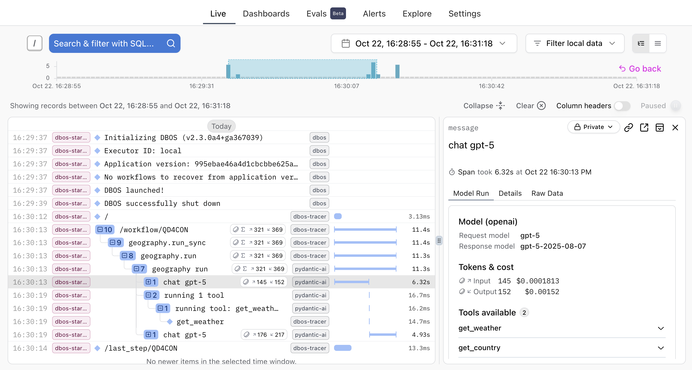

#  Use DBOS With Logfire

[Pydantic Logfire](https://logfire.pydantic.dev/docs/) is an observability platform built on OpenTelemetry that makes it easy to monitor your application.

This guide shows how to configure your DBOS application to export OpenTelemetry traces and logs to Logfire.

## Installation and Requirements

First, set up your Logfire account by following the instructions [here](https://logfire.pydantic.dev/docs/#logfire).

Next, generate a [write token](https://logfire.pydantic.dev/docs/how-to-guides/create-write-tokens/) so your application can push data to Logfire.

If you're not using the Logfire SDK, follow the instructions in [Configure DBOS OpenTelemetry Export](#configure-dbos-opentelemetry-export).

If you're using the Logfire SDK, follow the instructions in [Configure DBOS with Logfire SDK](#configure-dbos-with-logfire-sdk).


## Configure DBOS OpenTelemetry Export

The following section assumes you're not using the Logfire SDK. If you're using the Logfire SDK, skip this section and see [Configure DBOS with Logfire SDK](#configure-dbos-with-logfire-sdk).

First, set the `OTEL_EXPORTER_OTLP_HEADERS` environment variable to include your token:

```shell
export OTEL_EXPORTER_OTLP_HEADERS='Authorization=your-write-token'
```

:::tip

If you're deploying your app on DBOS Cloud, make sure to set `OTEL_EXPORTER_OTLP_HEADERS` in your application's [environment variables](../production/dbos-cloud/secrets).

:::

Then, configure your DBOS application to enable OpenTelemetry traces and export them to Logfire:

<LargeTabs groupId="language">
<LargeTabItem value="python" label="Python">

```python
dbos_config: DBOSConfig = {
    "name": "my-app",
# highlight-start
    "otlp_traces_endpoints": ["https://logfire-us.pydantic.dev/v1/traces"],
    "otlp_logs_endpoints": ["https://logfire-us.pydantic.dev/v1/logs"],
    "enable_otlp": True,
# highlight-end
}
DBOS(config=dbos_config)
```

</LargeTabItem>

<LargeTabItem value="typescript" label="Typescript">

```javascript
DBOS.setConfig({
  name: 'my-app',
// highlight-start
  otlpTracesEndpoints: ["https://logfire-us.pydantic.dev/v1/traces"],
  otlpLogsEndpoints: ["https://logfire-us.pydantic.dev/v1/logs"],
  enableOTLP: true,
// highlight-end
});
await DBOS.launch();
```

</LargeTabItem>
</LargeTabs>

:::tip

This page shows https://logfire-us.pydantic.dev as the base URL which is for the US region. If you are using the EU region, use https://logfire-eu.pydantic.dev instead.

:::

Now start your DBOS application. You should see your logs and traces appear on the Logfire dashboard!


## Configure DBOS with Logfire SDK

If you're using the Logfire SDK (currently only supported in Python), set the `LOGFIRE_TOKEN` environment variable to your write token:

```shell
export LOGFIRE_TOKEN='your-write-token'
```

:::tip

If you're deploying your app on DBOS Cloud, make sure to set `LOGFIRE_TOKEN` in your application's [environment variables](../production/dbos-cloud/secrets).

:::

Then, configure your DBOS application to use Logfire and enable OpenTelemetry traces. You don't need to set `otlp_traces_endpoints` or `otlp_logs_endpoints`, because the Logfire SDK automatically configures exporters.


```python
logfire.configure(service_name='my-app')
# (Optional) If you're using Pydantic AI, instrument the agents
logfire.instrument_pydantic_ai()

dbos_config: DBOSConfig = {
    "name": "my-app",
# highlight-start
    "enable_otlp": True,
# highlight-end
}
DBOS(config=dbos_config)
```

Now start your DBOS application. You should see your logs and traces appear on the Logfire dashboard! The following screenshot shows using DBOS durable agent integration, you can correlate Pydantic AI agent traces (e.g., token usage) and DBOS workflow execution in the same view.



For more details on using Logfire instrumentation with your application, see the [Pydantic Logfire documentation](https://logfire.pydantic.dev/docs/).
