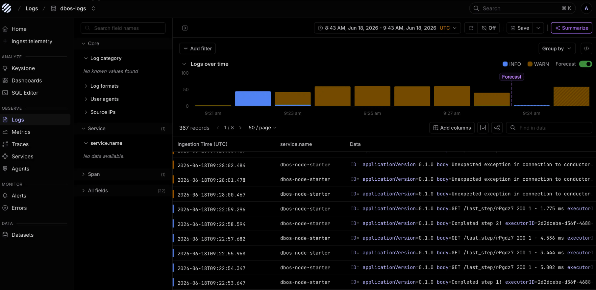

# Use DBOS With Parseable

[Parseable](https://www.parseable.com/) can ingest OpenTelemetry logs and traces from DBOS application processes as well as [Conductor Metrics](../production/metrics.md). 

For details, see the [Parseable DBOS Guide](https://www.parseable.com/docs/ingest-data/ai-agents/dbos).