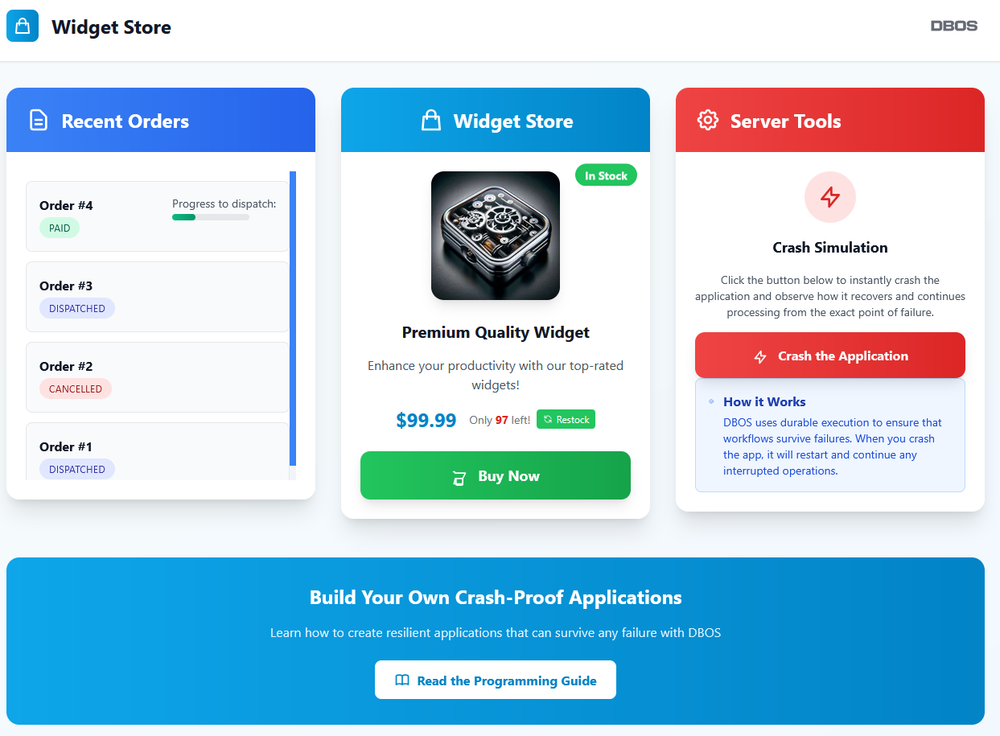

:::info
This example is also available in [TypeScript](../../typescript/examples/checkout-tutorial), [Go](../../golang/examples/widget-store), and [Python](../../python/examples/widget-store.md).
:::

In this example, we use DBOS and Spring Boot to build an online storefront that's resilient to any failure.

You can see the application live [here](https://demo-widget-store.cloud.dbos.dev/).
Try playing with it and pressing the crash button as often as you want.
Within a few seconds, the app will recover and resume as if nothing happened.

All source code is [available on GitHub](https://github.com/dbos-inc/dbos-demo-apps/tree/main/java/widget-store).




## Building the Checkout Workflow

The core of this application is the checkout workflow, which orchestrates the entire purchase process.
This workflow is triggered whenever a customer buys a widget and handles the complete order lifecycle:

1. Creates a new order in the system
2. Reserves inventory to ensure the item is available
3. Processes payment 
4. Marks the order as paid and initiates fulfillment
5. Handles failures gracefully by releasing reserved inventory and canceling orders when necessary

DBOS **durably executes** this workflow.
It checkpoints each step in the database so that if the app fails or is interrupted during checkout, it will automatically recover from the last completed step.
This means that customers never lose their order progress, no matter what breaks.

You can try this yourself!
On the [live application](https://demo-widget-store.cloud.dbos.dev/), start an order and press the crash button at any time.
Within seconds, your app will recover to exactly the state it was in before the crash and continue as if nothing happened.

```java
@Workflow
public String checkoutWorkflow(String key) {
    Integer orderId = DBOS.runStep(() -> service.createOrder(), "createOrder");
    try {
        DBOS.runStep(() -> service.subtractInventory(), "subtractInventory");
    } catch (RuntimeException e) {
        logger.error("Failed to reserve inventory for order {}", orderId);
        DBOS.runStep(() -> service.errorOrder(orderId), "errorOrder");
        DBOS.setEvent(PAYMENT_ID, null);
    }

    DBOS.setEvent(PAYMENT_ID, key);

    String payment_status = (String) DBOS.recv(PAYMENT_STATUS, Duration.ofSeconds(60));

    if (payment_status != null && payment_status.equals("paid")) {
        logger.info("Payment successful for order {}", orderId);
        DBOS.runStep(() -> service.markOrderPaid(orderId), "markOrderPaid");
        DBOS.startWorkflow(() -> service.dispatchOrderWorkflow(orderId));
    } else {
        logger.info("Payment failed for order {}", orderId);
        DBOS.runStep(() -> service.errorOrder(orderId), "errorOrder");
        DBOS.runStep(() -> service.undoSubtractInventory(), "undoSubtractInventory");
    }
    
    DBOS.setEvent(ORDER_ID, String.valueOf(orderId));
    return key;
}
```

## The Checkout and Payment Endpoints

Now let's implement the HTTP endpoints that handle customer interactions with the checkout system.

The checkout endpoint is triggered when a customer clicks the "Buy Now" button.
It starts the checkout workflow in the background, then waits for the workflow to generate and send it a unique payment ID.
It then returns the payment ID so the browser can redirect the user to the payments page.

The endpoint accepts an [idempotency key](../tutorials/workflow-tutorial.md#workflow-ids-and-idempotency) so that even if the customer presses "buy now" multiple times, only one checkout workflow is started.

```java
public ResponseEntity<String> checkout(@PathVariable String key) {
    logger.info("Checkout requested with key: " + key);
    
    try {
        // Execute the checkout workflow using DBOS
        logger.info("Calling checkoutWorkflow on service: {}", widgetStoreService.getClass().getName());
        var options = new StartWorkflowOptions(key);
        DBOS.startWorkflow(() -> widgetStoreService.checkoutWorkflow(key), options);

        String paymentID = (String) DBOS.getEvent(key, PAYMENT_ID, Duration.ofSeconds(60));
        if (paymentID == null) {
            return ResponseEntity.internalServerError().body("Item not available");
        }
        return ResponseEntity.ok(paymentID);
        
    } catch (RuntimeException e) {
        logger.error("Checkout failed: " + e.getMessage());
        return ResponseEntity.internalServerError().body("Error starting checkout");
    }
}
```

The payment endpoint handles the communication between the payment system and the checkout workflow.
It uses the payment ID to signal the checkout workflow whether the payment succeeded or failed.
It then retrieves the order ID from the checkout workflow so the browser can redirect the customer to the order status page.

```go
@PostMapping("/payment_webhook/{key}/{status}")
public ResponseEntity<String> paymentWebhook(@PathVariable String key, @PathVariable String status) {
    logger.info("Payment webhook called with key: " + key + ", status: " + status);
    
    try {
        DBOS.send(key, status, PAYMENT_STATUS);
        String orderId = (String) DBOS.getEvent(key, ORDER_ID, Duration.ofSeconds(60));
        return ResponseEntity.ok(orderId);
    } catch (Exception e) {
        logger.error("Payment webhook processing failed", e);
        return ResponseEntity.internalServerError().body("Error processing payment");
    }
}
```

## Database Operations

Now, let's implement the checkout workflow's steps.
Each step performs a database operation, like updating inventory or order status.
These are implemented as regular Java functions that interact with the Postgres database.

<details>
<summary><strong>Database Operations</strong></summary>

```java
@Transactional
public class WidgetStoreServiceImpl implements WidgetStoreService {
    
    private static final Logger logger = LoggerFactory.getLogger(WidgetStoreServiceImpl.class);

    private final DSLContext dsl;

    public WidgetStoreServiceImpl(DSLContext dsl) {
        this.dsl = dsl;
    }

    private WidgetStoreService service;

    public void setProxy(WidgetStoreService service) {
        this.service=service;
    }

    public ProductDto retrieveProduct() {
        Products product = dsl.selectFrom(PRODUCTS)
                .where(PRODUCTS.PRODUCT_ID.eq(PRODUCT_ID))
                .fetchOneInto(Products.class);
        
        if (product == null) {
            return null;
        }
        
        return new ProductDto(
                product.getProductId(),
                product.getProduct(),
                product.getDescription(),
                product.getInventory(),
                product.getPrice()
        );
    }

    public void setInventory(int inventory) {
        dsl.update(PRODUCTS)
                .set(PRODUCTS.INVENTORY, inventory)
                .where(PRODUCTS.PRODUCT_ID.eq(PRODUCT_ID))
                .execute();
    }

    public void subtractInventory() throws RuntimeException {
        int updated = dsl.update(PRODUCTS)
                .set(PRODUCTS.INVENTORY, PRODUCTS.INVENTORY.minus(1))
                .where(PRODUCTS.PRODUCT_ID.eq(PRODUCT_ID))
                .and(PRODUCTS.INVENTORY.ge(1))
                .execute();
        
        if (updated == 0) {
            throw new RuntimeException("Insufficient Inventory");
        }
    }

    public void undoSubtractInventory() {
        dsl.update(PRODUCTS)
                .set(PRODUCTS.INVENTORY, PRODUCTS.INVENTORY.plus(1))
                .where(PRODUCTS.PRODUCT_ID.eq(PRODUCT_ID))
                .execute();
    }

    public Integer createOrder() {
        return dsl.insertInto(ORDERS)
                .set(ORDERS.ORDER_STATUS, OrderStatus.PENDING.getValue())
                .set(ORDERS.PRODUCT_ID, PRODUCT_ID)
                .set(ORDERS.LAST_UPDATE_TIME, LocalDateTime.now())
                .set(ORDERS.PROGRESS_REMAINING, 10)
                .returningResult(ORDERS.ORDER_ID)
                .fetchOne()
                .get(ORDERS.ORDER_ID);
    }

    public OrderDto retrieveOrder(int orderId) {
        Orders order = dsl.selectFrom(ORDERS)
                .where(ORDERS.ORDER_ID.eq(orderId))
                .fetchOneInto(Orders.class);
        
        if (order == null) {
            return null;
        }
        
        return new OrderDto(
                order.getOrderId(),
                order.getOrderStatus(),
                order.getLastUpdateTime(),
                order.getProductId(),
                order.getProgressRemaining()
        );
    }

    public List<OrderDto> retrieveOrders() {
        List<Orders> orders = dsl.selectFrom(ORDERS)
                .orderBy(ORDERS.ORDER_ID.desc())
                .fetchInto(Orders.class);
        
        return orders.stream()
                .map(order -> new OrderDto(
                        order.getOrderId(),
                        order.getOrderStatus(),
                        order.getLastUpdateTime(),
                        order.getProductId(),
                        order.getProgressRemaining()
                ))
                .collect(Collectors.toList());
    }

    public void markOrderPaid(int orderId) {
        dsl.update(ORDERS)
                .set(ORDERS.ORDER_STATUS, OrderStatus.PAID.getValue())
                .set(ORDERS.LAST_UPDATE_TIME, LocalDateTime.now())
                .where(ORDERS.ORDER_ID.eq(orderId))
                .execute();
    }

    public void errorOrder(int orderId) {
        dsl.update(ORDERS)
                .set(ORDERS.ORDER_STATUS, OrderStatus.CANCELLED.getValue())
                .set(ORDERS.LAST_UPDATE_TIME, LocalDateTime.now())
                .where(ORDERS.ORDER_ID.eq(orderId))
                .execute();
    }

    @Workflow
    public void dispatchOrderWorkflow(Integer orderId) {
        for (int i = 0; i < 10; i++) {
            DBOS.sleep(Duration.ofSeconds(1));
            DBOS.runStep(() -> service.updateOrderProgress(orderId), "updateOrderProgress");
        }
    }

    public void updateOrderProgress(Integer orderId) {
        Integer progressRemaining = dsl.update(ORDERS)
                .set(ORDERS.PROGRESS_REMAINING, ORDERS.PROGRESS_REMAINING.minus(1))
                .set(ORDERS.LAST_UPDATE_TIME, LocalDateTime.now())
                .where(ORDERS.ORDER_ID.eq(orderId))
                .returningResult(ORDERS.PROGRESS_REMAINING)
                .fetchOne()
                .get(ORDERS.PROGRESS_REMAINING);

        if (progressRemaining == 0) {
            dsl.update(ORDERS)
                    .set(ORDERS.ORDER_STATUS, OrderStatus.DISPATCHED.getValue())
                    .set(ORDERS.LAST_UPDATE_TIME, LocalDateTime.now())
                    .where(ORDERS.ORDER_ID.eq(orderId))
                    .execute();
        }
    }
}
```
</details>

## Launching and Serving the App

To run this app, we need beans to create and configure DBOS and register workflows:

```java
@Configuration
public class WidgetStoreConfig {

    @Bean
    @Primary
    public WidgetStoreService widgetStoreService(DSLContext dslContext) {
        var impl = new WidgetStoreServiceImpl(dslContext);
	    var proxy = DBOS.registerWorkflows(WidgetStoreService.class, impl);
        impl.setProxy(proxy);
        return proxy;
    }

    @Bean
    DBOSConfig dbosConfig() {
        String databaseUrl = System.getenv("DBOS_SYSTEM_JDBC_URL");
        if (databaseUrl == null || databaseUrl.isEmpty()) {
            databaseUrl = "jdbc:postgresql://localhost:5432/widget_store_java";
        }
        return DBOSConfig.defaults("widget-store")
                .withDatabaseUrl(databaseUrl)
                .withDbUser(Objects.requireNonNullElse(System.getenv("PGUSER"), "postgres"))
                .withDbPassword(Objects.requireNonNullElse(System.getenv("PGPASSWORD"), "dbos"))
                .withAdminServer(true);
    }

    @Bean
    public DBOS.Instance dbos(DBOSConfig config) {
        return DBOS.configure(config);
    }
}
```

We also hook into the Spring Boot lifecycle to launch and shut down DBOS:

```java
@Component
@Lazy(false)
public class DBOSLifecycle implements SmartLifecycle {

    private static final Logger log = LoggerFactory.getLogger(DBOSLifecycle.class);
    private volatile boolean running = false;

    @Override
    public void start() {
        log.info("Launch DBOS");
        DBOS.launch();
        running = true;
    }

    @Override
    public void stop() {
        log.info("Shut Down DBOS");
        try {
            DBOS.shutdown();
        } finally {
            running = false;
        }
    }

    @Override public boolean isRunning() { return running; }

    @Override public boolean isAutoStartup() { return true; }

    // Start BEFORE the web server (default is 0). Lower = earlier.
    @Override public int getPhase() { return -1; }
}
```

## Try it Yourself!

First, clone and enter the [dbos-demo-apps](https://github.com/dbos-inc/dbos-demo-apps) repository:

```shell
git clone https://github.com/dbos-inc/dbos-demo-apps.git
cd java/widget-store
```

Then follow the instructions in the README to build and run the app!
