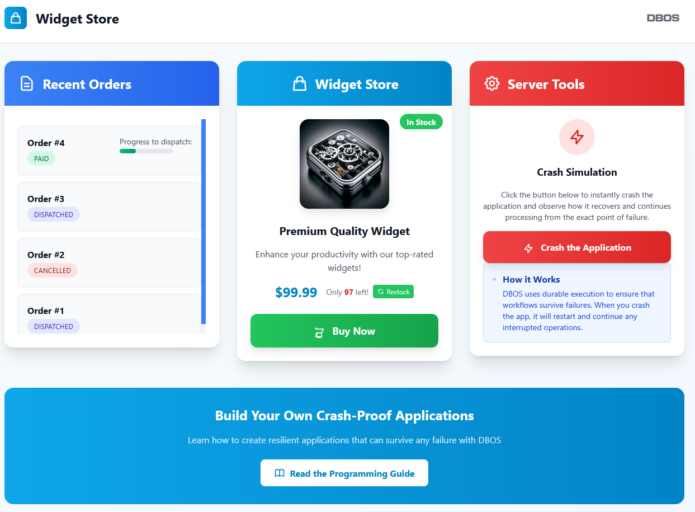

:::info
This example is also available in [TypeScript](../../typescript/examples/checkout-tutorial), [Go](../../golang/examples/widget-store), and [Python](../../python/examples/widget-store.md).
:::

In this example, we use DBOS and Spring Boot to build an online storefront that's resilient to any failure.

You can see the application live [here](https://demo-widget-store.cloud.dbos.dev/).
Try playing with it and pressing the crash button as often as you want.
Within a few seconds, the app will recover and resume as if nothing happened.

All source code is [available on GitHub](https://github.com/dbos-inc/dbos-demo-apps/tree/main/java/widget-store).




## Building the Checkout Workflow

The core of this application is the checkout workflow, which orchestrates the entire purchase process.
This workflow is triggered whenever a customer buys a widget and handles the complete order lifecycle:

1. Reserves inventory to ensure the item is available
2. Creates a new order in the system
3. Processes payment 
4. Marks the order as paid and initiates fulfillment
5. Handles failures gracefully by releasing reserved inventory and canceling orders when necessary

DBOS **durably executes** this workflow.
It checkpoints each step in the database so that if the app fails or is interrupted during checkout, it will automatically recover from the last completed step.
This means that customers never lose their order progress, no matter what breaks.

You can try this yourself!
On the [live application](https://demo-widget-store.cloud.dbos.dev/), start an order and press the crash button at any time.
Within seconds, your app will recover to exactly the state it was in before the crash and continue as if nothing happened.

```java
@Workflow
public String checkoutWorkflow(String key) {
  try {
    dbos.runStep(() -> repo.subtractInventory(), "subtractInventory");
  } catch (RuntimeException e) {
    logger.error("Failed to reserve inventory for workflow {}", DBOS.workflowId());
    dbos.setEvent(PAYMENT_ID, null);
    return;
  }

  var orderId = dbos.runStep(() -> repo.createOrder(), "createOrder");

  dbos.setEvent(PAYMENT_ID, DBOS.workflowId());
  var payment_status = dbos.<String>recv(PAYMENT_STATUS, Duration.ofSeconds(120));

  if (payment_status.map(ps -> ps.equals("paid")).orElse(false)) {
    logger.info("Payment successful for order {}", orderId);
    dbos.runStep(() -> repo.markOrderPaid(orderId), "markOrderPaid");
    dbos.startWorkflow(() -> self.dispatchOrderWorkflow(orderId));
  } else {
    logger.info("Payment failed for order {}", orderId);
    dbos.runStep(() -> repo.errorOrder(orderId), "errorOrder");
    dbos.runStep(() -> repo.undoSubtractInventory(), "undoSubtractInventory");
  }

  dbos.setEvent(ORDER_ID, String.valueOf(orderId));
}
```

## The Checkout and Payment Endpoints

Now let's implement the HTTP endpoints that handle customer interactions with the checkout system.

The checkout endpoint is triggered when a customer clicks the "Buy Now" button.
It starts the checkout workflow in the background, then waits for the workflow to generate and send it a unique payment ID.
It then returns the payment ID so the browser can redirect the user to the payments page.

The endpoint accepts an [idempotency key](../tutorials/workflow-tutorial.md#workflow-ids-and-idempotency) so that even if the customer presses "buy now" multiple times, only one checkout workflow is started.

```java
@PostMapping("/checkout/{key}")
public ResponseEntity<String> checkout(@PathVariable String key) {
  logger.info("Checkout requested with key: " + key);

  var options = new StartWorkflowOptions(key);
  dbos.startWorkflow(() -> service.checkoutWorkflow(), options);
  var paymentId = dbos.<String>getEvent(key, PAYMENT_ID, Duration.ofSeconds(60));
  if (paymentId.isEmpty()) {
    throw new RuntimeException("Item not available");
  } else {
    return ResponseEntity.ok(paymentId.get());
  }
}
```

The payment endpoint handles the communication between the payment system and the checkout workflow.
It uses the payment ID to signal the checkout workflow whether the payment succeeded or failed.
It then retrieves the order ID from the checkout workflow so the browser can redirect the customer to the order status page.

```java
@PostMapping("/payment_webhook/{key}/{status}")
public ResponseEntity<String> paymentWebhook(@PathVariable String key, @PathVariable String status) {
  logger.info("Payment webhook called with key: " + key + ", status: " + status);

  dbos.send(key, status, PAYMENT_STATUS);
  var orderId = dbos.<String>getEvent(key, ORDER_ID, Duration.ofSeconds(60));
  return ResponseEntity.ok(orderId.orElse(null));
}
```

## Database Operations

Now, let's take a look at how the checkout workflow's steps are implemented.
Each step performs a database operation, like updating inventory or order status.
These are implemented as [@Transactional](https://docs.spring.io/spring-framework/reference/data-access/transaction/declarative/annotations.html) Java functions that interact with the PostgreSQL database.

```java
@Transactional
public class WidgetStoreRepository {

  private static final int PRODUCT_ID = 1;

  // Product and Order Repository classes are JpaRepository implementations
  private final ProductRepository productRepository;
  private final OrderRepository orderRepository;

  public WidgetStoreRepository(ProductRepository productRepository, OrderRepository orderRepository) {
    this.productRepository = productRepository;
    this.orderRepository = orderRepository;
  }

  public ProductDto retrieveProduct() {
    return productRepository.findById(PRODUCT_ID).map(ProductDto::fromEntity).orElse(null);
  }

  @Transactional
  public void setInventory(int inventory) {
    productRepository.setInventory(PRODUCT_ID, inventory);
  }

  @Transactional
  public void subtractInventory() {
    int updated = productRepository.subtractInventory(PRODUCT_ID);
    if (updated == 0) {
      throw new RuntimeException("Insufficient Inventory");
    }
  }

  @Transactional
  public void undoSubtractInventory() {
    productRepository.addInventory(PRODUCT_ID);
  }

  @Transactional
  public Integer createOrder() {
    Product product = productRepository.getReferenceById(PRODUCT_ID);
    Order order = new Order();
    order.setOrderStatus(OrderStatus.PENDING);
    order.setProduct(product);
    order.setLastUpdateTime(LocalDateTime.now());
    order.setProgressRemaining(10);
    return orderRepository.save(order).orderId();
  }

  public OrderDto retrieveOrder(int orderId) {
    return orderRepository.findById(orderId).map(OrderDto::fromEntity).orElse(null);
  }

  public List<OrderDto> retrieveOrders() {
    return orderRepository.findAllByOrderByOrderIdDesc().stream()
        .map(OrderDto::fromEntity)
        .toList();
  }

  @Transactional
  public void markOrderPaid(int orderId) {
    orderRepository.updateOrderStatus(orderId, OrderStatus.PAID);
  }

  @Transactional
  public void errorOrder(int orderId) {
    orderRepository.updateOrderStatus(orderId, OrderStatus.CANCELLED);
  }

  @Transactional
  public void updateOrderProgress(int orderId) {
    Order order =
        orderRepository
            .findById(orderId)
            .orElseThrow(() -> new RuntimeException("Order not found: " + orderId));
    order.setProgressRemaining(order.progressRemaining() - 1);
    order.setLastUpdateTime(LocalDateTime.now());
    if (order.progressRemaining() == 0) {
      order.setOrderStatus(OrderStatus.DISPATCHED);
    }
    orderRepository.save(order);
  }
}
```

## Launching and Serving the App

`transact-spring-boot-starter` automatically provides `DBOSConfig` and `DBOS` beans, 
automatically creates proxies for beans with `@Workflow` or `@Step` annotations
and hooks into Spring's lifecycle management to automatically `dbos.launch()` and `dbos.shutdown()`.

WidgetStoreConfig only exists to create the app database on startup and run Flyway migrations, making the demo app easier to run.

## Try it Yourself!

First, clone and enter the [dbos-demo-apps](https://github.com/dbos-inc/dbos-demo-apps) repository:

```shell
git clone https://github.com/dbos-inc/dbos-demo-apps.git
cd java/widget-store
```

Then follow the instructions in the README to build and run the app!
