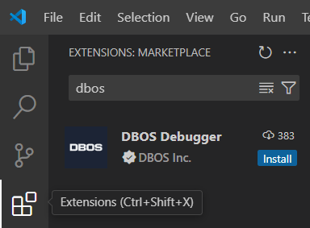

:::info
Interactive time travel is only available for DBOS Cloud applications using the **experimental** time travel feature.
:::

In this guide, you'll learn how to interactively time travel with DBOS Cloud: how to query your application's database as of any past point in time within the time travel [data retention period](https://www.dbos.dev/pricing) of your current plan.

## Preliminaries

Before following the steps in this guide, make sure you've [deployed an application to DBOS Cloud](application-management) with [time travel enabled](./cloud-cli#dbos-cloud-app-deploy).

Time travel debugging uses [Visual Studio Code](https://code.visualstudio.com/) and the
[DBOS Debugger Extension](https://marketplace.visualstudio.com/items?itemName=dbos-inc.dbos-ttdbg).
The extension can be installed from the link above or by searching the
[Extension Marketplace](https://code.visualstudio.com/docs/editor/extension-marketplace)
inside VS Code for "DBOS"



Once installed, the DBOS Time Travel Extension will automatically update as new releases are published to the VS Code Marketplace.


<Tabs groupId="environment" className="small-tabs">
  <TabItem value="VSCode" label="VSCode">
	  Open VSCode to your application folder. In the DBOS Cloud View, hover over the application you want to debug and select the `Launch Debug Proxy` menu item.
    This automatically launches the time travel proxy and connects it to your application database instance.


  </TabItem>
  <TabItem value="CLI" label="CLI">
	  Open a terminal window and navigate to the folder where you downloaded the pre-compiled debug proxy binary file (`debug-proxy`).
   ```bash
cd <Your Download Folder>/
chmod +x debug-proxy
./debug-proxy -db <app database name>_dbos_prov -host <app cloud database hostname>  -password <database password> -user <database username>
   ```
  </TabItem>
</Tabs>

:::info
The DBOS time travel proxy securely connects to the [provenance database](../../explanations/system-tables.md), an append-only replica of your application database maintained by DBOS Cloud.
It uses the historical information in this database to run time-travelled queries without modifying your application database.
:::

## Running Time-Travelled Queries

In this tutorial, we interactively run time-travelled queries on your application database using [`psql`](https://www.postgresql.org/docs/current/app-psql.html).
First, connect `psql` to your local time travel proxy:

```bash
psql -h localhost -p 2345 -U postgres
```

By default, any queries you run will reflect the current state of your database.
Let's assume you've deployed a simple application to DBOS Cloud.
The application's `dbos_hello` table tracks how many times each person has been greeted.
The following query tells you how many times Mike has been greeted:

```sql
postgres=> select greet_count from dbos_hello where name = 'Mike';
 greet_count
-------------
           8
```

Now, let's time travel!
To view your database at a past point in time, you can set the timestamp through the special `DBOS TS <timestamp>;` command.
We support any timestamp string in [RFC 3339 format](https://datatracker.ietf.org/doc/html/rfc3339).
For example, to view your database at 4:00:00 PM PDT (UTC-07:00) on 2024-04-26, and see how many times Mike had been greeted as of then, run:

```sql
postgres=> DBOS TS '2024-04-26T16:00:00-07:00';
postgres=> select greet_count from dbos_hello where name = 'Mike';
 greet_count
-------------
           4
```

You can run any `SELECT` statement on the database to query its state as of the timestamp you chose.
Statements that modify schemas or data (`INSERT`, `UPDATE`, `DROP TABLE`, etc.) will not have any effect.
At any time, you can run `DBOS TS <timestamp>;` again to travel to a different time.
You can also run `DBOS SNAPSHOT RESET;` to return to the present time.

## Interactive Time Travel Command Reference

When interactively querying your DBOS Cloud database, the following additional commands can be invoked from the 
[`psql`](https://www.postgresql.org/docs/current/app-psql.html) command prompt. 
As is typical for SQL commands, the interactive time travel commands are case insensitive.

### DBOS TIMESTAMP

::::info
Can be shortened to `DBOS TS`
::::

Sets the time travel debugger to a specific point in time for time travel queries. The timestamp can be specified in
[RFC 3339 format](https://datatracker.ietf.org/doc/html/rfc3339) (example: `2024-04-22T14:56:56-07:00`)
or as an integer indicating the Unix epoch in milliseconds. RFC 3339 formatted timestamps
must be enclosed in quotes.

Examples:

* `DBOS TIMESTAMP "2024-04-22T14:56:56-07:00";`
* `DBOS TS "2024-04-22T14:56:56-07:00";`
* `DBOS TIMESTAMP 1234567890;`

### DBOS WORKFLOW

::::info
Can be shortened to `DBOS WF`
::::

Sets the time travel debugger to the specific point in time when a specified workflow started. 
Workflows are identified by their workflow UUID, which can be found in the
[Monitoring Dashboard](./monitoring-dashboard.md).
The workflow UUID must be enclosed in quotes when using this command.

Examples:

* `DBOS WORKFLOW "7eb0968a-fbf0-4af2-909f-51d8516e7351";`
* `DBOS WF "7eb0968a-fbf0-4af2-909f-51d8516e7351";`

### DBOS SNAPSHOT RESET

Resets the time travel snapshot to the current time.  Example:

* `DBOS SNAPSHOT RESET;`
