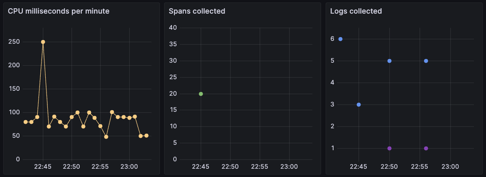
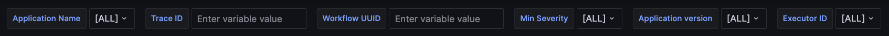

The [DBOS Cloud Console](https://console.dbos.dev) provides several tools to monitor your applications.

### Logs

You can view your application's logs from your application's cloud console page.
Logs are paginated and ordered chronologically.

### Traces

You can view traces for all your applications from the cloud console [traces page](https://console.dbos.dev/traces).
You can filter traces by application, time, operation, type, and status.
Traces are sorted chronologically and displayed hierarchically.
You can click on a trace or span to see detailed information about it.

### Grafana Dashboard

You can launch a Grafana dashboard for DBOS Cloud from the cloud console [dashboard page](https://console.dbos.dev/dashboard).

#### Time Selection

In the top-right corner, the Grafana dashboard provides a time selector, defaulting to the last hour. You can change this setting to navigate to a different window of time. All of the panels are filtered for the selected time interval.

Under the time selector you can find time series for active CPU milliseconds used by your apps and the counts of logs and traces generated by your applications, summarized for every minute. These panes have a matched time axis. You can click and drag across an interesting region in the series to "zoom in". 

This will update the time selector and, therefore, all other panels. You can then use the time selector to "zoom back out" or use the `<` and `>` buttons to move backwards and forwards in time.

#### Grafana Logs and Traces

On the left side, the Grafana dashboard provides a log view with entries generated by your applications arranged chronologically. The pane displays up to 1,000 most recent log records in the selected time period. Log records are color coded by severity level. Special entries for application lifetime events are colored grey and labeled as `[APP REGISTER]`, `[APP DEPLOY]` and so on. These are generated by DBOS Cloud automatically and not shown in the summarized log counts. You can click on a log record to browse additional metadata. In the example below, we see logs for an example app first getting registered, then undergoing schema migration, then getting deployed:

On the bottom of the dashboard, there is a table of traces. Each row corresponds to a handler, workflow, transaction or step span. Each span is timestamped and decorated with duration in milliseconds, the IDs of the trace and workflow it belongs to, its execution status, and other information. 

#### Filtering

In the top-right corner of the Grafana dashboard, there are filtering selectors:

1. you can select a single `Application Name` to filter for. Refresh the browser to update the list of names for a new app.
2. you can paste a specific `Trace ID` to only view logs and spans for that Trace. To clear, erase the text and press "return."
3. similar to Trace ID you can copy-paste a specific `Workflow UUID` to filter by that. It is cleared the same way as Trace ID.
4. you can use `Trace Operation Type` to filter for "handler", "workflow", "transaction" or "step" spans.
5. you can set `Trace Operation Name` to the name of a specific function.

:::tip
When turning on these filters, the time window filter also still applies. You may see more data for your selection if you "zoom out" in time.
:::

When filtering the `Workflow UUID` use `_` to match any one character and `%` to match any string (SQL 'like' notation). This is useful for selecting groups of scheduled workflows. For example you can use a string like `sched%T19%` to match any scheduled workflows that ran at 7PM on any of the days in the selected time interval. 

#### Requests and CPU Milliseconds

The Grafana dashboard tracks the total requests and active CPU milliseconds for all your apps. These totals are updated every time you refresh your dashboard. They are applied against your DBOS Pricing tier's [execution time limit](https://www.dbos.dev/pricing). Please allow up to 20 seconds of delay between an event happening and the dashboard refresh showing it.

The number of total active CPU milliseconds since the start of the month is at the top in orange. The light orange "selection" number to the right changes with the selected app(s) and time window. You can select a particular app or workload and see how much it contributes to your total. 

:::tip
It is possible for one or two small API calls to not consume a measurable amount of CPU ms. It is also normal for an idle app to use a negligible amount of CPU ms for periodic health checks and background tasks. For best results, run an example workflow of at least 10 API calls (the more the better). Observe how much CPU ms your example uses and extrapolate to your monthly expected usage.
:::

The total number of Requests since the start of the month is in the top left corner in purple. You can find the total number of requests for a specific app or time window by setting `Trace Operation Type` filter to `handler` and looking at the count at the bottom of the "Traces collected" plot.

#### Dashboards and Organizations

If you are part of a multi-user organization, your Grafana dashboard will show data for all applications deployed by all users in the organization. The log entries for application lifetime events (labeled as `[APP REGISTER]`, `[APP DEPLOY]` and so on) are annotated with the email address of the user performing each action.
