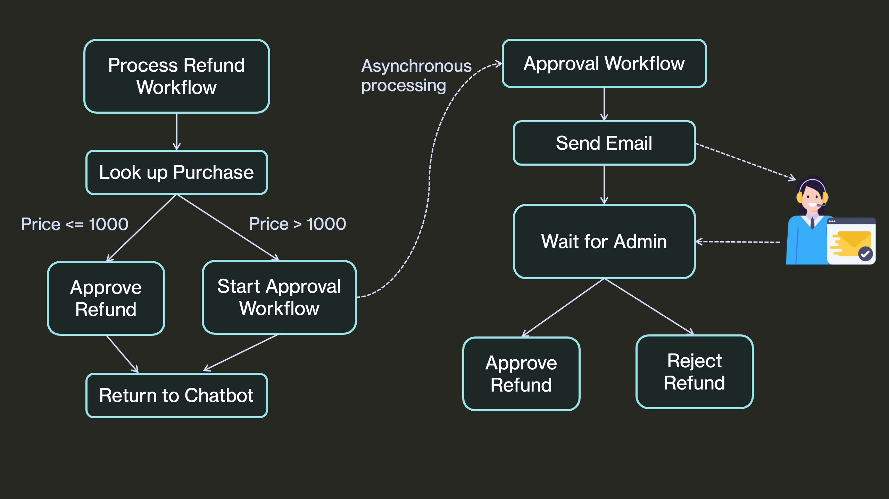

In this example, you'll learn how to build a reliable AI-powered customer service agent with DBOS and [LangGraph](https://langchain-ai.github.io/langgraph/) and serverlessly deploy it to DBOS Cloud. This example demonstrates how **DBOS makes it easy to connect your AI agent to your existing production systems**, especially when integrating **human decision-making** into automated processes.

You can see the customer service agent live [here](https://demo-reliable-refunds-langchain.cloud.dbos.dev/).

You can chat with this LLM-powered AI agent to check the status of your purchase order, or request a refund for your order.
Even if the agent is interrupted during refund processing, upon restart it automatically recovers, finishes processing the refund, then proceeds to the next step in its workflow.

<iframe width="90%" height="480" src="https://www.youtube.com/embed/ll1sMIs_wx0?si=u3qSWInf9kJLwJpH" title="YouTube video player" frameborder="0" allow="accelerometer; autoplay; clipboard-write; encrypted-media; gyroscope; picture-in-picture; web-share" referrerpolicy="strict-origin-when-cross-origin" allowFullScreen="true" webkitallowfullscreen="true" mozallowfullscreen="true"></iframe>

Try running this agent and pressing the `Crash System` button at any time. You can see that when it restarts, it resumes its pending refund processing.

All source code is [available on GitHub](https://github.com/dbos-inc/dbos-demo-apps/tree/main/python/reliable-refunds-langchain).

## Overview

This customer service AI agent allows users to chat and check the status of their purchase order or request a refund.
If the order exceeds a certain cost threshold, the refund request will be automatically escalated to a customer service admin via email for manual review. Based on the admin's decision (approval or rejection), the agent will either process the refund or decline the request accordingly.

Let's zoom in to the refund process. The refund process is asynchronous, meaning the user can continue chatting (or leaving and coming back in a few days) with the agent for other tasks while a background process handles the refund workflow. This ensures that the chatbot remains responsive and is not blocked by the potentially long manual review process, which could take hours or even days.

The architecture diagram of the refund processing workflow:



There are two main challenges in implementing this process within an AI agent:
1. **Asynchronous Processing**: The approval process may take days, so the workflow must be invoked asynchronously in the background. This ensures that the chatbot can respond to user input quickly and continue handling other interactions without being blocked.
2. **Workflow Reliability**: The workflow must be durable and fault tolerant. If the agent is interrupted during refund processing (e.g., server crashes, network connectivity issues), it should automatically recover upon restart, complete the refund, and seamlessly proceed to the next step.

Traditional solutions typically require setting up a **job queue** and separate **queue consumers** to process tasks asynchronously, along with an **external orchestrator** like AWS Step Functions to coordinate multiple subprocesses, guaranteeing the workflow runs to completion.

DBOS provides a simpler solution - [durable execution as an open source library](https://www.dbos.dev/blog/what-is-lightweight-durable-execution), so you can control durable execution more simply and entirely within your application code There’s no need to run and stitch together external orchestration services. In the following sections of this tutorial, we'll walk you through how we built a reliable customer service agent using DBOS + LangGraph.

## Writing an AI-Powered Refund Agent

Now let's build this agent step-by-step!

### Import and Initialize the App

Let's start off with imports and initializing DBOS.
We'll also set up FastAPI to serve HTTP requests.

```python showLineNumbers
from dbos import DBOS, DBOSConfig
from fastapi import FastAPI

app = FastAPI()
config: DBOSConfig = {
    "name": "reliable-refunds-langchain",
    "database_url": os.environ.get('DBOS_DATABASE_URL'),
}
DBOS(fastapi=app, config=config)

APPROVAL_TIMEOUT_SEC = 60 * 60 * 24 * 7  # One week timeout for manual review

sg_api_key = os.environ.get("SENDGRID_API_KEY")
assert sg_api_key, "Error: SENDGRID_API_KEY is not set"

from_email = os.environ.get("SENDGRID_FROM_EMAIL")
assert from_email, "Error: SENDGRID_FROM_EMAIL is not set"

admin_email = os.environ.get("ADMIN_EMAIL", None)
assert admin_email, "Error: ADMIN_EMAIL is not set"

callback_domain = os.environ.get("DBOS_APP_HOSTNAME", "http://localhost:8000")
```

### Defining Tools for the Agent

One great feature of DBOS is that it provides durable execution as a library, allowing seamless integration with popular AI frameworks like LangGraph.
To use the DBOS decorated functions as tools for this agent, you simply decorate the function with `@tool` and provide a docstring so that the LLM can correctly identify when to invoke it.

This agent has two tools:
1. `tool_get_purchase_by_id`: invokes a database transaction function to retrieve order status.
2. `process_refund`: a workflow process the refund request.

```python showLineNumbers
from langchain_core.tools import tool

# This tool lets the agent look up the details of an order given its ID.
@DBOS.transaction()
def get_purchase_by_id(order_id: int) -> Optional[Purchase]:
    DBOS.logger.info(f"Looking up purchase by order_id {order_id}")
    query = purchases.select().where(purchases.c.order_id == order_id)
    result = DBOS.sql_session.execute(query)
    row = result.first()
    return Purchase.from_row(row) if row is not None else None


# Define a wrapper function to make the output JSON serializable.
@tool
def tool_get_purchase_by_id(order_id: int) -> str:
    """Look up a purchase by its order id."""
    return asdict(get_purchase_by_id(order_id))


# This tool processes a refund for an order. If the order exceeds a cost threshold,
# it escalates to manual review.
@tool
@DBOS.workflow()
def process_refund(order_id: int):
    """Process a refund for an order given an order ID."""
    purchase = get_purchase_by_id(order_id)
    if purchase is None:
        DBOS.logger.error(f"Refunding invalid order {order_id}")
        return "We're unable to process your refund. Please check your input and try again."
    DBOS.logger.info(f"Processing refund for purchase {purchase}")
    if purchase.price > 1000:
        update_purchase_status(purchase.order_id, OrderStatus.PENDING_REFUND.value)
        DBOS.start_workflow(approval_workflow, purchase)
        return f"Because order_id {purchase.order_id} exceeds our cost threshold, your refund request must undergo manual review. Please check your order status later."
    else:
        update_purchase_status(purchase.order_id, OrderStatus.REFUNDED)
        return f"Your refund for order_id {purchase.order_id} has been approved."
```

We decorate the `tool_get_purchase_by_id` and `process_refund` functions with LangChain's `@tool` decorator, so that they can be recognized and used by LLMs. We decorate `process_refund` as a DBOS workflow. This way, if the agent's workflow is interrupted while processing a refund, when it restarts, it will resume from the last completed step.
DBOS guarantees that once the agent's workflow starts, you will always get a refund, and never be refunded twice!

### Asynchronous Human-in-the-Loop Workflow

If an order exceeds a certain cost threshold, the refund request will be escalated for manual review. In this case, the `process_refund` workflow starts a child workflow called `approval_workflow` which contains the following step:
- An email is sent to an admin for manual review.
- The approval workflow **pauses** until a human decision is made.
- When the admin clicks approve or reject, it sends an HTTP request to the `/approval/{workflow_id}/{status}` endpoint, which then notifies the pending workflow about the decision.
- Based on the response, the workflow either proceeds with the refund or rejects the request.

```python showLineNumbers
# This workflow manages manual review. It sends an email to a reviewer, then waits up to a week
# for the reviewer to approve or deny the refund request.
@DBOS.workflow()
def approval_workflow(purchase: Purchase):
    send_email(purchase)
    status = DBOS.recv(timeout_seconds=APPROVAL_TIMEOUT_SEC)
    if status == "approve":
        DBOS.logger.info("Refund approved :)")
        update_purchase_status(purchase.order_id, OrderStatus.REFUNDED)
        return "Approved"
    else:
        DBOS.logger.info("Refund rejected :/")
        update_purchase_status(purchase.order_id, OrderStatus.REFUND_REJECTED)
        return "Rejected"

@app.get("/approval/{workflow_id}/{status}")
def approval_endpoint(workflow_id: str, status: str):
    DBOS.send(workflow_id, status)
    msg = Template(Path(os.path.join(html_dir, "confirm.html")).read_text()).substitute(
        result=status,
        wfid=workflow_id,
    )
    return HTMLResponse(msg)

# This function sends an email to a manual reviewer. The email contains links that send notifications
# to the approval workflow to approve or deny a refund.
@DBOS.step()
def send_email(purchase: Purchase):
    content = f"{callback_domain}/approval/{DBOS.workflow_id}"
    msg = Template(Path(os.path.join(html_dir, "email.html")).read_text()).substitute(
        purchaseid=purchase.order_id,
        purchaseitem=purchase.item,
        orderdate=purchase.order_date,
        price=purchase.price,
        content=content,
        datetime=time.strftime("%Y-%m-%d %H:%M:%S %Z"),
    )

    message = Mail(
        from_email=from_email,
        to_emails=admin_email,
        subject="Refund Validation",
        html_content=msg,
    )
    email_client = SendGridAPIClient(sg_api_key)
    email_client.send(message)
    DBOS.logger.info(f"Message sent from {from_email} to {admin_email}")


# This function updates the status of a purchase.
@DBOS.transaction()
def update_purchase_status(order_id: int, status: OrderStatus):
    query = (
        purchases.update()
        .where(purchases.c.order_id == order_id)
        .values(order_status=status)
    )
    DBOS.sql_session.execute(query)
```

The `process_refund` tool uses `DBOS.start_workflow` to execute the approval workflow asynchronously and returns back to the chatbot as soon as the workflow is started, so the chatbot is not blocked by the potentially long review period.

### Setting Up LangGraph

Once we define all the tools we need, let's set up LangGraph.
We'll use OpenAI's `gpt-3.5-turbo` model to answer each chat message.
We'll configure LangGraph to store message history in Postgres so it persists across app restarts.

```python showLineNumbers
def create_agent():
    llm = ChatOpenAI(model="gpt-3.5-turbo")
    tools = [tool_get_purchase_by_id, process_refund]
    llm_with_tools = llm.bind_tools(tools)

    prompt = ChatPromptTemplate.from_messages(
        [
            (
                "system",
                "You are a helpful refund agent. You always speak in fluent, natural, conversational language. You can look up order status and process refunds.",
            ),
            MessagesPlaceholder(variable_name="messages"),
        ]
    )

    # This is our refund agent. It follows these instructions to process refunds.
    # It uses two tools: one to look up order status, one to actually process refunds.
    agent = prompt | llm_with_tools

    # Create a state machine using the graph builder
    graph_builder = StateGraph(State)

    def chatbot(state: State):
        return {"messages": [agent.invoke(state["messages"])]}

    graph_builder.add_node("chatbot", chatbot)
    tool_node = ToolNode(tools=tools)
    graph_builder.add_node("tools", tool_node)
    graph_builder.add_conditional_edges(
        "chatbot",
        tools_condition,
    )
    # Any time a tool is called, we return to the chatbot to decide the next step
    graph_builder.add_edge("tools", "chatbot")
    graph_builder.add_edge(START, "chatbot")

    # Create a checkpointer LangChain can use to store message history in Postgres.
    db = DBOS.config["database"]
    connection_string = f"postgresql://{db['username']}:{db['password']}@{db['hostname']}:{db['port']}/{db['app_db_name']}"
    pool = ConnectionPool(connection_string)
    checkpointer = PostgresSaver(pool)

    graph = graph_builder.compile(checkpointer=checkpointer)

    return graph


class ChatSchema(BaseModel):
    message: str


# Currently supports only one chat thread
chat_config = {"configurable": {"thread_id": "1"}}
compiled_agent = create_agent()
```

Each time a user inputs a message, the agent traverses the DAG until it reaches the "end" node, then responds to the user. The agent diagram (generated by LangGraph) looks simple because DBOS handles all the complex workflows in the "tools" node.


### Handling Chats

Now, let's chat!
We define two endpoints. The first endpoint handles each new incoming user input. It invokes the agent DAG with the user's message, and filter the response messages for the frontend.

```python showLineNumbers
@app.post("/chat")
def chat_workflow(chat: ChatSchema):
    # Invoke the agent DAG with the user's message
    events = compiled_agent.stream(
        {"messages": [HumanMessage(chat.message)]},
        config=chat_config,
        stream_mode="values",
    )
    # Filter the response messages for the frontend
    response_messages = []
    for event in events:
        if "messages" in event:
            latest_msg = event["messages"][-1]
            if isinstance(latest_msg, AIMessage) and latest_msg.content:
                response_messages.append(
                    {"isUser": False, "content": latest_msg.content}
                )
    return response_messages
```

Next, let's add a history endpoint that retrieves all past chats from the database. This function is called when we start/refresh the chatbot page so it can display your chat history. We parse the retrieved messages from the `PostgresSaver` checkpointer to list all past chat.

```python showLineNumbers
@app.get("/history")
def history_endpoint():
    # Retrieve the messages from the chat history and parse them for the frontend
    chats = compiled_agent.checkpointer.list(config=chat_config, limit=1000)
    message_list = []
    for chat in chats:
        writes = chat.metadata.get("writes")
        if writes is not None:
            record = writes.get("chatbot") or writes.get(START)
            if record is not None:
                messages = record.get("messages")
                if messages is not None:
                    for message in messages:
                        if isinstance(message, HumanMessage) and message.content:
                            message_list.append(
                                {"isUser": True, "content": message.content}
                            )
                        elif isinstance(message, AIMessage) and message.content:
                            message_list.append(
                                {"isUser": False, "content": message.content}
                            )
    # The list is reversed so the most recent messages appear at the bottom
    message_list.reverse()
    return message_list
```

Additionally, let's serve the app's frontend from an HTML file using FastAPI.
In production, we recommend using DBOS primarily for the backend, with your frontend deployed elsewhere.

```python showLineNumbers
@app.get("/")
def frontend():
    with open(os.path.join("html", "app.html")) as file:
        html = file.read()
    return HTMLResponse(html)
```

## Try it Yourself!

### Creating an OpenAI Account

To run this app, you need an OpenAI developer account.
Obtain an API key [here](https://platform.openai.com/api-keys) and set up a payment method for your account [here](https://platform.openai.com/account/billing/overview).
This bot uses `gpt-3.5-turbo` for text generation.
Make sure you have some credits (~$1) to use it.

Set your API key as an environment variable:

```shell
export OPENAI_API_KEY=<your_openai_key>
```

### Setting Up SendGrid

This app uses [SendGrid](https://sendgrid.com/en-us) to send emails.
Create a SendGrid account, verify an email for sending, and generate an API key.
Then set the API key and sender email as environment variables:

```shell
export SENDGRID_API_KEY=<your key>
export SENDGRID_FROM_EMAIL=<your email>
export ADMIN_EMAIL=<your email>
```

### Deploying to the Cloud

To serverlessly deploy this app to DBOS Cloud, first install the DBOS Cloud CLI (requires Node):

```shell
npm i -g @dbos-inc/dbos-cloud
```

Then, run this command to deploy your app:

```shell
dbos-cloud app deploy
```

This command outputs a URL&mdash;visit it to see your chatbot!
You can also visit the [DBOS Cloud Console](https://console.dbos.dev/login-redirect) to see your app's status and logs.

### Running Locally

First create a virtual environment and install dependencies:

```shell
python3 -m venv .venv
source .venv/bin/activate
pip install -r requirements.txt
```


Then start your app in the virtual environment:

```shell
alembic upgrade head
dbos start
```

Visit [`http://localhost:8000`](http://localhost:8000) to see your customer service chatbot!