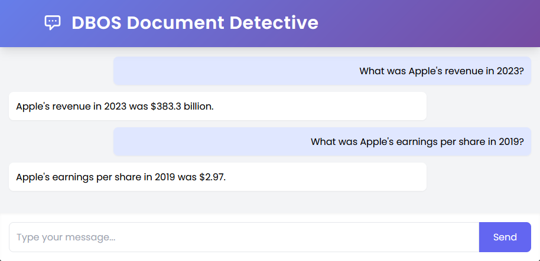

In this example, we'll use DBOS to build a **reliable and scalable data processing pipeline**.
We'll show how DBOS can help you process many items concurrently and seamlessly recover from failures.
Specifically, we'll build a pipeline that indexes PDF documents for RAG, though you can use a similar design pattern to build almost any data pipeline.

To show the pipeline works, we'll also build a chat agent that can accurately answer questions about the indexed documents.
For example, here's what the chat agent looks like after ingesting the last three years of Apple 10-K filings.
It can accurately answer questions about Apple's financials:



All source code is [available on GitHub](https://github.com/dbos-inc/dbos-demo-apps/tree/main/python/document-detective).

## Import and Initialize the App

Let's start off with imports and initializing DBOS.

```python
import os
from tempfile import TemporaryDirectory
from typing import List

import requests
from dbos import DBOS, DBOSConfig, Queue, WorkflowHandle
from fastapi import FastAPI
from fastapi.responses import HTMLResponse
from llama_index.core import Settings, StorageContext, VectorStoreIndex
from llama_index.readers.file import PDFReader
from llama_index.vector_stores.postgres import PGVectorStore
from pydantic import BaseModel, HttpUrl

from .schema import chat_history

app = FastAPI()
config: DBOSConfig = {
    "name": "document-detective",
    "database_url": os.environ.get("DBOS_DATABASE_URL"),
}
DBOS(fastapi=app, config=config)
```

Next, let's initialize LlamaIndex to store and query the vector index we'll be constructing.

```python
def configure_index():
    Settings.chunk_size = 512
    dbos_config = DBOS.config
    db = dbos_config["database"]
    vector_store = PGVectorStore.from_params(
        database=db["app_db_name"],
        host=db["hostname"],
        password=db["password"],
        port=db["port"],
        user=db["username"],
        perform_setup=False,
    )
    storage_context = StorageContext.from_defaults(vector_store=vector_store)
    index = VectorStoreIndex([], storage_context=storage_context)
    chat_engine = index.as_chat_engine()
    return index, chat_engine


index, chat_engine = configure_index()
```

## Building a Durable Data Ingestion Pipeline

Now, let's write the document ingestion pipeline.
Because ingesting and indexing documents may take a long time, we need to build a pipeline that's both _concurrent_ and _reliable_.
It needs to process multiple documents at once and it needs to be resilient to failures, so if the application is interrupted or restarted, or encounters an error, it can recover from where it left off instead of restarting from the beginning or losing some documents entirely.

We'll build a concurrent, reliable data ingestion pipeline using DBOS [queues](../tutorials/queue-tutorial.md) and [durable execution](../tutorials/workflow-tutorial.md).
This workflow takes in a batch of document URLs and enqueues them for ingestion.
It then waits for them all to complete and counts how many total documents and pages were ingested.
If it's ever interrupted or restarted, it recovers the ingestion of each document from the last completed step, guaranteeing that every document is ingested and none are lost.

```python
queue = Queue("indexing_queue")


@DBOS.workflow()
def indexing_workflow(urls: List[HttpUrl]):
    handles: List[WorkflowHandle] = []
    for url in urls:
        handle = queue.enqueue(index_document, url)
        handles.append(handle)
    indexed_pages = 0
    for handle in handles:
        indexed_pages += handle.get_result()
    DBOS.logger.info(f"Indexed {len(urls)} documents totaling {indexed_pages} pages")
```

Now, let's write the key step of this pipeline: the function that ingests a PDF document from a URL.
This function downloads a document, scans it into pages, then uses LlamaIndex to embed it and store the embedding in Postgres.

Because this entire procedure is implemented in a single function, we annotate it with [`@DBOS.step()`](../tutorials/step-tutorial.md) to mark it as a _step_ of the indexing workflow.
Additionally, in case of transient failures (for example in downloading the document) we set it to automatically retry up to 5 times with exponential backoff.
In a more complex pipeline, we might process each document with a durable workflow of several steps; this would be a _child workflow_ of the indexing workflow.

```python
@DBOS.step(retries_allowed=True, max_attempts=5)
def index_document(document_url: HttpUrl) -> int:
    with TemporaryDirectory() as temp_dir:
        temp_file_path = os.path.join(temp_dir, "file.pdf")
        with open(temp_file_path, "wb") as temp_file:
            with requests.get(document_url, stream=True) as r:
                r.raise_for_status()
                for page in r.iter_content(chunk_size=8192):
                    temp_file.write(page)
            temp_file.seek(0)
            reader = PDFReader()
            pages = reader.load_data(temp_file_path)
    for page in pages:
        index.insert(page)
    return len(pages)
```

Next, let's write the endpoint for indexing.
It starts the indexing workflow in the background on a batch of documents.

```python
class URLList(BaseModel):
    urls: List[HttpUrl]


@app.post("/index")
async def index_endpoint(urls: URLList):
    DBOS.start_workflow(indexing_workflow, urls.urls)
```

## Chatting With Your Data

Now, let's build the backend for a chatbot agent you can use to ask questions about the documents you've ingested.

Each time we get a chat message, we call this workflow with three steps:

1. Store the incoming chat message in Postgres.
2. Query LlamaIndex to respond to the message using RAG.
3. Store the response in Postgres.

```python
class ChatSchema(BaseModel):
    message: str


@app.post("/chat")
@DBOS.workflow()
def chat_workflow(chat: ChatSchema):
    insert_chat(chat.message, True)
    response = query_model(chat.message)
    insert_chat(response, False)
    return {"content": response, "isUser": True}


@DBOS.transaction()
def insert_chat(content: str, is_user: bool):
    DBOS.sql_session.execute(
        chat_history.insert().values(content=content, is_user=is_user)
    )


@DBOS.step()
def query_model(message: str) -> str:
    return str(chat_engine.chat(message))
```

Let's also write a history endpoint that retrieves all past chats from the database.

This function is called when we open up the chatbot so it can display your chat history.

```python
@app.get("/history")
def history_endpoint():
    return get_chats()


@DBOS.transaction()
def get_chats():
    stmt = chat_history.select().order_by(chat_history.c.created_at.asc())
    result = DBOS.sql_session.execute(stmt)
    return [{"content": row.content, "isUser": row.is_user} for row in result]
```

Finally, let's serve the app's frontend from an HTML file using FastAPI.
In production, we recommend using DBOS primarily for the backend, with your frontend deployed elsewhere.

```python
@app.get("/")
def frontend():
    with open(os.path.join("html", "app.html")) as file:
        html = file.read()
    return HTMLResponse(html)
```

## Try it Yourself!

### Creating an OpenAI Account

To run this app, you need an OpenAI developer account.
Obtain an API key [here](https://platform.openai.com/api-keys) and set up a payment method for your account [here](https://platform.openai.com/account/billing/overview).
This bot uses `gpt-3.5-turbo` for text generation.
Make sure you have some credits (~&dollar;1) to use it.

Set your API key as an environment variable:

```shell
export OPENAI_API_KEY=<your_openai_key>
```

### Deploying to the Cloud

To deploy this app to DBOS Cloud, first install the DBOS Cloud CLI (requires Node):

```shell
npm i -g @dbos-inc/dbos-cloud
```

Then clone the [dbos-demo-apps](https://github.com/dbos-inc/dbos-demo-apps) repository and deploy:

```shell
git clone https://github.com/dbos-inc/dbos-demo-apps.git
cd python/document-detective
dbos-cloud app deploy
```

This command outputs a URL&mdash;visit it to see your chat agent!
You can also visit the [DBOS Cloud Console](https://console.dbos.dev/login-redirect) to see your app's status and logs.

### Running Locally

First, clone and enter the [dbos-demo-apps](https://github.com/dbos-inc/dbos-demo-apps) repository:

```shell
git clone https://github.com/dbos-inc/dbos-demo-apps.git
cd python/document-detective
```

Then create a virtual environment:

```shell
python3 -m venv .venv
source .venv/bin/activate
```

Then start your app:

```shell
pip install -r requirements.txt
dbos migrate
dbos start
```

Visit [`http://localhost:8000`](http://localhost:8000) to see your chat agent!

### Indexing Documents

To index a batch of PDF documents, send a list of their URLs in a POST request to the `/index` endpoint.

For example, try this cURL command to index Apple's SEC 10-K filings for 2021, 2022, and 2023
The application URL you should use is `http://localhost:8000` locally and your app URL in DBOS Cloud:

```shell
curl -X POST "http://<URL>/index" \
     -H "Content-Type: application/json" \
     -d '{"urls": ["https://d18rn0p25nwr6d.cloudfront.net/CIK-0000320193/faab4555-c69b-438a-aaf7-e09305f87ca3.pdf", "https://d18rn0p25nwr6d.cloudfront.net/CIK-0000320193/b4266e40-1de6-4a34-9dfb-8632b8bd57e0.pdf", "https://d18rn0p25nwr6d.cloudfront.net/CIK-0000320193/42ede86f-6518-450f-bc88-60211bf39c6d.pdf"]}'

```

