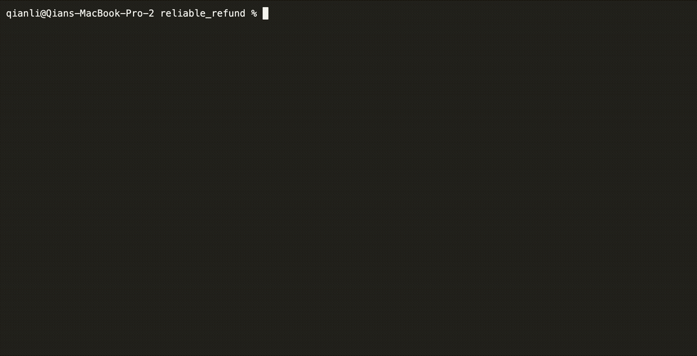

In this example, you'll learn how to build a reliable AI-powered customer service agent with DBOS and OpenAI's Swarm framework.

This agent takes in a user's name, processes a refund for the user, and then applies a discount.
Even if the agent is interrupted during refund processing, upon restart it automatically recovers, finishes processing the refund, then proceeds to the next step in its workflow.

Try running this agent and pressing `Ctrl+C` at any time. You can see that when it restarts, it automatically resumes from the last completed step:



All source code is [available on GitHub](https://github.com/dbos-inc/durable-swarm/tree/main/examples/reliable_refund).


## Reliable Multi-Agent Orchestration

Let's start off with enhancing OpenAI's lightweight multi-agent orchestration framework, [Swarm](https://github.com/openai/swarm/tree/main), with DBOS to make it **resilient to any failure**.
Simply create a `durable_swarm.py` file containing the following code:

```python showLineNumbers title="durable_swarm.py"
from swarm import Swarm
from dbos import DBOS, DBOSConfiguredInstance
from swarm.repl.repl import pretty_print_messages

DBOS()

@DBOS.dbos_class()
class DurableSwarm(Swarm, DBOSConfiguredInstance):
    def __init__(self, client=None):
        Swarm.__init__(self, client)
        DBOSConfiguredInstance.__init__(self, "openai_client")

    @DBOS.step()
    def get_chat_completion(self, *args, **kwargs):
        return super().get_chat_completion(*args, **kwargs)

    @DBOS.workflow()
    def run(self, *args, **kwargs):
        response = super().run(*args, **kwargs)
        pretty_print_messages(response.messages)
        return response

DBOS.launch()
```

This code declares the main loop of Swarm (`run`) to be a durable workflow and each chat completion to be a step in that workflow.
Therefore, if a workflow is interrupted, it will skip already finished chat completion steps and use the recorded outputs of those steps.

## Writing a Refund Agent

Next, let's create a refund agent using Swarm.
Swarm agents can call python functions directly, and this agent contains two functions: `process_refund` and `apply_discount`. We decorate the `refund_step` and `apply_discount` functions as DBOS steps in the agent's workflow.

This way, if the agent's workflow is interrupted while processing a refund, when it restarts, it will resume from the last completed step.
DBOS guarantees that once the agent's workflow starts, you will always get a refund, and never be refunded twice or get the discount twice!

```python showLineNumbers title="agents.py"
from swarm import Agent
from dbos import DBOS

def process_refund(context_variables, item_id, reason="NOT SPECIFIED"):
    """Refund an item. Refund an item. Make sure you have the item_id of the form item_... Ask for user confirmation before processing the refund."""
    user_name = context_variables.get("user_name", "user")
    print(f"[mock] Refunding for {user_name}, item {item_id}, because {reason}...")
    for i in range(1, 6):
        refund_step(i)
        DBOS.sleep(1)
    print("[mock] Refund successfully processed!")
    return "Success!"

@DBOS.step()
def refund_step(step_id):
    print(f"[mock] Processing refund step {step_id}... Press Control + C to quit")

@DBOS.step()
def apply_discount():
    """Apply a discount to the user's cart."""
    print("[mock] Applying discount...")
    return "Applied discount of 11%"

refunds_agent = Agent(
    name="Refunds Agent",
    instructions="Help the user with a refund. If the reason is that it was too expensive, offer the user a refund code. If they insist, then process the refund.",
    functions=[process_refund, apply_discount],
)
```

## Invoking the Agent's Workflow

Finally, let's connect to the agent and use it to process refunds!
In your `main.py`, import `refunds_agent` and `DurableSwarm` you just wrote, and kick off a workflow with the user's name as an [idempotency key](../tutorials/idempotency-tutorial.md).
This way, each user is guaranteed to be refunded exactly once.

```python showLineNumbers title="main.py"
import sys
import signal

from agents import refunds_agent
from durable_swarm import DurableSwarm
from dbos import SetWorkflowID

client = DurableSwarm()

def main():
    print("Connecting to Durable Refund Agent 💪🐝")

    user_name = input("\033[90mWhat's your name\033[0m: \n")
    if user_name.strip() == "":
        return  # Exit if user doesn't provide a name

    query = "I want to refund item 99 because it's too expensive and I don't like its color! I want to proceed with the refund and also get a discount for my next purchase!"
    context_variables = {"user_name": user_name}

    # SetWorkflowID is used to ensure that user is refunded exactly once.
    with SetWorkflowID(user_name):
        client.run(
            agent=refunds_agent,
            messages=[{"role": "user", "content": query}],
            context_variables=context_variables,
        )

if __name__ == "__main__":
    main()
```

## Try it Yourself!

To run this app, you need an OpenAI developer account.
Obtain an API key [here](https://platform.openai.com/api-keys) and set up a payment method for your account [here](https://platform.openai.com/account/billing/overview).

Set your API key as an environment variable:

```shell
export OPENAI_API_KEY=<your_openai_key>
```

Then, clone and enter the [durable-swarm](https://github.com/dbos-inc/dbos-demo-apps) repository:

```shell
git clone https://github.com/dbos-inc/durable-swarm.git
cd examples/reliable_refund
```

Next, create a virtual environment and install [Swarm](https://github.com/openai/swarm/tree/main) and [DBOS](https://github.com/dbos-inc/dbos-transact-py). Swarm requires Python >=3.10.

```shell
python3 -m venv .venv
source .venv/bin/activate
pip install dbos git+https://github.com/openai/swarm.git
```

DBOS requires a Postgres database.
If you don't already have one, you can start one with Docker:

```shell
export PGPASSWORD=dbos
python3 start_postgres_docker.py
```

Finally, run the app in the virtual environment with a single command `python3 main.py`.
You can crash and restart this application as many times as you want. An example output:

```shell
> python3 main.py

Connecting to Durable Refund Agent 💪🐝
What's your name: Max
[mock] Refunding for Max, item item_99, because Too expensive and I don't like its color...
[mock] Processing refund step 1... Press Control + C to quit
[mock] Processing refund step 2... Press Control + C to quit
[mock] Processing refund step 3... Press Control + C to quit
^C⏎

# Resume from where the last completed step (step 3), continuing with step 4.
> python3 main.py

Connecting to Durable Refund Agent 💪🐝
[mock] Refunding for Max, item item_99, because Too expensive and I don't like its color...
[mock] Processing refund step 4... Press Control + C to quit
[mock] Processing refund step 5... Press Control + C to quit
[mock] Refund successfully processed!
[mock] Applying discount...
Refunds Agent:
process_refund("item_id"= "item_99", "reason"= "Too expensive and I don't like its color")
apply_discount()
Refunds Agent: I've processed the refund for item 99 and also applied a discount of 11% for your next purchase. If there's anything else you need, feel free to ask!
```