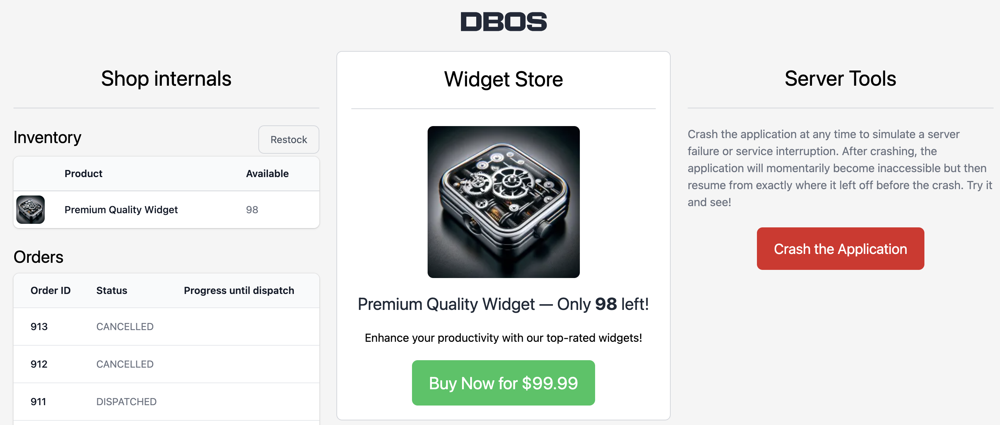

:::info
This example is also available in [TypeScript](../../typescript/examples/checkout-tutorial) and [Go](../../golang/examples/widget-store.md).
:::

In this example, we use DBOS and FastAPI to build an online storefront that's resilient to any failure.

You can see the application live [here](https://demo-widget-store.cloud.dbos.dev/).
Try playing with it and pressing the crash button as often as you want.
Within a few seconds, the app will recover and resume as if nothing happened.

All source code is [available on GitHub](https://github.com/dbos-inc/dbos-demo-apps/tree/main/python/widget-store).



## Import and Initialize the App

Let's begin with imports and initializing DBOS and FastAPI.
We'll also define some constants.

```python
import os

import uvicorn
from dbos import DBOS, SetWorkflowID, DBOSConfig
from fastapi import FastAPI, HTTPException, Response
from fastapi.responses import HTMLResponse

from .schema import OrderStatus, orders, products

app = FastAPI()
config: DBOSConfig = {
    "name": "widget-store",
    "application_database_url": os.environ.get('DBOS_DATABASE_URL'),
}
DBOS(fastapi=app, config=config)

WIDGET_ID = 1
PAYMENT_STATUS = "payment_status"
PAYMENT_ID = "payment_id"
ORDER_ID = "order_id"
```

## Building the Checkout Workflow

The heart of this application is the checkout workflow, which orchestrates the entire purchase process.
This workflow is triggered whenever a customer buys a widget and handles the complete order lifecycle:

1. Creates a new order in the system
2. Reserves inventory to ensure the item is available
3. Processes payment 
4. Marks the order as paid and initiates fulfillment
5. Handles failures gracefully by releasing reserved inventory and canceling orders when necessary

DBOS **durably executes** this workflow.
It checkpoints each step in the database so that if the app fails or is interrupted during checkout, it will automatically recover from the last completed step.
This means that customers never lose their order progress, no matter what breaks.

You can try this yourself!
On the [live application](https://demo-widget-store.cloud.dbos.dev/), start an order and press the crash button at any time.
Within seconds, your app will recover to exactly the state it was in before the crash and continue as if nothing happened.

```python
@DBOS.workflow()
def checkout_workflow():
    # Create a new order
    order_id = create_order()

    # Attempt to reserve inventory, cancelling the order if no inventory remains.
    inventory_reserved = reserve_inventory()
    if not inventory_reserved:
        DBOS.logger.error(f"Failed to reserve inventory for order {order_id}")
        update_order_status(order_id=order_id, status=OrderStatus.CANCELLED.value)
        DBOS.set_event(PAYMENT_ID, None)
        return

    # Send a unique payment ID to the checkout endpoint so it
    # can redirect the customer to the payments page.
    DBOS.set_event(PAYMENT_ID, DBOS.workflow_id)

    # Wait for a message that the customer has completed payment.
    payment_status = DBOS.recv(PAYMENT_STATUS)

    # If payment succeeded, mark the order as paid and start the order dispatch workflow.
    # Otherwise, return reserved inventory and cancel the order.
    if payment_status == "paid":
        DBOS.logger.info(f"Payment successful for order {order_id}")
        update_order_status(order_id=order_id, status=OrderStatus.PAID.value)
        DBOS.start_workflow(dispatch_order_workflow, order_id)
    else:
        DBOS.logger.warn(f"Payment failed for order {order_id}")
        undo_reserve_inventory()
        update_order_status(order_id=order_id, status=OrderStatus.CANCELLED.value)

    # Finally, send the order ID to the payment endpoint so it
    # can redirect the customer to the order status page.
    DBOS.set_event(ORDER_ID, str(order_id))
```

## The Checkout and Payment Endpoints

Now let's implement the HTTP endpoints that handle customer interactions with the checkout system.

The checkout endpoint is triggered when a customer clicks the "Buy Now" button.
It starts the checkout workflow in the background, then waits for the workflow to generate and send it a unique payment ID.
It then returns the payment ID so the browser can redirect the user to the payments page.

The endpoint accepts an [idempotency key](../tutorials/workflow-tutorial.md#workflow-ids-and-idempotency) so that even if the customer presses "buy now" multiple times, only one checkout workflow is started.

```python
@app.post("/checkout/{idempotency_key}")
def checkout_endpoint(idempotency_key: str) -> Response:
    # Idempotently start the checkout workflow in the background.
    with SetWorkflowID(idempotency_key):
        handle = DBOS.start_workflow(checkout_workflow)
    # Wait for the checkout workflow to send a payment ID, then return it.
    payment_id = DBOS.get_event(handle.workflow_id, PAYMENT_ID)
    if payment_id is None:
        raise HTTPException(status_code=404, detail="Checkout failed to start")
    return Response(payment_id)
```

The payment endpoint handles the communication between the payment system and the checkout workflow.
It uses the payment ID to signal the checkout workflow whether the payment succeeded or failed.
It then retrieves the order ID from the checkout workflow so the browser can redirect the customer to the order status page.

```python
@app.post("/payment_webhook/{payment_id}/{payment_status}")
def payment_endpoint(payment_id: str, payment_status: str) -> Response:
    # Send the payment status to the checkout workflow.
    DBOS.send(payment_id, payment_status, PAYMENT_STATUS)
    # Wait for the checkout workflow to send an order ID, then return it.
    order_url = DBOS.get_event(payment_id, ORDER_ID)
    if order_url is None:
        raise HTTPException(status_code=404, detail="Payment failed to process")
    return Response(order_url)
```

## Database Operations

Now, let's implement the checkout workflow's steps.
Each step performs a database operation, like updating inventory or order status.
Because these steps access the database, they are implemented as [transactions](../tutorials/transaction-tutorial.md).

<details>
<summary><strong>Database Operations</strong></summary>

```python
@DBOS.transaction()
def reserve_inventory() -> bool:
    rows_affected = DBOS.sql_session.execute(
        products.update()
        .where(products.c.product_id == WIDGET_ID)
        .where(products.c.inventory > 0)
        .values(inventory=products.c.inventory - 1)
    ).rowcount
    return rows_affected > 0


@DBOS.transaction()
def undo_reserve_inventory() -> None:
    DBOS.sql_session.execute(
        products.update()
        .where(products.c.product_id == WIDGET_ID)
        .values(inventory=products.c.inventory + 1)
    )


@DBOS.transaction()
def create_order() -> int:
    result = DBOS.sql_session.execute(
        orders.insert().values(order_status=OrderStatus.PENDING.value)
    )
    return result.inserted_primary_key[0]


@app.get("/order/{order_id}")
@DBOS.transaction()
def get_order(order_id: int):
    return (
        DBOS.sql_session.execute(orders.select().where(orders.c.order_id == order_id))
        .mappings()
        .first()
    )


@DBOS.transaction()
def update_order_status(order_id: int, status: int) -> None:
    DBOS.sql_session.execute(
        orders.update().where(orders.c.order_id == order_id).values(order_status=status)
    )


@app.get("/product")
@DBOS.transaction()
def get_product():
    return DBOS.sql_session.execute(products.select()).mappings().first()


@app.get("/orders")
@DBOS.transaction()
def get_orders():
    rows = DBOS.sql_session.execute(orders.select())
    return [dict(row) for row in rows.mappings()]


@app.post("/restock")
@DBOS.transaction()
def restock():
    DBOS.sql_session.execute(products.update().values(inventory=100))

@DBOS.workflow()
def dispatch_order_workflow(order_id):
    for _ in range(10):
        DBOS.sleep(1)
        update_order_progress(order_id)

@DBOS.transaction()
def update_order_progress(order_id):
    # Update the progress of paid orders.
    progress_remaining = DBOS.sql_session.execute(
        orders.update()
        .where(orders.c.order_id == order_id)
        .values(progress_remaining=orders.c.progress_remaining - 1)
        .returning(orders.c.progress_remaining)
    ).scalar_one()

    # Dispatch if the order is fully-progressed.
    if progress_remaining == 0:
        DBOS.sql_session.execute(
            orders.update()
            .where(orders.c.order_id == order_id)
            .values(order_status=OrderStatus.DISPATCHED.value)
        )
```
</details>

## Launching and Serving the App

Let's add the final touches to the app.
This FastAPI endpoint serves its frontend:

```python
@app.get("/")
def frontend():
    with open(os.path.join("html", "app.html")) as file:
        html = file.read()
    return HTMLResponse(html)
```

This FastAPI endpoint crashes the app. Trigger it as many times as you want&mdash;DBOS always comes back, resuming from exactly where it left off!

```python
@app.post("/crash_application")
def crash_application():
    os._exit(1)
```

Finally, launch DBOS and the FastAPI server.

```python
if __name__ == "__main__":
    DBOS.launch()
    uvicorn.run(app, host="0.0.0.0", port=8000)
```


## Try it Yourself!

Clone and enter the [dbos-demo-apps](https://github.com/dbos-inc/dbos-demo-apps) repository:

```shell
git clone https://github.com/dbos-inc/dbos-demo-apps.git
cd python/widget-store
```

Then follow the instructions in the [README](https://github.com/dbos-inc/dbos-demo-apps/tree/main/python/widget-store) to run the app.
