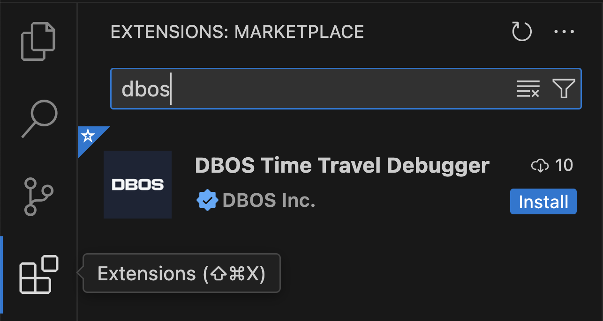

DBOS applications automatically save their state to Postgres every time a workflow step is executed.
While this is primarily done for [reliablity and fault-tolerance](../../why-dbos.md), the saved state can also be used for debugging purposes.
The DBOS Debugger enables you to replay the execution of your application workflows, step through the recorded states and identify the root cause of bugs more efficiently. 
Additionally, DBOS includes a novel Time Travel Debugger that allows you to arbitrarily explore your database state as it existed at the time a given workflow ran. 

## Preliminaries

The DBOS Debugger is an extension to [Visual Studio Code](https://code.visualstudio.com/) (aka VSCode), a free cross-platform interactive development environment.
If you don't already have VSCode installed, please see [their official documentation](https://code.visualstudio.com/docs/setup/setup-overview) to get started.

The DBOS Debugger can be installed from the [VSCode Marketplace website](https://marketplace.visualstudio.com/items?itemName=dbos-inc.dbos-ttdbg)
or or by searching the [Extension Marketplace](https://code.visualstudio.com/docs/editor/extension-marketplace) inside VSCode for "DBOS".

:::info
Python developers will also need to install the official [VSCode Python extension](https://marketplace.visualstudio.com/items?itemName=ms-python.python) in order to debug their DBOS Python applications. 
For more information about this extension, please see the [official VSCode documentation](https://code.visualstudio.com/docs/python/python-quick-start)

The official [VSCode Node debugger](https://code.visualstudio.com/docs/typescript/typescript-debugging) comes in the box, so Typescript developers only need to install the DBOS Debugger to debug their DBOS applications.
:::

