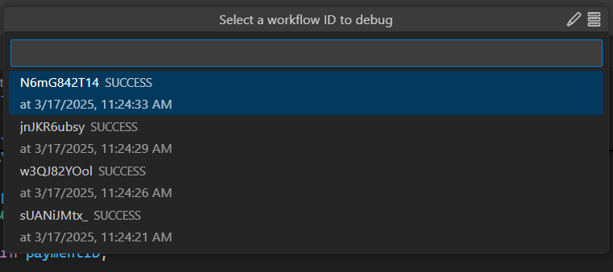
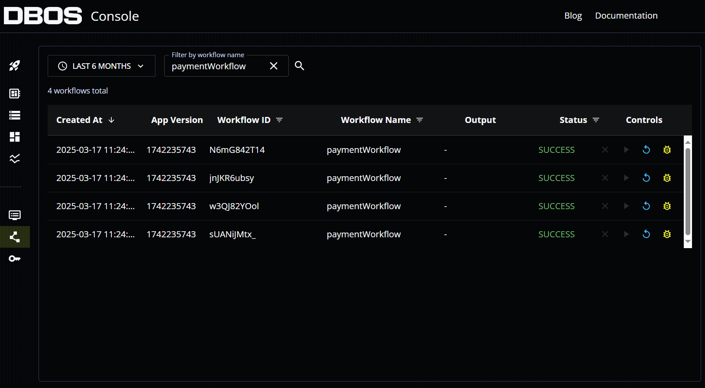

DBOS applications automatically save their state to Postgres every time a workflow step is executed.
While this is primarily done for [reliablity and fault-tolerance](../../why-dbos.md), the saved state can also be used for debugging purposes.
The DBOS Debugger enables you to replay the execution of your application workflows, step through the recorded states and identify the root cause of bugs more efficiently. 

## Preliminaries

The DBOS Debugger is an extension to [Visual Studio Code](https://code.visualstudio.com/) (aka VS Code), a free cross-platform interactive development environment.
If you don't already have VS Code installed, please see [their official documentation](https://code.visualstudio.com/docs/setup/setup-overview) to get started.

The DBOS Debugger can be installed from the [VS Code Marketplace website](https://marketplace.visualstudio.com/items?itemName=dbos-inc.dbos-ttdbg)
or or by searching the [Extension Marketplace](https://code.visualstudio.com/docs/editor/extension-marketplace) inside VS Code for "DBOS".

Additionally, the official [VS Code Python extension](https://marketplace.visualstudio.com/items?itemName=ms-python.python) is needed to debug DBOS Python applications. 
For more information about this extension, please see the [official VS Code documentation](https://code.visualstudio.com/docs/python/python-quick-start).

## Local Replay Debugging

Once the DBOS Debugger extension is installed, VS Code will display a [CodeLens](https://code.visualstudio.com/blogs/2017/02/12/code-lens-roundup)
labeled `🔁 Replay Debug` on every [workflow function](./workflow-tutorial.md) in your application.

The debugger will pick the database connection information from the `dbos-config.yaml` file.

If you click on the Replay Debug CodeLens, a list of recent [workflow IDs](./workflow-tutorial#workflow-ids-and-idempotency) will be shown.
You can filter the list of workflow IDs by entering a value in the text box above the list.
If the workflow you wish to debug does not appear in the list, select the pencil icon in the upper right hand corner of the picker window to manually enter a workflow ID. 

After selecting a workflow ID, the DBOS debugger will automatically launch your application.
command with the VS Code Python debugger attached. 
From here, you can step through your DBOS workflow and inspect variables as you would when debugging any other Python application.

:::info Note
You can only step through workflow code when using the Replay Debugger.
Step and transaction functions are skipped when Replay Debugging.
The results returned from step and transaction functions when the workflow originally ran are retrieved and returned automatically without excecuting the function body.
:::

## Cloud Replay Debugging

You can also replay debug DBOS applications deployed to DBOS Cloud.
If your application is deployed to DBOS Cloud and you are logged into DBOS Cloud in the DBOS Debugger, you will see an additional 
`☁️ Cloud Replay Debug` CodeLens attached to your DBOS workflow functions.

Cloud replay debugging works the same as local replay debugging. 
The only difference is the database your application connects to.
When cloud replay debugging, the DBOS Debugger retrieves the DBOS Cloud database connection information
and passes it to the `dbos debug` command via environment variables, overriding the database connection information in the `dbos-config.yaml` file.

## DBOS Console Integration

When using the cloud replay debugger, an additional button appears in the upper right corner of the pick list next to the pencil icon.
This button launches your default browser and navigates to the [DBOS Cloud Workflow Manager page](../../production/dbos-cloud/workflow-management.md).

In the DBOS Cloud Workflow Manager, a new control button appears that allows you to select the workflow that you wish to debug.
Selecting the debug button in this view will navigate the user back to VS Code, where the debugger will launch the selected workflow.

:::info Note
For your safety, VS Code will ask for confirmation before navigating to the Workflow Manager page and when navigating back to VS Code.
If desired, you can configure VS Code not to prompt on these navigation events in the future.
:::

## Log Into to DBOS Cloud

To login to DBOS Cloud in the DBOS Debugger, navigate to the DBOS Cloud view and select the `Log Into DBOS Cloud` menu item.

Alternatively, you can open the VS Code [Command Palette](https://code.visualstudio.com/docs/getstarted/userinterface#_command-palette) 
and run the `DBOS: Log Into DBOS Cloud` command directly.

