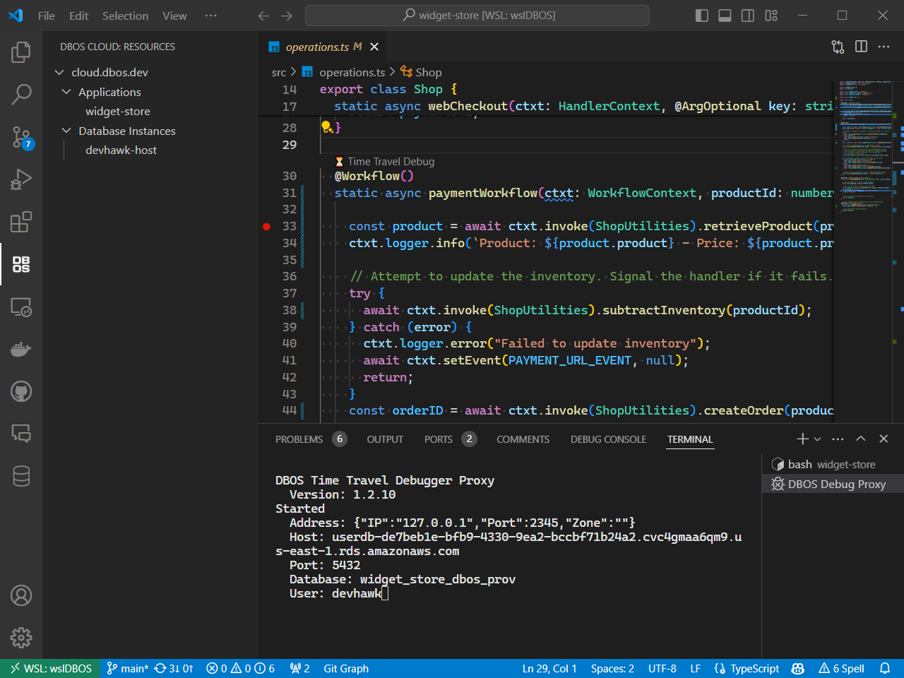

The DBOS Time Travel Debugger VS Code extension enables you to debug your production application deployed on DBOS Cloud.

## Installation

For VS Code setup instructions, please see Microsoft's [official documentation](https://code.visualstudio.com/docs/setup/setup-overview).

The DBOS Time Travel Debugger Extension can be installed via the
[VS Code Marketplace website](https://marketplace.visualstudio.com/items?itemName=dbos-inc.dbos-ttdbg)
or by searching the 
[VS Code Extension Marketplace](https://code.visualstudio.com/docs/editor/extension-marketplace)
for "DBOS".

## Views

As of v1.2 of the DBOS Time Travel Debugger Extension, you can view your DBOS Cloud applications
and database instances directly inside VSCode. Hovering over a cloud resource provides additional
information in a tooltip.



## Menu Items

### Launch Debug Proxy

The time travel debugger relies on Debug Proxy utility to project the state of the database as it existed when a selected workflow started.
When debugging a DBOS application in VSCode, the Debug Proxy is launched automatically. 
You can launch the Debug Proxy manually in order to  use `psql` for running [interactive time-traveled queries](../../cloud-tutorials/interactive-timetravel.md).

When the Debug Proxy is running, its output appears in a [VSCode terminal window](https://code.visualstudio.com/docs/terminal/basics).
You cannot interact with the Debug Proxy via this window, but you can shut it down with Ctrl-C.

### Launch DBOS Dashboard

This menu item launches the [Monitoring Dashboard](../cloud-tutorials/monitoring-dashboard.md) in a new browser instance.

## Interactive Time Travel Commands

When interactively querying your DBOS Cloud database, the following additional commands can be invoked from the 
[`psql`](https://www.postgresql.org/docs/current/app-psql.html) command prompt. 
As is typical for SQL commands, the interactive time travel commands are case insensitive.

### DBOS TIMESTAMP

::::info
Can be shortened to `DBOS TS`
::::

Sets the time travel debugger to a specific point in time for time travel queries. The timestamp can be specified in
[RFC 3339 format](https://datatracker.ietf.org/doc/html/rfc3339) (example: `2024-04-22T14:56:56-07:00`)
or as an integer indicating the Unix epoch in milliseconds. RFC 3339 formatted timestamps
must be enclosed in quotes.

Examples:

* `DBOS TIMESTAMP "2024-04-22T14:56:56-07:00";`
* `DBOS TS "2024-04-22T14:56:56-07:00";`
* `DBOS TIMESTAMP 1234567890;`

### DBOS WORKFLOW

::::info
Can be shortened to `DBOS WF`
::::

Sets the time travel debugger to the specific point in time when a specified workflow started. 
Workflows are identified by their workflow UUID, which can be found in the
[Monitoring Dashboard](../cloud-tutorials/monitoring-dashboard.md).
The workflow UUID must be enclosed in quotes when using this command.

Examples:

* `DBOS WORKFLOW "7eb0968a-fbf0-4af2-909f-51d8516e7351";`
* `DBOS WF "7eb0968a-fbf0-4af2-909f-51d8516e7351";`

### DBOS SNAPSHOT RESET

Resets the time travel snapshot to the current time.  Example:

* `DBOS SNAPSHOT RESET;`

## VSCode Commands

These commands can be invoked via the [VS Code Command Palette](https://code.visualstudio.com/docs/getstarted/userinterface#_command-palette).

### DBOS: Log into DBOS Cloud

The time travel debugger needs information about the application and its database from DBOS cloud. 
While this information can be provided via configuration settings described below, the extension can retrieve this information via the
[DBOS Cloud CLI](../api-reference/cloud-cli). This command runs [`npx dbos-cloud login`](../api-reference/cloud-cli#npx-dbos-cloud-login)
on your behalf from inside VS Code.

Typically, the time travel debugger will automatically prompt you to login to DBOS cloud if you're not logged in or your credentials have expired.
However, this command can also be executed explicitly.

### DBOS: Delete Stored Passwords

:::note
This command was originally named "Delete Stored Application Database Passwords"
:::

The time travel debugger needs your DBOS Cloud credentials as well as DBOS database password in order to access your database history.
The extension will prompt the user to login to DBOS Cloud and for the DBOS database password when needed.
Credentials are saved in VS Code's secrets storage so you don't have to enter it every time you use the time travel debugger.
This command deletes any stored passwords saved in VS Code's secrets storage.

:::note
The database password is different from the DBOS Cloud login credentials. 
Please see [Cloud Database Management](../cloud-tutorials/database-management) for more information.
:::

### DBOS: Shutdown Debug Proxy

The time travel debugger relies on Debug Proxy utility to project the state of the database as it existed when a selected workflow started.
The extension automatically launches the Debug Proxy the first time a DBOS application is time travel debugged. 
The debug proxy process is automatically shut down when VS Code shuts down, but this command can be used to shut down the debug proxy process manually.

## Command Variables

VS Code supports using [extension commands as variables](https://code.visualstudio.com/docs/editor/variables-reference#_command-variables)
in launch and task configuration files. The following commands are designed to be used as configuration file variables.

The default DBOS launch configuration includes both of these commands in the Time Travel Debug configuration.

```js
{
    "type": "node-terminal",
    "request": "launch",
    "name": "Time Travel Debug",
    "command": "npx dbos debug -x ${command:dbos-ttdbg.get-proxy-url} -u ${command:dbos-ttdbg.pick-workflow-id}",
    "preLaunchTask": "npm: build"
}
```

### dbos-ttdbg.get-proxy-url

This command retrieves the url of the Debug Proxy. By default, this is `http://localhost:2345`, but the port can be configured
via the ['debug_proxy_port'](#dbos-ttdbgdebug_proxy_port) setting.

### dbos-ttdbg.pick-workflow-id

This command prompts the user to choose a select a workflow to debug. For more information, please see the 
[Time Travel Debugger tutorial](../cloud-tutorials/timetravel-debugging).

## Configuration

Some behavior of the extension can be controlled via [VS Code Settings](https://code.visualstudio.com/docs/getstarted/settings).

### dbos-ttdbg.debug_proxy_port

The Debug Proxy listens on port 2345 by default. This port can be changed via the `dbos-ttdbg.debug_proxy_port` configuration setting.

### dbos-ttdbg.debug_pre_launch_task

By default, the [Time Travel Debugging CodeLens](http://localhost:3000/cloud-tutorials/timetravel-debugging#launching-a-debug-session) will use
the settings from the first [VS Code launch configuration](https://code.visualstudio.com/docs/editor/debugging#_launch-configurations)
that includes `npx dbos-cloud debug` in the command string. If there are no such launch configurations, the extension will create
a launch configuration from scratch. The `dbos-ttdbg.debug_pre_launch_task` configuration setting is used as the 
[`preLaunchTask`](https://code.visualstudio.com/Docs/editor/debugging#:~:text=Debug%20quick%20pick.-,preLaunchTask,-%2D%20to%20launch%20a)
value of the generated launch configuration.

:::warning
This configuration setting is ignored if you have a launch configuration with `npx dbos-cloud debug` in the command string,
even if that launch configuration does not specify a `preLaunchTask`.
:::

### DBOS Cloud Database Connection

Typically, the time travel debugger retrieves database connection information via [DBOS Cloud CLI](./cloud-cli). 
However, the developer can specify this information directly via 
[VS Code settings](https://code.visualstudio.com/docs/getstarted/settings), bypassing the need to use DBOS Cloud CLI.

:::note
For security reasons, the database password cannot be specified via VS Code settings.
:::

* [dbos-ttdbg.prov_db_host](https://www.postgresql.org/docs/16/libpq-connect.html#LIBPQ-CONNECT-HOST)
* [dbos-ttdbg.prov_db_port](https://www.postgresql.org/docs/16/libpq-connect.html#LIBPQ-CONNECT-PORT)
* [dbos-ttdbg.prov_db_database](https://www.postgresql.org/docs/16/libpq-connect.html#LIBPQ-CONNECT-DBNAME)
* [dbos-ttdbg.prov_db_user](https://www.postgresql.org/docs/16/libpq-connect.html#LIBPQ-CONNECT-USER)