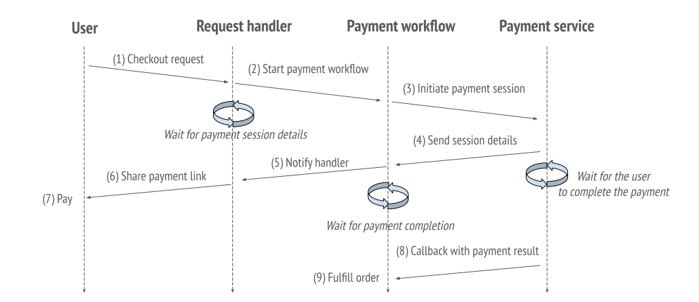

# Building a Reliable Checkout Workflow

In this guide, we'll show you how to use DBOS to write a more complex program: the checkout workflow of an online store.
When a customer orders an item, this workflow must reserve inventory for the order, redirect the customer to a third-party payment service, wait for the payment to process, then fulfill the order if payment succeeded.
Because this workflow manages inventory and money, it should be **reliable**, meaning it should:

1. Never charge a customer without fulfilling an order.
2. Never charge a customer twice for the same order.
3. Reserve inventory for an order if and only if the order is fulfilled.

Without DBOS, these properties are hard to guarantee.
If the checkout service is interrupted after a customer pays, you have to recover the workflow from where it left off and fulfill their order.
If a customer clicks the buy button twice, you have to make sure they aren't charged twice.
If a payment doesn't go through, you have to return any reserved inventory.
**As we'll show, DBOS makes this easy.**

:::info what you will learn
- How to develop reliable programs with workflows
- How to write interactive workflows that await user input
- How to use idempotency keys to call your workflows once and only once
:::

## Resources
This guide comes a companion [repository](https://github.com/dbos-inc/dbos-demo-apps/tree/main/typescript/shop-guide) containing all its code.


## Overview
In this guide, we'll be implementing two functions: the checkout workflow and its request handler.
These interact with an external payment service modelled on [Stripe](https://stripe.com).
Here's a diagram of what the end-to-end checkout flow looks like:



When a customer sends a checkout request, it's intercepted by the handler, which starts a checkout workflow, which initiates a session in the payment service.
After the session is initiated, the workflow notifies the handler, which responds to the customer with a link to submit payment.
The workflow then waits for the payment service to notify it whether the customer has paid.
Once the customer pays, the workflow fulfills the customer's order.

## The Request Handler

We'll start by building the checkout request handler, which initiates checkout in response to customer HTTP requests.

### Registering the handler

The handler is implemented in this `webCheckout` function and served from HTTP POST requests to the URL `<host>/checkout/:key?`.

```javascript
@DBOS.postApi('/checkout/:key?')
static async webCheckout(@ArgOptional key: string): Promise<string> {
```

It accepts an optional parameter `key`, used to invoke the checkout workflow [idempotently](../tutorials/idempotency-tutorial).
If a workflow is invoked many times with the same idempotency key (for example, because a customer pressed the buy button many times), it only executes once.

### Invoking the checkout workflow
Upon receiving a request, the handler asynchronously invokes the checkout workflow using its idempotency key.
It obtains a [workflow handle](../reference/transactapi/workflow-handles), used to interact with the workflow.

```javascript
// A workflow handle is immediately returned. The workflow continues in the background.
const handle = const handle = await DBOS.startWorkflow(Shop, {workflowID: key}).checkoutWorkflow();`
```

### Awaiting payment information
After invoking the checkout workflow, the handler uses the DBOS [events API](../tutorials/workflow-tutorial.md#workflow-events) to await a notification from the checkout workflow that the payment session is ready.
We will see in the next section how the checkout workflow notifies the handler.
Upon receiving the payment session ID, it generates a link to submit payment and returns it to the customer.

```javascript
// Wait until the payment session is ready
const session_id = await DBOS.getEvent<string>(handle.workflowID, session_topic);
if (session_id === null) {
  DBOS.logger.error("workflow failed");
  return;
}
return generatePaymentUrls(handle.workflowID, session_id);
```

### Full handler code

```javascript
@DBOS.postApi('/checkout/:key?')
static async webCheckout(@ArgOptional key: string): Promise<string> {
  // A workflow handle is immediately returned. The workflow continues in the background.
  const handle = await DBOS.startWorkflow(Shop, {workflowID: key}).checkoutWorkflow();
  DBOS.logger.info(`Checkout workflow started with UUID: ${handle.workflowID}`);

  // Wait until the payment session is ready
  const session_id = await DBOS.getEvent<string>(handle.workflowID, session_topic);
  if (session_id === null) {
    DBOS.logger.error("workflow failed");
    return "";
  }

  return generatePaymentUrls(handle.workflowID, session_id);
}
```

## The Checkout Workflow

The checkout workflow reserves inventory for an order, attempts to process payment, and fufills the order if payment is successful.
As we'll show, it's **reliable**: it always fulfills orders if payments succeed, never charges customers twice for the same order, and always returns reserved inventory on failure.

:::info
Check out our [e-commerce demo app](https://github.com/dbos-inc/dbos-demo-apps/tree/main/typescript/e-commerce) for a more elaborate example.
:::

### Registering the workflow

First, we declare the workflow using the `@DBOS.workflow` decorator:

```javascript
@DBOS.workflow()
static async checkoutWorkflow(): Promise<void> {
```

### Reserving inventory
Before purchasing an item, the checkout workflow reserves inventory for the order using the `reserveInventory` transaction.
If this fails (likely because the item is out of stock), the workflow notifies its handler of the failure using the [events API](../tutorials/workflow-tutorial.md#workflow-events) and returns.

```javascript
// Attempt to update the inventory. Signal the handler if it fails.
try {
  await ShopUtilities.reserveInventory();
} catch (error) {
  DBOS.logger.error("Failed to update inventory");
  await DBOS.setEvent(session_topic, null);
  return;
}
```

### Initiating a payment session
Next, the workflow initiates a payment session using the `createPaymentSession` [step](../tutorials/step-tutorial).
If this fails, it returns reserved items using the `undoReserveInventory` transaction, notifies its handler, and returns.
```javascript
// Attempt to start a payment session. If it fails, restore inventory state and signal the handler.
const paymentSession = await ShopUtilities.createPaymentSession();
if (!paymentSession.url) {
  DBOS.logger.error("Failed to create payment session");
  await ShopUtilities.undoReserveInventory();
  await DBOS.setEvent(session_topic, null);
  return;
}
```

### Notifying the handler

After initiating a payment ession, the workflow notifies its handler that the payment session is ready.
We use `DBOS.setEvent` to publish the payment session ID to the workflow's `session_topic`, on which the handler is awaiting a notification.
```javascript
// Notify the handler of the payment session ID.
await DBOS.setEvent(session_topic, paymentSession.session_id);
```

### Waiting for a payment
After notifying its handler, the checkout workflow waits for the payment service to notify it whether the customer has paid.
We await this notification using the `DBOS.recv` method from the DBOS [messages API](../tutorials/workflow-tutorial.md#workflow-messaging-and-notifications).
When the customer pays, the payment service sends a callback HTTP request to a separate callback handler (omitted for brevity, source code in `src/utilities.ts`), which notifies the checkout workflow via [`DBOS.send`].

```javascript
// Await a notification from the payment service.
const notification = await DBOS.recv<string>(payment_complete_topic);
```

### Handling payment outcomes
After receiving a payment notification, the workflow fulfills the order if the payment succeeded and cancels the order and returns reserved inventory if the payment failed or timed out.
In a real application, we may want to check with the payment provider in case of a timeout to verify the status of the payment.

```javascript
if (notification && notification === 'paid') {
  // If the payment succeeds, fulfill the order (code omitted for brevity.)
  DBOS.logger.info(`Checkout with UUID ${DBOS.workflowID} succeeded!`);
} else {
  // If the payment fails or times out, cancel the order and return inventory.
  DBOS.logger.warn(`Checkout with UUID ${DBOS.workflowID} failed or timed out...`);
  await ShopUtilities.undoReserveInventory();
}
```

### Full workflow code
```javascript
@DBOS.workflow()
static async checkoutWorkflow(): Promise<void> {
  // Attempt to update the inventory. Signal the handler if it fails.
  try {
    await ShopUtilities.reserveInventory();
  } catch (error) {
    DBOS.logger.error("Failed to update inventory");
    await DBOS.setEvent(session_topic, null);
    return;
  }

  // Attempt to start a payment session. If it fails, restore inventory state and signal the handler.
  const paymentSession = await ShopUtilities.createPaymentSession();
  if (!paymentSession.url) {
    DBOS.logger.error("Failed to create payment session");
    await ShopUtilities.undoReserveInventory();
    await DBOS.setEvent(session_topic, null);
    return;
  }

  // Notify the handler of the payment session ID.
  await DBOS.setEvent(session_topic, paymentSession.session_id);

  // Await a notification from the payment service.
  const notification = await DBOS.recv<string>(payment_complete_topic);

  if (notification && notification === 'paid') {
    // If the payment succeeds, fulfill the order (code omitted for brevity.)
    DBOS.logger.info(`Checkout with UUID ${DBOS.workflowUUID} succeeded!`);
  } else {
    // If the payment fails or times out, cancel the order and return inventory.
    DBOS.logger.warn(`Checkout with UUID ${DBOS.workflowUUID} failed or timed out...`);
    await ShopUtilities.undoReserveInventory();
  }
}
```

## Running it Yourself

Now, let's see this code in action!
First, clone and enter the companion repository:

```shell
git clone https://github.com/dbos-inc/dbos-demo-apps
cd dbos-demo-apps/typescript/shop-guide
```

Then, start the payment service in the background.
In one terminal, run:
```shell
./start_payment_service.sh
```

Next, start the shop application.
In another terminal, run:
```shell
npm ci
npm run build
npx dbos migrate
npx dbos start
```

The output should look like:

```shell
[info]: Workflow executor initialized
[info]: HTTP endpoints supported:
[info]:     POST  :  /payment_webhook
[info]:     POST  :  /checkout/:key?
[info]: DBOS Server is running at http://localhost:8082
[info]: DBOS Admin Server is running at http://localhost:8083
```

In another terminal, let's send a request to initiate a checkout: 

```
curl -X POST http://localhost:8082/checkout
```

The response will include two `curl` commands, one for validating the payment and one for cancelling it.

```shell
Submit payment:
curl -X POST http://localhost:8086/api/submit_payment -H "Content-type: application/json" -H "dbos-idmpotency-key: f5103e9f-e78a-4aab-9801-edd45a933d6a" -d '{"session_id":"fd17b90a-1968-440c-adf7-052aaeaaf788"}'
Cancel payment:
curl -X POST http://localhost:8086/api/cancel_payment -H "Content-type: application/json" -H "dbos-idempotency-key: f5103e9f-e78a-4aab-9801-edd45a933d6a" -d '{"session_id":"fd17b90a-1968-440c-adf7-052aaeaaf788"}'
```

If you submit the payment, you should see this output:

```shell
[info]: Checkout with UUID <uuid> succeeded!
```

If you cancel the payment or do nothing, you should see this output:

```
[warn]: Checkout with UUID <uuid> failed or timed out...
```

## Using Idempotency Keys

You can use idempotency keys to send a request idempotently, guaranteeing it only executes once, even if the request is sent multiple times.
To see this in action, set the idempotency key when submitting a checkout request:

```
curl -X POST http://localhost:8082/checkout/abcde-12345
```

No matter how many times you submit this request, you always receive the same response and the checkout is only started once (notice that all printed messages share the same UUID).
If you submit the payment for this checkout, you'll see it's only processed once.
