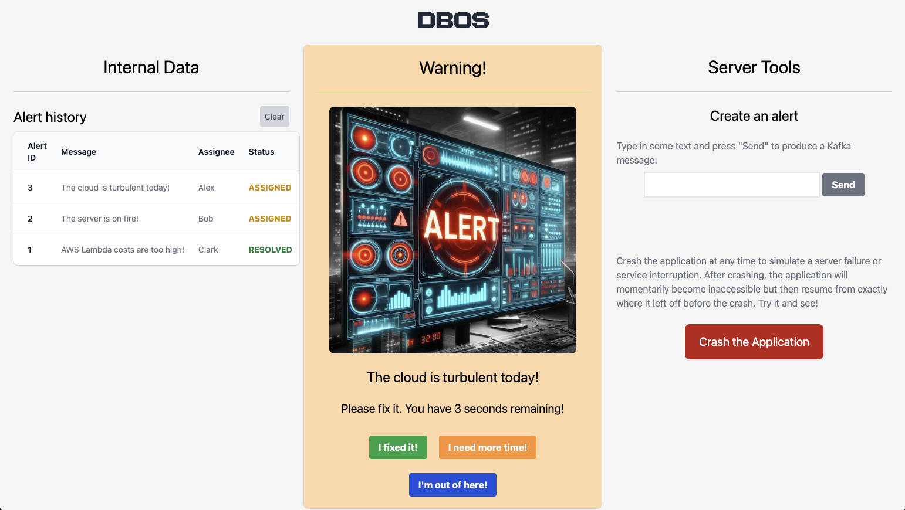

In this example, we use DBOS to build an app that consumes Alert notifications as Kafka messages. Every Kafka message is handled exactly once, even if the app is stopped and restarted at any point.  All source code is [available on GitHub](https://github.com/dbos-inc/dbos-demo-apps/tree/main/typescript/alert-center).

## The Flow of the App

The app maintains a table of **employees** working in a fictional (but very important) DBOS Alert Center. There is a second table of **alerts**. Incoming Kafka messages create alerts. Employees can log in to the app to respond to the alerts. 

Once an employee logs in, the app looks for any alerts that are not assigned. If such an alert exists, the employee is assigned to handle it. The employee has 30 seconds to resolve the alert or request more time. After the timer expires, the alert may be reassigned to any of the other logged-in employees. The employee may also choose to log out, making the alert eligible for immediate reassignment. If there are no active alerts to handle, the employee is presented with a soothing message encouraging them to relax.

For easy demonstration, the app allows several employees to log in from the same machine, using different browser tabs. The frontend also features a button to create new alerts. In this case, the app produces a Kafka message to the broker that it also consumes. And, as with other example apps, we provide the "Crash Application" button to showcase how DBOS recovers from failures at any point.

The front end presents a history of all the alerts on the left, the current alert assignment in the middle and tools for creating alerts or crashing the app on the right:


Roughly speaking, this app implements many features of a [Task Queue](https://en.wikipedia.org/wiki/Scheduling_(computing)#task_queue). Employees act like workers requesting tasks and then sending completion updates. Tasks are assigned reliably and properly reassigned if a worker stops responding. 

Below, we walk you through the key components of this app, step by step.

## 1. Setting up App Schema

Alerts have 3 enumerated statuses: ACTIVE (not assigned), ASSIGNED and RESOLVED. We define these in utilities.ts:
```typescript
export enum AlertStatus {
  ACTIVE   = 0,
  ASSIGNED = 1,
  RESOLVED = 2
}
```

In this app we use [Knex](../tutorials/orms/using-knex.md) for schema management. Our two tables are quite simple. The employee table has a nullable alert_id and the alert table has a nullable employee_name. These are set when an employee is assigned to an alert. Our schema migration file looks like so:
```typescript
exports.up = async function(knex) {
  await knex.schema.createTable('employee', table => {
    table.string('employee_name', 255).primary();        //name of the employee
    table.integer('alert_id').unique();                  //ID of the alert assigned (null if none)
    table.datetime('expiration').defaultTo(null);        //date when this assignment expires
  });

  await knex.schema.createTable('alert_employee', table => {
    table.integer('alert_id').primary();                  //unique ID of the alert
    table.integer('alert_status').notNullable();          //one of the 3 values above
    table.string('message', 255).defaultTo('');           //the text of the alert
    table.string('employee_name', 255).defaultTo(null);   //employee assigned (null if not assigned)
  });
};

//obligatory teardown
exports.down = async function(knex) {
  await knex.schema.dropTable('alert_employee');
  await knex.schema.dropTable('employee');
};
```

## 2. Receiving Kafka Messages

We create a `env` line in dbos-config.yaml for the KAFKA_BROKER environment variable:
```yaml
#...
env:
  KAFKA_BROKER: ${KAFKA_BROKER}
```
This passes the value of `KAFKA_BROKER` to the app when running locally and also to DBOS Cloud when deploying the app.

Following the [Kafka Integration](../tutorials/requestsandevents/kafka-integration.md) guide, we create a configuration to handle Kafka messages in our `operations.ts` file like so:
```typescript
//The Kafka topic and broker configuration
const respondTopic = 'alert-responder-topic';

// KAFKA_BROKER is passed via dbos-config.yaml
const kbroker = process.env['KAFKA_BROKER'] ? process.env['KAFKA_BROKER'] : 'localhost:9092';

const kafkaConfig: KafkaConfig = {
  clientId: 'dbos-kafka-test',
  brokers: [kbroker],
  ssl: process.env['KAFKA_USERNAME'] ? true : false,
  sasl: process.env['KAFKA_USERNAME'] ? {
    mechanism: 'plain',
    username: process.env['KAFKA_USERNAME']!,
    password: process.env['KAFKA_PASSWORD']!,
  } : undefined,
  connectionTimeout: 45000,
  logLevel: logLevel.ERROR
};
```

We can trigger a DBOS Workflow every time a message arrives with the `@KafkaConsume` decorator like so. In this workflow we call a transaction to add all incoming alerts to our `alerts` table:
```typescript
//The structure returned to the frontend when an employee asks for an assignment
export interface AlertEmployeeInfo
{
  employee: Employee;
  alert: AlertEmployee[];
  expirationSecs: number | null;
  newAssignment: boolean;
}

@Kafka(kafkaConfig)
export class AlertCenter {

  //This is invoked when a new alert message arrives using the @KafkaConsume decorator
  @DBOS.workflow()
  @KafkaConsume(respondTopic)
  static async inboundAlertWorkflow(topic: string, _partition: number, message: KafkaMessage) {
    const payload = JSON.parse(message.value!.toString()) as {
      alerts: AlertWithMessage[],
    };
    DBOS.logger.info(`Received alert: ${JSON.stringify(payload)}`);
    //Add to the database
    for (const detail of payload.alerts) {
      await RespondUtilities.addAlert(detail);
    }
    return Promise.resolve();
  }
}
```

Here's the code for `addAlert` in utilities.ts:
```typescript
//in utilities.ts/RespondUtilities
@DBOS.transaction()
static async addAlert(message: AlertWithMessage) {
  await DBOS.knexClient<AlertEmployee>('alert_employee').insert({
    alert_id: message.alert_id,
    alert_status: message.alert_status,
    message: message.message,
    employee_name: null,
  }).onConflict(['alert_id']).ignore();
}
```
This workflow is guaranteed to handle every Kafka message exactly once, even if interrupted by app crash.

## 3. Sending Kafka Messages

To send messages, we create a KafkaProducerCommunicator object like so:
```typescript
//A configured instance used to produce messages (operations.ts)
const producerConfig: KafkaProduceStep = new KafkaProduceStep( 
  'wfKafka', kafkaConfig, respondTopic, {
    createPartitioner: Partitioners.DefaultPartitioner
  });
```

We then create an HTTP handler that accepts a message string and uses `producerConfig` to produce a new message:
```typescript
//Produce a new alert message to our broker (in operations.ts/AlertCenter)
@DBOS.postApi('/do_send')
@DBOS.workflow()
static async sendAlert(message: string) {
  const max_id = await RespondUtilities.getMaxId();
  await producerConfig.send(
    {
      value: JSON.stringify({
        alerts: [
          { 
            alert_id: max_id+1,
            alert_status: AlertStatus.ACTIVE,
            message: message
          }
        ]
      })
    }
  );
}
```
We now have a very simple app that can send and recieve Kafka messages!

## 4. Creating Employee-Alert Assignments

Now that we have a table of alerts, we provide capabilities for employees to request work and see their assignment status. First, we define a database transaction that accepts the name of an employee and current time. It covers the following cases:

1. if an employee needs a new alert assignment, try to find one and return whether a new assignment is made
2. if an employee has an existing assignment - return its status, including how much time is left

If the employee does not exist (first time on duty), we add them to the `employees` table on the spot.

First we create a few auxiliary structures:
```typescript
//Query interfaces (utilities.ts)
export interface Employee {
  employee_name: string;
  alert_id: number | null;
  expiration: Date | null;
  timeLeft?: number;
}

export interface AlertEmployee {
  alert_id: number;
  alert_status: AlertStatus;
  message: string;
  employee_name: string | null;
}

const timeToRespondToAlert = 30; //default alert time window, in seconds
```

Then we add the following `getUserAssignment` transaction:
```typescript
//in utilities.ts/RespondUtilities
  @DBOS.transaction()
  static async getUserAssignment(employee_name: string, currentTime: number, @ArgOptional more_time: boolean | undefined) {
    let employees = await DBOS.knexClient<Employee>('employee').where({employee_name}).select();
    let newAssignment = false;

    if (employees.length === 0) {
      //Is this the first getUserAssignment for this employee? Add them to the employee table
      employees = await DBOS.knexClient<Employee>('employee').insert({employee_name, alert_id: null, expiration: null}).returning('*');
    }

    const expirationTime = new Date(currentTime + timeToRespondToAlert * 1000);

    if (!employees[0].alert_id) { 
      //This employee does not have a current assignment. Let's find a new one!
      const op = await DBOS.knexClient<AlertEmployee>('alert_employee').whereNull('employee_name').orderBy(['alert_id']).first();

      if (op) { //found an alert - assign it
        op.employee_name = employee_name;
        const alert_id = op.alert_id;
        employees[0].alert_id = op.alert_id;
        employees[0].expiration = expirationTime;
        await DBOS.knexClient<Employee>('employee').where({employee_name}).update({alert_id, expiration: expirationTime});
        await DBOS.knexClient<AlertEmployee>('alert_employee').where({alert_id}).update({employee_name});
        newAssignment = true;
        DBOS.logger.info(`New Assignment for ${employee_name}: ${alert_id}`);
      }
    }
    else if (employees[0].alert_id && more_time) {
      //This employee has an assignment and is asking for more time.
      DBOS.logger.info(`Extending time for ${employee_name} on ${employees[0].alert_id}`);
      employees[0].expiration = expirationTime;
      await DBOS.knexClient<Employee>('employee').where({employee_name}).update({expiration: expirationTime});
    }

    //If we have an assignment (new or existing), retrieve and return it
    let alert : AlertEmployee[] = [];
    if (employees[0].alert_id) {
      alert = await DBOS.knexClient<AlertEmployee>('alert_employee').where({alert_id: employees[0].alert_id}).select();
    }
    return {employee: employees[0], newAssignment, alert};
  }
```

## 5. Releasing Assignments When Time is Up

We define another transaction to check whether an existing assignment has run out of time. If so, we unlink the alert from the employee making it up for grabs by others:

```typescript
//in utilities.ts/RespondUtilities
@DBOS.transaction()
static async checkForExpiredAssignment(employee_name: string, currentDate: Date) : Promise<Date | null> {
  const employees = await DBOS.knexClient<Employee>('employee').where({employee_name}).select();

  if (!employees[0].alert_id) {
    // This employee is not assigned
    return null;
  }

  if ((employees[0].expiration?.getTime() ?? 0) > currentDate.getTime()) {
    //This employee is assigned and their time is not yet expired
    DBOS.logger.info(`Not yet expired: ${employees[0].expiration?.getTime()} > ${currentDate.getTime()}`);
    return employees[0].expiration;
  }

  //This assigment expired - free up the alert for other employees to take
  await DBOS.knexClient<AlertEmployee>('alert_employee').where({alert_id: employees[0].alert_id}).update({employee_name: null});
  await DBOS.knexClient<Employee>('employee').where({employee_name}).update({alert_id: null, expiration: null});
  return null;
}
```

## 6. The Workflow to Assign and Release

We now compose a workflow that leverages `getUserAssignment` and `checkForExpiredAssignment` to reliably assign alerts and then release them when they expire. This workflow takes the name of the employee and, optionally, whether this is a request for more time.  It does the following:
1. use [DBOSDateTime](../reference/libraries.md) to durably retrieve the workflow start time
2. call `getUserAssignment` to retrieve the assignment status for the employee (creating a new assignment if appropriate)
3. use [DBOS.setEvent](../tutorials/workflow-tutorial.md#setevent) to return the assignment status to the caller
4. if this is a new assignment, go into a loop that performs durable sleep and calls `checkForExpiredAssignment` to release this assignment when time is up.

In other words, if this is a new assignment, then the workflow runs longer, until the assignment is over. Else, it simply checks the status and returns quickly. We can do this with DBOS because workflows are guaranteed to continue executing to completion. 

The code looks like so:
```typescript
//in operations.ts/AlertCenter
@DBOS.workflow()
static async userAssignmentWorkflow(name: string, @ArgOptional more_time: boolean | undefined) {
  
  // Get the current time from a checkpointed step;
  //   This ensures the same time is used for recovery or in the time-travel debugger
  let ctime = await DBOSDateTime.getCurrentTime();

  //Assign, extend time or simply return current assignment
  const userRec = await RespondUtilities.getUserAssignment(name, ctime, more_time);
  
  //Get the expiration time (if there is a current assignment); use setEvent to provide it to the caller
  const expirationSecs = userRec.employee.expiration ? (userRec.employee.expiration!.getTime()-ctime) / 1000 : null;
  await DBOS.setEvent<AlertEmployeeInfo>('rec', {...userRec, expirationSecs});

  if (userRec.newAssignment) {

    //First time we assigned this alert to this employee. 
    //Here we start a loop that sleeps, wakes up and checks if the assignment has expired
    DBOS.logger.info(`Start watch workflow for ${name}`);
    let expirationMS = userRec.employee.expiration ? userRec.employee.expiration.getTime() : 0;

    while (expirationMS > ctime) {
      DBOS.logger.debug(`Sleeping ${expirationMS-ctime}`);
      await DBOS.sleepms(expirationMS - ctime);
      const curDate = await DBOSDateTime.getCurrentDate();
      ctime = curDate.getTime();
      const nextTime = await RespondUtilities.checkForExpiredAssignment(name, curDate);

      if (!nextTime) {
        //The time on this assignment expired, and we can stop monitoring it
        DBOS.logger.info(`Assignment for ${name} ended; no longer watching.`);
        break;
      }

      expirationMS = nextTime.getTime();
      DBOS.logger.info(`Going around again: ${expirationMS} / ${ctime}`);
    }
  }
}
```

## 7. Other Ways to Release Assignments

An employee may also release an assignment by fixing the alert! We add a transaction to do this like so:
```typescript
//in utilities.ts/RespondUtilities
@DBOS.transaction()
static async employeeCompleteAssignment(employee_name: string) {
  const employees = await DBOS.knexClient<Employee>('employee').where({employee_name}).select();
  
  if (!employees[0].alert_id) {
    throw new Error(`Employee ${employee_name} completed an assignment that did not exist`);
  }

  await DBOS.knexClient<AlertEmployee>('alert_employee').where({alert_id: employees[0].alert_id}).update({alert_status: AlertStatus.RESOLVED});
  await DBOS.knexClient<Employee>('employee').where({employee_name}).update({alert_id: null, expiration: null});
}
```
We write a very analogous `employeeAbandonAssignment` for when an employee logs out [here](https://github.com/dbos-inc/dbos-demo-apps/blob/59357e56792e668c8315fb4859674827c7dce9eb/typescript/alert-center/src/utilities.ts#L132). It mainly differs in not setting alert status to `RESOLVED`.

## 8. Exposing these APIs to the Frontend

Finally we define routes for these actions in `frontend.ts` that our UI invokes. Like so:
```typescript
//Serve public/app.html as the main endpoint
@DBOS.getApi('/')
static frontend() {
  return render("app.html", {});
}


//For a new employee to get an assignment or for an assigned employee to ask for more time
@DBOS.getApi('/assignment')
static async getAssignment(name: string, @ArgOptional more_time: boolean | undefined) {
  const userRecWF = await DBOS.startWorkflow(AlertCenter).userAssignmentWorkflow(name, more_time);

  //This Workflow Event lets us know if we have an assignment and, if so, how much time is left
  const userRec = await DBOS.getEvent<AlertEmployeeInfo>(userRecWF.getWorkflowUUID(), 'rec');
  return userRec;
}

//And so on for respond/cancel, respond/more_time, etc...
```

The frontend at `app.html` calls `/assignment` in a loop, every half second or so, to show the assignment time countdown. In production, we recommend using DBOS primarily for the backend, with your frontend deployed elsewhere.

## 9. Trying out the App

You can run locally with a Kafka broker container we provide. First, make sure you have Docker and Postgres configured as shown in the [quickstart](../../quickstart.md).

Then, start the broker container:
```bash
cd alert-center
export KAFKA_BROKER="localhost:9092"
docker-compose -f kafka-compose.yml up
```
This starts a session with terminal output. You can leave it running.

Then, in another terminal window, build, migrate and run the app:
```bash
cd alert-center
export KAFKA_BROKER="localhost:9092"
export PGPASSWORD="..." #export your password if using Docker for Postgres
npm install
npm run build
npx dbos migrate

# in order to restart when crashed, we run the app in a loop. On Linux or Mac:
while [ 1 ] ; do npx dbos start; done 
# Alternatively you can use regular npx dbos start
```

## 10. Running with a Kafka Broker in the Cloud

If you have an existing Kafka broker you'd like to use, pass the URL and port to the app via the environment variable KAFKA_BROKER like so:
```bash
export KAFKA_BROKER="broker1.example.com:9092"
#...
dbos-cloud app deploy
```
This way, the `dbos-cloud app deploy` command passes the value of `KAFKA_BROKER` to the deployed cloud app.
