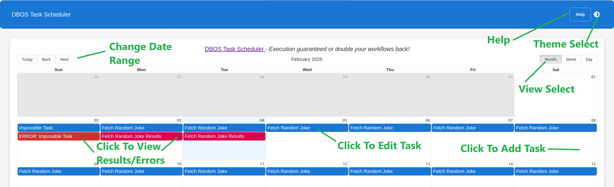

# DBOS Task Scheduler
DBOS Task Scheduler is a full-stack app built with [Next.js](https://nextjs.org/) and [DBOS](https://dbos.dev).  It serves as both a demo for learning DBOS concepts and a template for building your own DBOS-powered Next.js applications.



If you like the idea of a cloud-based task scheduler with a calendar UI, you can easily [customize it with your own tasks](#task-code) and deploy it to [DBOS Cloud](https://www.dbos.dev/dbos-cloud) for free.

## Running DBOS Task Scheduler in DBOS Cloud
Provisioning an instance of DBOS Task Scheduler in DBOS Cloud is easy:
- Go to [DBOS Cloud Console](https://console.dbos.dev/launch)
- Sign Up or Sign In, if you haven't already
- Select the "TYPESCRIPT" tab
- Choose the "DBOS Task Scheduler" template

After a bit of launch activity, you will be presented with:
- A URL for accessing the app
- Monitoring dashboards
- Management options
- Code download

## Running DBOS Task Scheduler Locally
If you [started out in DBOS Cloud](#running-dbos-task-scheduler-in-dbos-cloud), you can download your code to your development environment.  Or, you can [clone the code from the git repository](https://github.com/dbos-inc/dbos-demo-apps) and change to the `typescript/nextjs-calendar` directory.

### Setting Up A Database
DBOS requires a Postgres database.
If you already have Postgres, you can set the `DBOS_DATABASE_URL` environment variable to your connection string.
Otherwise, you can start Postgres in a Docker container with this command:

```shell
npx dbos postgres start
```


### Running In Development
Once you have a local copy of the DBOS Task Scheduler, run the following:

```
npm install
npm run dev
```

When running under `npm run dev`, any changes to source files will cause the application to reload (if UI components were changed) or restart (if DBOS server components were changed).

### Production Builds

Instead of `npm run dev` it is also possible to run the following sequence of commands to launch an optimized "production" build:
```
npm install
npm run build
npx knex migrate:latest
npm run start
```

## DBOS Task Scheduler's Web UI
Once the app is running, open it in a web browser.
- If the app is running In DBOS Cloud, the URL will be shown [in the cloud console](https://console.dbos.dev/applications) under "Visit your app", and the URL will also be reported in the output of the deploy command.
- If running locally, the default will be at [http://localhost:3000/](http://localhost:3000/), but check your startup logs for confirmation.

Upon opening the web browser (and perhaps dismissing the help popup), the main screen should be shown:


## Setting Up Email Notifications (Optional)
The DBOS Task Scheduler app will *optionally* send notifications using Amazon Simple Email Service (SES).  To use this, set the following environment variables prior to launching the app:
- AWS_REGION: The AWS region for SES service
- AWS_ACCESS_KEY_ID: The AWS access key provisioned for SES access
- AWS_SECRET_ACCESS_KEY: The access secret corresponding to AWS_ACCESS_KEY_ID
- REPORT_EMAIL_FROM_ADDRESS: The email address to use as the "from" address for results reports
- REPORT_EMAIL_TO_ADDRESS: The email address to use as the "to" address for results reports

If these environment variables aren't set, email will not be sent.

# Code Tour
::::tip
The DBOS Task Scheduler app is somewhat complex, showcasing many features.  For a simpler starting point, see [dbos-nextjs-starter](https://github.com/dbos-inc/dbos-demo-apps/tree/main/typescript/dbos-nextjs-starter#readme).
::::

This app uses the following:
- DBOS [Workflows](../tutorials/workflow-tutorial.md), [Transactions](../tutorials/transaction-tutorial.md), and [Steps](../tutorials/step-tutorial.md) – Complete actions [exactly once](../tutorials/workflow-tutorial.md#workflow-ids-and-idempotency), record the results, and send notifications, without worrying about server disruptions
- [Knex](https://knexjs.org/) – Type-safe database access and schema management
- [DBOS Scheduled Workflows](../tutorials/scheduled-workflows.md) – Ensure tasks are run as scheduled
- React, with [Material](https://mui.com) and [react-big-calendar](https://github.com/jquense/react-big-calendar) – Present a calendar of tasks and results
- Next.js server actions – Simple interaction between the browser-based client and the server
- Next.js API routes and DBOS HTTP endpoints – Allow access to the server logic from clients other than Next.js
- [WebSockets](https://developer.mozilla.org/en-US/docs/Web/API/WebSockets_API) – Send calendar and result updates to the browser with low latency
- Database triggers – Listen for database updates made by other VMs
- [Jest](https://jestjs.io/) – Unit test backend code

## DBOS and Database Logic

### Task Code
The list of schedulable tasks is in `src/dbos/tasks.ts`. The `schedulableTasks` array contains the available tasks, with information needed for `doTaskFetch` to execute them.  Tasks can be added by expanding the array with additional entries:
```typescript
  {
    id: 'fetch_joke', // Unique ID for the task
    name: 'Fetch Random Joke', // Text label the task
    url: 'https://official-joke-api.appspot.com/random_joke', // URL to fetch when the task runs
    type: 'json', // Type of result to expect from the task
  },
```

### Main Workflow
The main workflow for executing tasks is in `src/dbos/operations.ts`, in the `SchedulerOps` class:

```typescript
  @DBOS.workflow()
  static async runJob(sched: string, task: string, time: Date) {
    DBOS.logger.info(`Running ${task} at ${time.toString()}`);

    let resstr = "";
    let errstr = "";

    try {
      // Fetch the result
      const res = await SchedulerOps.runTask(task);
      resstr = res;

      // Store result in database
      await ScheduleDBOps.setResult(sched, task, time, res, '');
    }
    catch (e) {
      const err = e as Error;
      // Store error in database
      await ScheduleDBOps.setResult(sched, task, time, '', err.message);
      errstr = err.message;
    }

    // Tell attached clients
    SchedulerOps.notifyListeners('result');

    // Send notification
    await SchedulerOps.sendStatusEmail(
      errstr ? `Task ${task} failed` : `Task ${task} result`,
      errstr || resstr
    );
  }
```

Because it is a `@DBOS.workflow`, `runJob` will be [executed durably](../tutorials/workflow-tutorial.md).  That is, if the server crashes after `runTask` is complete, but the result hasn't been recorded in the database with `setResult`, or if the email hasn't been sent by `sendStatusEmail`, DBOS Transact will finish the workflow during recovery and execute those steps.

### Scheduling

Scheduling a workflow in DBOS is quite simple; simply affix the [`@DBOS.scheduled` decorator](https://docs.dbos.dev/typescript/tutorials/scheduled-workflows).  The `crontab` of `'* * * * *'` will cause `runSchedule` to execute every minute, and `runSchedule` will check the database for tasks to execute.

```typescript
  @DBOS.scheduled({crontab: '* * * * *', mode: SchedulerMode.ExactlyOncePerIntervalWhenActive })
  @DBOS.workflow()
  static async runSchedule(schedTime: Date, _atTime: Date) {
    // Retrieve schedule from database
    const schedule = await ScheduleDBOps.getSchedule();
    for (const sched of schedule) {
      // See if this schedule should be triggered now
      const occurrences = getOccurrencesAt(sched, schedTime);
      for (const occurrence of occurrences) {
        // Start each job in the background
        await DBOS.startWorkflow(SchedulerOps).runJob(sched.id, sched.task, occurrence);
      }
    }
  }
```

Note that the use of `mode: SchedulerMode.ExactlyOncePerIntervalWhenActive` means that makeup work will not be performed if DBOS is down at the time that tasks are scheduled.  To make up for missed intervals, ensuring the scheduled workflows run exactly once, use `mode: SchedulerMode.ExactlyOncePerInterval`.

### Database Schema and Transactions

DBOS Task Scheduler stores its schedule and results data in a Postgres database using [Knex](https://knexjs.org/).  The code for the transactions resides in `src/dbos/dbtransactions.ts`.  For example, the `getSchedule` method in `ScheduleDBOps` retrieves the entire schedule from the database:

```typescript
  @DBOS.transaction({readOnly: true})
  static async getSchedule() {
    return await DBOS.knexClient<ScheduleRecord>('schedule').select();
  }
```

Note that the transaction function is decorated with [`@DBOS.transaction`](https://docs.dbos.dev/typescript/tutorials/transaction-tutorial).  The `ScheduleRecord` has been defined in `src/types/models.ts` and is applied to the query for type checking.

The database schema, which defines the `schedule` table, can be found in `migrations/20250122121006_create_calendar_tables/.js`:
```javascript
exports.up = function(knex) {
  return knex.schema
    .createTable('schedule', (table) => {
      table.uuid('id').primary().defaultTo(knex.raw('gen_random_uuid()'));  // Use UUID as primary key
      table.string('task').notNullable();  // Task ID
      table.datetime('start_time').notNullable();  // Scheduled time
      table.datetime('end_time').notNullable();  // Scheduled time
      table.string('repeat').notNullable();  // Repetition options
      table.timestamps(true, true);  // Adds created_at and updated_at timestamps
    })
    //...
};
```


### Sending Email with Amazon SES

The optional sending of task results emails is done using Amazon SES, and the `@dbos-inc/dbos-email-ses` package.

All that is necessary, as shown in `src/dbos/operations.ts`, is to configure the email instance (using environment variables):
```typescript
if (!globalThis.reportSes && (process.env['REPORT_EMAIL_TO_ADDRESS'] && process.env['REPORT_EMAIL_FROM_ADDRESS'])) {
  globalThis.reportSes = new DBOS_SES('reportSES', {awscfgname: 'aws_config'});
}
```

And then call `send`:
```typescript
  static async sendStatusEmail(subject: string, body: string) {
    if (!globalThis.reportSes) return;
    await globalThis.reportSes.sendEmail({
      to: [process.env['REPORT_EMAIL_TO_ADDRESS']!],
      from: process.env['REPORT_EMAIL_FROM_ADDRESS']!,
      subject: subject,
      bodyText: body,
    });
  }
```

## UI
The user interface for DBOS Task Scheduler is built on React, with [Material](https://mui.com) and [react-big-calendar](https://github.com/jquense/react-big-calendar).

### UI Components
The app-specific UI components can be found in `src/app/components/*.tsx`, with the overall layout established in `src/app/layout.tsx` and `src/app/page.tsx`.  Nothing in these components is particularly notable; they just use core React/Next.js constructs.

### Server Actions
One of the key benefits of Next.js over straight React is [server actions](https://nextjs.org/docs/app/building-your-application/data-fetching/server-actions-and-mutations).  Server actions provide an easy way for the UI to call code on the server, without specifying the API.

Within DBOS Task Scheduler, server actions are used for updating the calendar tasks, and fetching results.  The action code can be found in `src/actions/schedule.ts`.  For example, `ScheduleForm.tsx` calls the `addSchedule` server action:

```typescript
// Add a new schedule item
export async function addSchedule(task: string, start: Date, end: Date, repeat: string) {
  const res = await ScheduleDBOps.addScheduleItem(task, start, end, repeat);
  // Tell attached clients
  SchedulerOps.notifyListeners('schedule');
  return res;
}
```

This server action will in turn call DBOS.  Note that `addSchedule` involves a remote method invocation provided by Next.js, as the `ScheduleForm` is rendered on the client, and `addSchedule` is processed on the server.

### API Routes
While server actions are convenient, they are only available to Next.js clients.  For cases where other clients should have access to the API, Next.js offers API routes.

One author of DBOS Task Scheduler wanted to fetch boredom-relieving tasks from [Bored API](https://www.boredapi.com/).  While this API was unfortunately down at the time the demo was written, this presents an opportunity to write a replacement API as part of the app.

First, the list of available activities was copied and added to `src/app/bored/db/activities.ts`.  Then the following code was set up in `src/app/api/boredactivity/route.ts` to handle the GET request for `api/boredactivity`:

```typescript
import { dbosBored } from '@/actions/bored';
import { NextResponse } from 'next/server';

export async function GET() {
  const dbb = await dbosBored();
  return NextResponse.json(dbb);
}
```

This route code then calls into the server action code:
```typescript
import { DBOSBored } from "@/dbos/operations";

export async function dbosBored() {
  return await DBOSBored.getActivity();
}
```

Which in turn calls the DBOS logic:
```typescript
export class DBOSBored {
  @DBOS.workflow()
  static async getActivity() : Promise<Activity> {
    const choice = Math.floor(await DBOSRandom.random() * activities.length);
    return activities[choice];
  }
}
```

Note that while this successfully registers the `/api/boredactivity` endpoint, it is fortunate that this API is simple... there is no API description or type checking code provided when using this method.

### DBOS Routes
DBOS provides a much simpler way to register API endpoints.

By simply decorating a method with `@DBOS.getAPI`, the API will be available, with built-in type checking, and available for OpenAPI support.  The following registers the API at `/dbos/boredapi/activity`:

```typescript
  @DBOS.getApi('/dbos/boredapi/activity')
  static async boredAPIActivity() {
    return await DBOSBored.getActivity();
  }
```

### WebSockets
Another thing that is not generally possible in Next.js is real-time updates to the client.  In DBOS Task Scheduler, the client calendar should be updated when new task results arrive, or if another user alters the calendar.  While this can be achieved with polling, we can use WebSockets in DBOS.

```typescript
  static notifyListeners(type: string) {
    const gss = globalThis.webSocketClients;
    DBOS.logger.debug(`WebSockets: Sending update '${type}' to ${gss?.size} clients`);
    gss?.forEach((client) => {
      if (client.readyState === WebSocket.OPEN) {
        client.send(JSON.stringify({type}));
      }
    });
  }
```

### Database Notifications
While WebSockets can be used to deliver notifications from DBOS to the client, a challenge arises if the database update was running on another virtual machine in the application group.  To detect this, we can watch for changes in the underlying database table, and use those updates to broadcast notifications to the WebSockets.

```typescript
  @DBTrigger({tableName: 'schedule', useDBNotifications: true, installDBTrigger: true})
  static async scheduleListener(_operation: TriggerOperation, _key: string[], _record: unknown) {
    SchedulerOps.notifyListeners('schedule');
    return Promise.resolve();
  }
```

### Next.js Custom Server
While many Next.js applications are "serverless", several of the features in DBOS Task Scheduler require a "custom server".  This file, located in `src/server.ts`, handles the following:
- Sets up all DBOS application code so that it is all available before serving requests.
- Launches DBOS, which starts any necessary workflow recovery.
- Creates an HTTP server with the WebSockets extension.
- Directs any requests starting with `/dbos` to DBOS handler logic, allowing DBOS routing to function alongside Next.js

#### Loading DBOS Logic
Code for DBOS steps, transactions, workflows, queues, and configured instances should be loaded before DBOS is launched.  Two approaches are demonstrated in `src/server.ts`:

- Import and use the modules from within `server.ts`:
```typescript
import { SchedulerOps  } from './dbos/operations';
...
```

- Load the files dynamically with a utility function that finds them:
```typescript
export async function loadAllDBOSServerFiles() {
  ...
}
```

#### Configuring DBOS (Optional)
By default, DBOS will configure itself by loading [`dbos-config.yaml`](../reference/configuration.md).  To override this behavior, set the configuration before launching DBOS:

```typescript
const [cfg, rtcfg] = parseConfigFile();
DBOS.setConfig(cfg, rtcfg);
```

#### Launching DBOS
Once all code has been loaded, and DBOS is configured, launch DBOS.  This 

```typescript
  await DBOS.launch();
```

#### Starting the Next.js Server
Once DBOS is launched and ready to serve requests, start the Next.js server.

```typescript
const dev = process.env.NODE_ENV !== 'production';
const app = next({ dev });

async function main() {
  // Launch DBOS first
  //...

  // Then start Next.js
  await app.prepare();
  const handle = app.getRequestHandler();
  const server = http.createServer((req, res) => {
    handle(req, res as ServerResponse<IncomingMessage>);
  })

  const PORT = DBOS.runtimeConfig?.port ?? 3000;
  const ENV = process.env.NODE_ENV || 'development';

  server.listen(PORT, () => {
    DBOS.logger.info(`🚀 Server is running on http://localhost:${PORT}`);
    DBOS.logger.info(`🌟 Environment: ${ENV}`);
  });
}

// Only start the server when this file is run directly from Node
if (require.main === module) {
  main().catch(console.log);
}
```

#### Setting up DBOS Routes (optional)
If you expect to use DBOS HTTP Decorators, add a provision for these to your server configuration when you create it.  In this example, we hand any request with a URL under `/dbos` to DBOS, but you can implement your own logic:

```typescript
  // Create HTTP server
  const server = http.createServer((req, res) => {
    if (req.url?.startsWith('/dbos')) {
      // Pass API routes to DBOS
      DBOS.getHTTPHandlersCallback()!(req, res);
    }
    else {
      // Pass rest of the routes to Next.js
      handle(req, res as ServerResponse<IncomingMessage>);
    }
  })
```

#### Setting up WebSockets (optional)
As part of server setup, before server listening is started, add WebSockets functionality to the server:

```typescript
  // Create WebSocket server
  const wss = new WebSocketServer({ noServer: true });
  const gss: Set<WebSocket> = new Set();
  globalThis.webSocketClients = gss;
  wss.on('connection', (ws: WebSocket) => {
    DBOS.logger.debug('Client connected to WebSocket');
    gss.add(ws);
    DBOS.logger.debug(`${gss.size} clients`);

    ws.send(JSON.stringify({ type: 'connected' }));

    ws.on('message', (_data) => {
      ws.send(JSON.stringify({ type: 'received' }));
    });

    ws.on('close', () => {
      gss.delete(ws);
      DBOS.logger.info('Client disconnected');
    });
  });

  // Register WebSocket server under /ws
  // Upgrade HTTP to WebSocket when hitting `/ws`
  server.on('upgrade', (request, socket, head) => {
    if (request.url === '/ws') {
      wss.handleUpgrade(request, socket, head, (ws) => {
        wss.emit('connection', ws, request);
      });
    } else {
      socket.destroy(); // Reject unknown upgrade requests
    }
  });

  // Proceed to start sderver...
```

#### The Importance of `globalThis`
Next.js creates multiple "bundles" that contain minimized code for handling each request type.  These bundles have their own copies of what would otherwise be "global" variables.  If you intend to share data across bundles and with the DBOS logic in `server.ts`, you should use `globalThis` or a similar construct.

## Configuration Files
DBOS Task Scheduler relies on a significant number of configuration files.  While an exhaustive treatment is not possible, the following sections describe some of more important bits.

### `package.json`
As is customary, `package.json` contains a list of the project's dependencies, for use by `npm` or other package managers.

`package.json` also includes the following scripts that are worth mentioning:
```json
  "scripts": {
    "dev": "npx knex migrate:latest && nodemon",
    "build": "tsc && next build",
    "start": "NODE_ENV=production node dist/src/server.js",
    "test": "npx knex migrate:latest && jest --detectOpenHandles",
    "lint": "next lint --fix"
  },
```

#### npm run dev
This script starts DBOS Task Scheduler in development mode, where code changes cause the server to automatically reload / restart.  This script automatically applies any database migrations, and uses a combination of `nodemon` and Next.js to handle code updates.

##### `nodemon.json`
While Next.js is quite good at handling updates to UI components and API routes, updates to DBOS code cannot be made incrementally.  For this reason, `nodemon` is set to watch the `dbos` directory, and restart the server if anything changes:

```json
{
  "watch": ["src/dbos/", "migrations/"],
  "ext": "ts,js,tsx,jsx",
  "ignore": ["src/**/*.test.ts"],
  "exec": "tsc && node dist/src/server.js"
}
```

#### npm run build / start
These targets build and start a "production" build of DBOS Task Scheduler.  This runs the `next` and `tsc` compilation processes, to produce client bundles, and server code.

#### npm run lint
This script checks the code for common errors, using [`eslint`](https://eslint.org/) and typical settings for a Next.js project.  There are some specific configuration overrides in `eslint.config.mjs`.

##### `eslint.config.mjs`
This file contains the `eslint` configuration.  This is based on the "next/core-web-vitals" and "next/typescript" settings, with an additional override to ignore unused variables, as long as the names are prefixed with `_`.

### `tsconfig.json`
For DBOS code and `server.ts` to compile properly, some `tsconfig.json` settings are required.

### `next.config.ts`
It is important keep the DBOS library, and any workflow functions or other code used by DBOS, external to Next.js bundles.
This prevents incomplete, duplicate, and incorrect registration of functions.  For this project, we import all DBOS logic with the prefix `@dbos/`, and ask the bundler to treat such files as external:
```typescript
  webpack: (config, { isServer, dev: _dev }) => {
    if (isServer) {
      config.externals = [
        ...config.externals,
        {
          // highlight-next-line
          "@dbos-inc/dbos-sdk": "commonjs @dbos-inc/dbos-sdk",    // Treat @dbos-inc/dbos-sdk as external
        },
        // highlight-next-line
        /^@dbos\/.+$/, // Treat ALL `@dbos/*` imports (from src/dbos) as external
      ];
    }

    return config;
  },
```

To allow server actions to work in DBOS Cloud, the following was added:
```typescript
  experimental: {
    serverActions: {
      allowedOrigins: ['*.cloud.dbos.dev'], // Allow DBOS Cloud to call server actions
    },
  },
```

### `dbos-config.yaml`
[`dbos-config.yaml`](https://docs.dbos.dev/typescript/reference/configuration) sets up important operational aspects, such as the database migration scripts and the environment variables for sending email.

### `knexfile.ts`
This file is used to establish a database connection for running migrations.

### `jest.config.js`
This file supports running `jest` (via `npm run test`).

### `.gitignore`
This is a list of paths, files, and filename patterns that are not to be kept in version control.

While this is mostly a template for Next.js, the following entries are specific to this project:
- .dbos
- dbos_deploy/
- node_modules/
- dist/
- *.tsbuildinfo
