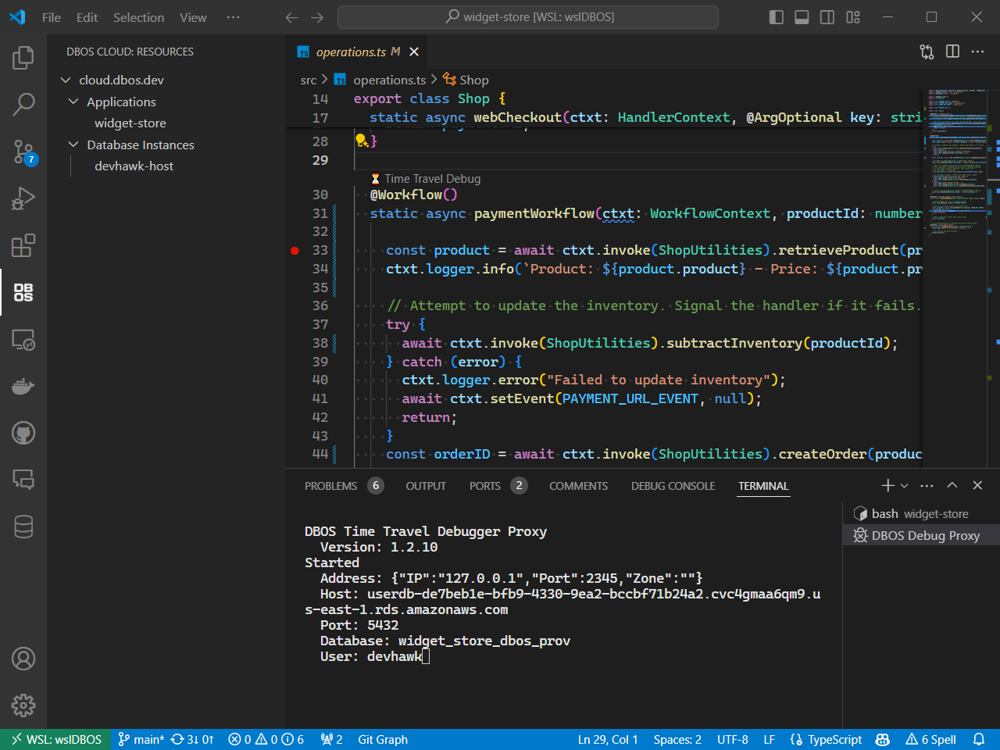

The DBOS Debugger VS Code extension enables you to replay debug your application using data from your local database or from DBOS Cloud.

## Installation

For VS Code setup instructions, please see Microsoft's [official documentation](https://code.visualstudio.com/docs/setup/setup-overview).

The DBOS Time Travel Debugger Extension can be installed via the
[VS Code Marketplace website](https://marketplace.visualstudio.com/items?itemName=dbos-inc.dbos-ttdbg)
or by searching the 
[VS Code Extension Marketplace](https://code.visualstudio.com/docs/editor/extension-marketplace)
for "DBOS".

## Views

As of v1.2 of the DBOS Time Travel Debugger Extension, you can view your DBOS Cloud applications
and database instances directly inside VS Code. Hovering over a cloud resource provides additional
information in a tooltip.

## Commands and Menu Items

These commands can be invoked via the [VS Code Command Palette](https://code.visualstudio.com/docs/getstarted/userinterface#_command-palette)
or from menu items in the DBOS Cloud Resources view. 

### Login to DBOS Cloud

You must log into DBOS Cloud from VS Code to populate the DBOS Cloud resources view and to use the [Cloud Replay Debugger](../../tutorials/debugging.md#cloud-replay-debugging). 

Typically, the extension will automatically prompt you to login to DBOS Cloud if you're not logged in or your credentials have expired.
However, this command can also be executed explicitly.

### Delete Stored DBOS Cloud Credentials

This commands logs the user out of DBOS Cloud and deletes any previously stored credentials.

### Browse DBOS Cloud App

This commands launches the user's default browser and navigates to the root URL of the DBOS application.

### Launch Time Travel Debugging Proxy

[Interactive time travel](../../../cloud-tutorials/interactive-timetravel.md) relies on Debug Proxy utility to project the state of the database as it existed when a selected workflow started.
You can launch the Debug Proxy in order to use `psql` or other similar tools for running [interactive time-traveled queries](../../../cloud-tutorials/interactive-timetravel.md).

When the Debug Proxy is running, its output appears in a [VSCode terminal window](https://code.visualstudio.com/docs/terminal/basics).
You cannot interact with the Debug Proxy via this window, but you can shut it down with Ctrl-C.

## Configuration

Some behavior of the extension can be controlled via [VS Code Settings](https://code.visualstudio.com/docs/getstarted/settings).

### dbos-ttdbg.debug_proxy_port

The Time Travel Debugging Proxy listens on port 2345 by default. This port can be changed via the `dbos-ttdbg.debug_proxy_port` configuration setting.

### dbos-ttdbg.debug_proxy_path

The `dbos-ttdbg.debug_proxy_path` configuration setting allows the user to use a different debugging proxy than the one automatically downloaded byt DBOS Debugger.

:::info
This setting is typically used by internal DBOS developers when making changes to the Time Travel Debugging Proxy.
:::

### dbos-ttdbg.debug_proxy_prerelease

By default, the DBOS Debugger will automatically download the latest release build of the Time Travel Debugging Proxy for the user's operating system. 
The `dbos-ttdbg.debug_proxy_prerelease` configuration setting allows the user to specify they want preview releases as well.

### dbos-ttdbg.just_my_code

By default, the DBOS debugger is configured to [skip code](https://code.visualstudio.com/docs/nodejs/nodejs-debugging#_skipping-uninteresting-code)
that is not a part of the DBOS application. 
In practice, this means skipping any code installed under `node_modules` as well as core modules that ship with Node.
You can disable this skipping with the `dbos-ttdbg.just_my_code` configuration setting.