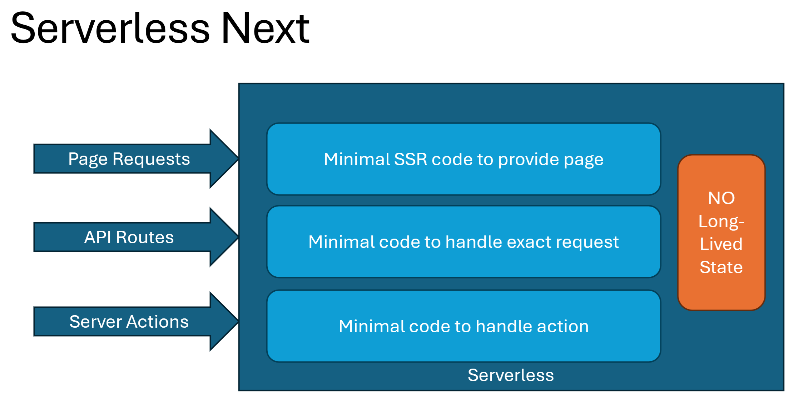

# Introduction

## Why Add DBOS To a Next.js Application?
[Next.js](https://nextjs.org/) is a solid choice for full-stack applications, but popular Next.js hosting options focus on serverless, CDN-heavy deployments that do not allow long-running tasks or other “heavy lifting”.  By adding DBOS Transact, and running in a suitable hosting environment (such as [DBOS Cloud](https://www.dbos.dev/dbos-cloud)), the following additional features are available:
- Lightweight durable execution – DBOS [workflows](../workflow-tutorial) run to completion exactly once.
- External systems integration – [Place calls to external services](../step-tutorial) with much simpler error recovery.
- Simple, powerful database integration – [Manage database data](../transaction-tutorial) with DBOS.
- Cron-style task scheduling – Automate recurring jobs with [cron-like scheduling](../scheduled-workflows).
- Background tasks and WebSockets – Keep execution and state across UI calls, with the ability to send results back to the client.
- Built-in tracing and replay debugging – [Find workflows in the dashboard](../../../cloud-tutorials/monitoring-dashboard) and [re-run them locally](../../../cloud-tutorials/timetravel-debugging).

## Architectural Overview
Next.js is a framework that optimizes where and when React UI components render—whether on the client, server, or edge—while also handling routing, data fetching, and performance optimizations.  Part of this architecture involves the creation of minimized code bundles for handling requests.  These bundles can be loaded quickly in a “serverless” environment, leading to minimal request latency even when the server is “cold”.  This “serverless” style of deployment precludes any long-running jobs, background tasks that execute while no client requests are pending, or long-lived server objects such as WebSockets:

However, Next.js also supports “custom server” deployments, which do not have limitations on long-running tasks and long-lived state.  The custom server loads code when launched, and the optimized request handler bundles can then interact with this server-side code:

The latter architecture is a requirement for using Next.js with DBOS.  This guide covers switching to a deployment with a custom `server.ts` file, and creating, calling, building, and deploying the logic within it.

## Integration Overview
The high-level steps for adding DBOS to a Next.JS application are:
- Placing DBOS startup code in the custom server file, often named ‘server.ts’ or similar.  If a custom server is not in use, it will be necessary to add one.  This may also affect how Next.js is launched, and additional build steps may be required.
- Adding files containing workflow logic implemented with DBOS. Ensure that the files are being compiled, and load the code from ‘server.ts’ at startup.
- Adding calls to the DBOS code from Next.js code.  This can include server-side render code, server actions, and route handlers.
- Ensuring that your workflow functions and the DBOS library code do not get bundled into the bundles used by Next.js to handle the requests.  (Failure to do this will lead to a wide variety of error messages.)  This guide covers two techniques: configuring `webpack` to treat the files and modules as external, or using `globalThis` to get a reference to shared objects and code set up in `server.ts`.
- Running and troubleshooting the development environment and production build

# Adding DBOS To Next.JS Applications
## Coding `server.ts`
The `server.ts` file (note that, while any file name can be used, `server.ts` is the common convention that is used in this guide)

### Creating a `server.ts` From Scratch

### Adding DBOS Code To An Existing `server.ts`

## Calling DBOS Code From Next.js

## Preventing Bundling

### Webpack Configuration in `next.config.ts`

### Using `globalThis`

## Running and Troubleshooting
Check each step of the process
Common error messages
